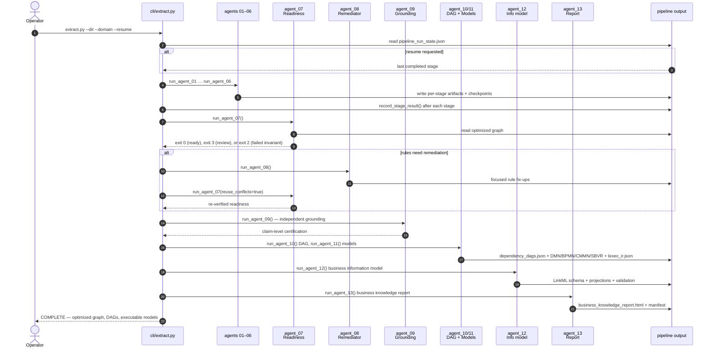
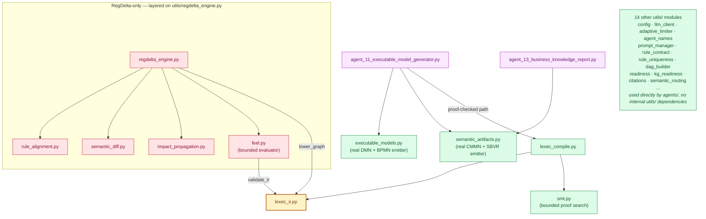
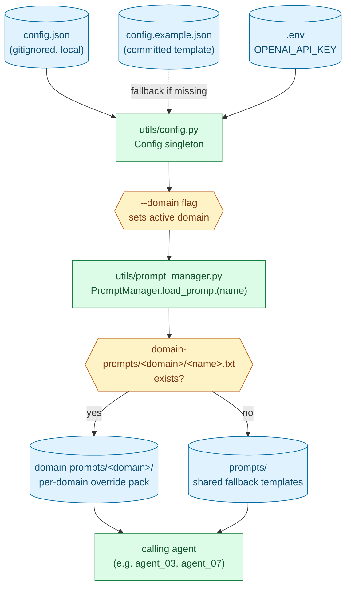
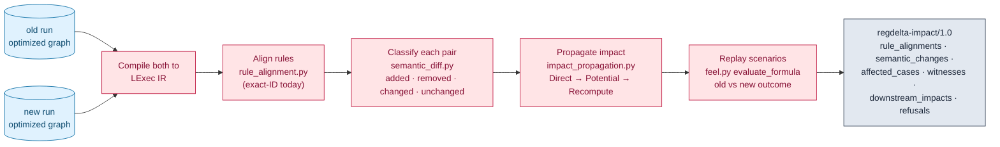

# Architecture

This document describes how Policy Logic Forge is put together: the
thirteen-agent extraction pipeline, the shared services and compiler layer
underneath it, the RegDelta differential-execution engine layered on top,
and how configuration and prompts flow through all of it. For setup and CLI
usage, see [`README.md`](README.md).

## 1. System overview

Policy Logic Forge turns compliance policy text into a typed,
source-grounded knowledge graph, then optionally compares two versions of
that graph to report what actually changed. There are three moving parts:

- **The extraction pipeline** (`agents/`, orchestrated by `cli/extract.py`)
  — thirteen agents run in a fixed sequence, each consuming the previous
  stage's output and writing its own artifacts under
  `pipeline-output/<batch>/`.
- **Shared services and the compiler layer** (`utils/`) — configuration,
  the LLM client, prompt resolution, and (for rules the compiler can
  represent) a fail-closed lowering to an intermediate representation with
  bounded proof search.
- **RegDelta** (`utils/regdelta_engine.py` and friends) — a
  differential-execution engine that compiles two graphs, aligns their
  rules, classifies what changed, and propagates impact through the
  dependency graph.

```mermaid
flowchart LR
    classDef input fill:#e0f2fe,stroke:#0369a1,color:#0c4a6e,stroke-width:1px
    classDef orchestration fill:#ede9fe,stroke:#6d28d9,color:#4c1d95,stroke-width:1px
    classDef agent fill:#fae8ff,stroke:#a21caf,color:#701a75,stroke-width:1px
    classDef shared fill:#dcfce7,stroke:#15803d,color:#14532d,stroke-width:1px
    classDef compiler fill:#fef3c7,stroke:#b45309,color:#78350f,stroke-width:1px
    classDef regdelta fill:#ffe4e6,stroke:#be123c,color:#881337,stroke-width:1px
    classDef output fill:#e2e8f0,stroke:#334155,color:#1e293b,stroke-width:1px

    DOCS[("Source docs<br/>compliance-files/")]
    CFG[("config.json + .env")]

    subgraph ORCH["Orchestration — cli/extract.py"]
        EXTRACT["ExtractionPipeline"]
    end

    subgraph PIPELINE["12-Agent Pipeline (agents/)"]
        direction LR
        A1["01<br/>Organize"] --> A2["02<br/>Entities"] --> A3["03<br/>Rules"]
        A3 --> A4["04<br/>Validate"] --> A5["05<br/>Merge"] --> A6["06<br/>Optimize"]
        A6 --> A7["07<br/>Readiness"]
        A7 -.->|"review"| A8["08<br/>Remediate"]
        A8 -.->|"re-check"| A7
        A7 --> A9["09<br/>Ground"] --> A10["10<br/>DAG"] --> A11["11<br/>Models"] --> A12["12<br/>Info model"] --> A13["13<br/>Report"]
    end

    subgraph OUTPUTS["Outputs (pipeline-output/&lt;batch&gt;/)"]
        GRAPH["optimized graph"]
        DAGS["dependency DAGs"]
        MODELS["DMN·BPMN·CMMN·SBVR"]
        INFOMODEL["business information model"]
        REPORT["business knowledge report"]
    end

    DOCS --> EXTRACT
    CFG --> EXTRACT
    EXTRACT ==> A1
    A6 -.-> GRAPH
    A10 -.-> DAGS
    A11 -.-> MODELS
    A12 -.-> INFOMODEL
    A13 -.-> REPORT

    subgraph SUPPORT["Support layers, used throughout the pipeline"]
        direction TB
        SHARED["Shared services<br/>utils/config · llm_client<br/>adaptive_limiter · prompt_manager"]
        PROMPTS["Prompts<br/>domain-prompts/&lt;domain&gt; + prompts/"]
        COMPILER["Compiler + proof layer<br/>lexec_ir · lexec_compile · smt · feel<br/>executable_models · semantic_artifacts"]
    end

    PIPELINE -.->|"config, LLM calls,<br/>rate limiting"| SHARED
    SHARED -.-> PROMPTS
    A11 -.->|"compiles + proves"| COMPILER

    subgraph REGDELTA["RegDelta engine"]
        direction LR
        RE["regdelta_engine.py<br/>align → classify<br/>→ propagate"]
    end

    GRAPH ==>|"old vs new run"| REGDELTA
    COMPILER -.->|"lower_graph / evaluate_formula"| REGDELTA

    class DOCS,CFG input
    class EXTRACT orchestration
    class A1,A2,A3,A4,A5,A6,A7,A8,A9,A10,A11,A12,A13 agent
    class SHARED,PROMPTS shared
    class COMPILER compiler
    class RE regdelta
    class GRAPH,DAGS,MODELS,INFOMODEL,REPORT output
```



Two things worth noticing immediately:

1. **The compiler layer is additive, not required.** Agents 01–10 and most
   of agent_11 (the review-projection DMN/BPMN/CMMN/SBVR) never touch
   `lexec_ir.py`/`lexec_compile.py`/`smt.py`. Only the proof-checked side
   output (`lexec_ir.json`, `compilation_report.json`, `proof_records.json`)
   goes through the compiler, and a failure there never blocks or replaces
   the review-projection output.
2. **RegDelta consumes the pipeline's output, it doesn't run inside it.**
   It reads two already-completed runs' optimized graphs; nothing in
   `agents/` or `cli/extract.py` imports from `utils/regdelta_engine.py` or
   its dependencies.

## 2. The thirteen-agent pipeline

### 2.1 Stage responsibilities

| Stage | Agent | Responsibility | Primary output |
| --- | --- | --- | --- |
| 01/13 | `agent_01` | Document organization | `agent_01-organized-documents/` |
| 02/13 | `agent_02` | Entity and relationship extraction | `agent_02-entities/` |
| 03/13 | `agent_03` | Business-rule extraction | `agent_03-rules/` |
| 04/13 | `agent_04` | Advisory rule validation | `agent_04-validation/` |
| 05/13 | `agent_05` | Rules/entities merge | `agent_05-rules-with-entities/` |
| 06/13 | `agent_06` | Knowledge-graph optimization (dedup + dependency analysis) | `agent_06-07-08-09-optimized/optimized_compliance_knowledge_graph.json` |
| 07/13 | `agent_07` | Executable-readiness gate (four invariants) | readiness report, embedded in the shared optimized directory |
| 08/13 | `agent_08` | Readiness remediation (only if agent_07 requests it) | focused rule fix-ups |
| 09/13 | `agent_09` | Independent grounding verification | claim-level certification |
| 10/13 | `agent_10` | Dependency-DAG generation, 100%-coverage guarantee | `agent_10-dag-generation/dependency_dags.json` |
| 11/13 | `agent_11` | DMN/BPMN/CMMN/SBVR generation + LExec compile | `agent_11-executable-models/` |
| 12/13 | `agent_12` | Business information model (LinkML schema; classes, typed attributes, enumerations) | `agent_12-business-information-model/` |
| 13/13 | `agent_13` | Self-contained business knowledge report | `agent_13-business-knowledge-report/business_knowledge_report.html` |

Stages 07–09 share one directory (`agent_06-07-08-09-optimized/`) because
they all read and write the same optimized graph; their stage IDs and
checkpoints stay distinct. The stage number and agent identifier are always
the same value — `--stage 9` and `--agent agent_09` select the same stage.

#### Exit-code contract

Every stage is a subprocess, so its exit code is the only thing the
orchestrator can route on. There are three meanings, and one of them is
overloaded:

| Code | Meaning | Orchestrator |
| --- | --- | --- |
| 0 | The stage did its work | continue |
| 2 | A required upstream artifact is missing, or the stage could not produce its output | stop |
| 3 (agents 07, 08, 09, 12) | **Data quality.** The stage did its work and wrote its output; the result needs review | continue, carrying the review flags |
| 3 (agent 03) | **Incomplete extraction.** Partial artifacts are kept for resume | stop, so no later stage consumes a partial graph |
| 1 | Unhandled runtime or configuration error | stop |

Two invariants follow, and both were violated in practice:

- **A stage may never exit 0 for work it did not do.** `agent_02` and
  `agent_03` printed "No documents found" and returned normally, so a run over
  an empty corpus was reported as successful through three further stages and
  only stopped at `agent_05`, blaming its own missing inputs.
- **A missing input is reported, not raised.** `agent_07`, `agent_08` and
  `agent_09` died on an unhandled `FileNotFoundError`, which exits 1 — a code
  the orchestrator reads as a runtime crash — and prints a traceback that says
  nothing about which stage to run first.

`tests/test_pipeline_end_to_end.py` checks both for every agent whose
missing-input path runs before any provider call.

### 2.2 Execution flow, including the readiness/remediation loop



**Readiness exit code 3 is a review signal, not a crash.** Exit code 2 may
enter remediation only when the current report proves `schema_consistency`
is the sole failed invariant. Exit 1 (configuration/runtime failure) and
non-schema invariant failures stop even if an older readiness report is
present. The full
orchestrator runs remediation, then continues to independent grounding and
DAG generation once all four readiness invariants pass; affected rules
remain `requires_review: true` in the final artifacts rather than blocking
the run. A structural invariant failure (not remediable) still stops it.

### 2.3 Detailed stage reference

Each agent runs as its own subprocess (`ExtractionPipeline._run`,
`cli/extract.py`); the orchestration semantics in **Failure semantics**
below refer to the OS exit code that subprocess returns, not a Python
exception.

#### `agent_01` — Document Organizer

| | |
| --- | --- |
| **File** | `agents/agent_01_document_organizer.py` |
| **Purpose** | Converts heterogeneous source documents (PDF, DOCX, Markdown, CSV, XLSX, TXT) into structurally chunked `.txt` files that mirror each source document's own table-of-contents/header hierarchy — not fixed-size splitting. |
| **Inputs** | Raw files under the run's source directory, filtered to a supported-extension set. |
| **Outputs** | `agent_01-organized-documents/<document_stem>/<section_path…>/<chunk_title>.txt` (metadata header + content) per chunk; per-document `_metadata.json` (`source_file, total_chunks, chunk_methods, structure[]`); run-level `_processing_results.json` (`total_files, processed, failed, total_chunks, chunker_tools_used, chunk_size_stats`). |
| **Concurrency** | Documents are chunked concurrently via a thread pool (`KG_ORGANIZER_WORKERS`, default 32, capped to file count) — safe because each document's output folder is independent. |
| **Failure semantics** | Plain success/failure per file; the orchestrator hard-blocks the pipeline if the stage as a whole fails. |

##### Key logic

- A tool registry dispatches by file type: `MarkdownChunker`, `CSVChunker`, `ExcelChunker`, `DocxChunker`, plus built-in PDF/TXT handling (PDF chunking is TOC/bookmark-based, with OCR fallback via `pytesseract`/`pdf2image` for scanned pages).
- Before writing, any pre-existing output folder for a document is deleted (`shutil.rmtree`) — chunking is LLM-assisted and non-deterministic, so stale chunks from a prior run would otherwise be glob-matched by every downstream agent.
- Chunk filenames are de-duplicated on title collision by appending the chunk id, since chunk titles are model-generated and can repeat within a section.

#### `agent_02` — Entity Extractor

| | |
| --- | --- |
| **File** | `agents/agent_02_entity_extractor.py` |
| **Purpose** | Iteratively catalogs domain entity types and relationships (not rules) across up to `n_iterations` refinement passes, accumulating discoveries rather than replacing them each pass. |
| **Inputs** | Every organized `.txt` chunk from `agent_01`. |
| **Outputs** | `entity_types_and_relationships.json` — `entity_types`, `relationships`, `iteration`, `optimization_summary`, `final_quality_analysis`; an intermediate `entity_iteration_checkpoint.json` after every pass. |
| **Failure semantics** | No special exit codes; raises on `n_iterations < 1` or invalid LLM JSON. Hard-blocks the pipeline. |

##### Key logic

- Each iteration samples a representative, evenly distributed subset of documents (default 8 docs / 1,200 chars each), shifted by a rotating offset per pass so successive iterations see different corpus windows, then merges new findings into the accumulated catalog (never overwrites it).
- `entity_extractor.n_iterations` defaults to **3**; `entity_min_iterations` defaults to **2**. Early stop (`entity_early_stop`, on by default) fires only once `iteration ≥ min_iterations` and the number of new catalog items reaches the configured convergence floor. The reported quality values are deterministic schema/evidence-integrity measurements for the sampled catalog; corpus concept recall is explicitly `not measured` and never used as an early-stop shortcut.

#### `agent_03` — Rules Extractor

| | |
| --- | --- |
| **File** | `agents/agent_03_rules_extractor.py`, contract in `utils/rule_contract.py` |
| **Purpose** | Extracts individual business rules as structured "v2 contract" objects — typed predicates, variables, and outcomes with exact source citations — batching the corpus into word-balanced batches with per-batch checkpointing. |
| **Inputs** | Organized chunks (`agent_01`) plus the entity catalog (`agent_02`, used to validate `responsible_party`/`counterparties`). |
| **Outputs** | `compliance_rules_with_entities.json`, keyed by `entity_types`/`relationships`, each carrying a nested `business_rules[]` list. |
| **Checkpointing** | Batches are appended to a JSONL checkpoint keyed by a content fingerprint (SHA-256 of batch text); a checkpoint whose fingerprint no longer matches current content — because the source changed — is rejected as stale, never silently reused. |
| **Failure semantics** | A malformed rule candidate is retained with `requires_review: true` rather than dropped. Hard-blocks the pipeline on stage failure. |

##### Key logic

- Batches are **word-balanced**, not fixed-file-count: oversized files are re-split at word boundaries with overlap, then bin-packed toward `target_words_per_batch`.
- `bridge_exact_span` repairs LLM-quoted source text that isn't an exact substring of the source (e.g. the model silently drops an inline aside), by locating the true matching word span and rebuilding the quote verbatim — required downstream because `agent_09`'s grounding verifier needs literal substrings.
- Every candidate is run through `annotate_rule_contract`, which never discards an invalid rule — it attaches `contract_issues[]` and sets `requires_review: true` on any error-severity issue instead.

**v2 rule contract — top-level fields** (`utils/rule_contract.py`):

| Field | Notes |
| --- | --- |
| `condition_predicates[]` | `predicate_id, variable, operator (==, !=, >, >=, <, <=, in, not_in), value, value_type` |
| `condition_logic` | Boolean tree over predicate refs (`all`/`any`/`predicate_ref`), or `{"constant": true}` only for a direct, explicitly unconditional source assertion |
| `outcomes[]` | `variable, operator="=", value, value_type`; validated numeric arithmetic may use canonical `feel_expression` |
| `variables[]` | `name, type, role (input\|derived\|output), unit?, allowed_range?, allowed_values?` |
| `scope_basis` | One of `explicit`, `explicit_in_source`, `explicitly_none_in_source`, `explicitly_universal_in_source`, `genuinely_unscoped`, `inferred`, `unresolved_after_source_review` |
| `exceptions[]`, `exception_basis` | Input-side exception triggers use the predicate shape and a 5-value basis enum |
| `exception_effects[]` | Preserves source-backed alternate output assignments separately from exception triggers; remains review-gated until branch lowering is available |
| `source_reference`, `field_evidence` | Chunk path, section id, exact quoted source text |
| `test_vectors[]` | Input/output example pairs for the rule |

**Example** (`tests/test_rule_contract.py`):

```python
"condition_predicates": [{
    "predicate_id": "p1", "variable": "price_differential_amount",
    "operator": ">=", "value": "designated_threshold_amount",
    "value_type": "variable_reference",
}],
"condition_logic": {"predicate_ref": "p1"},
"outcomes": [{"variable": "maximum_number_of_pools", "operator": "=", "value": 3, "value_type": "number"}],
"scope_basis": "inferred",
"inference_reasoning": "The cited section is within the conventional-loan chapter.",
"responsible_party": "SELLER_SERVICER", "counterparties": ["FANNIE_MAE"],
"exception_basis": "explicitly_none_in_source",
```

#### `agent_04` — Rule Validator

| | |
| --- | --- |
| **File** | `agents/agent_04_rule_validator.py` |
| **Purpose** | Runs five heuristic quality checks over `agent_03`'s rules and writes a standalone report. **Advisory only — never gates or modifies pipeline data.** |
| **Inputs** | `compliance_rules_with_entities.json`; optionally the organized source directory. |
| **Outputs** | `validation_report.json` — `passed[], warnings[], failures[], corrections[], statistics{passed_count, warning_count, failure_count, avg_confidence}`. |
| **Failure semantics** | None that matter — `main()` always exits 0. `cli/extract.py` calls it as `self.run_agent_04()  # advisory; never blocks the pipeline` and discards the return value. |

##### Key logic — the five checks, and how heuristic each really is

1. Confidence score presence/threshold (flag if `< 70`).
2. Numeric-threshold consistency — regex-extracted numbers on shared key terms (`credit score`, `ltv`, `dti`, …).
3. Field completeness against the v2 required-field list.
4. Cross-rule contradiction detection — **a documented placeholder**; the code comment states a full implementation would use an LLM, and it never actually flags anything today.
5. Source-reference verification — samples up to 10 rules and checks only that a `source_reference` exists, not that it is textually correct.

Its findings are never read by any other agent or by the orchestrator's control flow.

#### `agent_05` — Rules/Entities Merger

| | |
| --- | --- |
| **File** | `agents/agent_05_rules_with_entities_merger.py` |
| **Purpose** | Flattens `agent_03`'s entity/relationship-nested rule structure into one top-level rule list, cross-references each rule's entity/relationship reference to `agent_02`'s canonical names, and attaches inline entity/relationship definitions to each rule. |
| **Inputs** | `entity_types_and_relationships.json` (`agent_02`) + `compliance_rules_with_entities.json` (`agent_03`). |
| **Outputs** | `compliance_knowledge_graph.json` — `metadata`, `entity_types`, `relationships`, flat `business_rules[]`, `statistics{total_entities, total_relationships, total_rules, rules_by_entity, rules_by_type}`. |
| **Failure semantics** | No special exit codes; hard-blocks the pipeline on failure. |

##### Key logic

- Builds a case/whitespace/hyphen-insensitive canonical-name lookup over `agent_02`'s entity/relationship keys, and remaps any rule whose reference resolves but differs in spelling (e.g. `"Financial Institution"` → `"FINANCIAL_INSTITUTION"`).
- If a rule references a party `agent_02` never emitted as a top-level entity, a placeholder entity is synthesized and explicitly marked as such — never silently dropped, never silently invented as an unmarked definition.

#### `agent_06` — Knowledge Graph Optimizer

| | |
| --- | --- |
| **File** | `agents/agent_06_knowledge_graph_optimizer.py` |
| **Purpose** | Conservatively deduplicates truly-identical rules, canonicalizes rule IDs, then derives typed deterministic rule relationships from the canonical contracts. |
| **Inputs** | `compliance_knowledge_graph.json` (`agent_05`). |
| **Outputs** | `optimized_compliance_knowledge_graph.json` — `optimization_summary{deduplication, dependency_analysis}`, `business_rules`, graph-wide `fact_registry`, `deduplication_details`, `dependency_details{dependencies, associations, conflict_candidates, relation_refusals}`. This directory is then shared and overwritten in place by `agent_07`–`agent_09`. |
| **Failure semantics** | A chunk-level dedup failure is caught and that chunk's rules are retained unchanged, rather than failing the whole stage. `--skip-optimize` skips `agent_06`–`agent_08` entirely. |

##### Key logic

- **Deduplication** is LLM-based and batched (default 25 rules/batch): semantic cross-batch merges are intentionally never inferred — "a missed merge is safer than combining rules whose numeric scope or source differs." A deterministic global pass does merge byte-equivalent structured semantics across batches. Both `source_reference` **and** `field_evidence` are merged onto the surviving primary rule.
- Relationship derivation runs **after** deduplication and uniqueness enforcement. A declared output is not a write; only an actual assignment in `outcomes` can produce dataflow. Optional `variables[].fact_id` binds differently named local variables to one graph-wide semantic fact, while type, unit, and applicability-scope compatibility prevent false joins. The emitted `fact_registry` exposes aliases, producers, consumers, and type/unit drift.
- **Relationship derivation** is deterministic (`utils/rule_dependencies.py`), not model-driven. Every relation kind carries a decidable acceptance condition, and a kind the rule contract cannot express is refused rather than emitted as an unenforced label — the posture `lexec_ir.py` takes toward constructs it cannot lower. `dataflow`: the target reads a symbol the source assigns. `gating`: dataflow *and* the target provably cannot fire unless the source's outcome holds (needs an entailment oracle; without one a relation stays `dataflow` rather than being promoted on faith). `conflict`: both rules assign the same symbol. `association`: shared input symbol or shared source passage — **symmetric, deliberately not a dependency**, and excluded from any topological ordering. Refused with a stated reason: `sequential` (no temporal semantics in the contract), `override` (no precedence field), `complementary` (symmetric), `validation` (no condition was ever defined), `contradictory` (belongs to conflict analysis).
- This replaced an LLM proposal pass screened by a single structural check. That arrangement had three measured defects on real runs: proposal read batched summaries under a hard cap on cross-batch comparisons, so ~96% of the 187,578 rule pairs in a 613-rule run were never examined (4 edges asserted where 66 were derivable); the six accepted `dependency_type` values were defined nowhere and were all validated by the same check, which is correct for one of them and irrelevant to four; and the check ran only here, so a later stage renaming a variable left an edge asserting a symbol flow that no longer existed. On that same historical run, `agent_09`'s independent grounding pass found **44% of dependency/conflict claims did not hold up structurally** — the reason a second, independent verification stage exists at all.
- Derivation is re-run as a *validation* pass at the end of `agent_07` and `agent_08` (`revalidate_graph`), because both rewrite variables in place. Gating carries a contract fingerprint and must reproduce its solver proof; otherwise it is downgraded to valid dataflow or dropped. Other relations whose acceptance condition no longer holds are dropped and reported.
- The graph carries a **second, older dependency channel**: each rule's `related_rules`, which the extraction prompt asks the model to fill with "rule_ids that interact with this rule". It is not derived, not typed, and not part of the acceptance-condition machinery above. Nothing validated it, and nothing pruned it when deduplication removed a rule, so an 832-rule privacy run shipped 18 references to 17 rule ids that were not in the graph — 9 to rules optimization had deleted, and **8 that never existed in any graph at any stage**. `agent_10` discarded them while building DAGs and recorded `dropped_edges: 0`, so the loss was invisible as well. `prune_dangling_related_rules` now runs alongside `revalidate_graph` in both stages: dangling targets are dropped with a reason, and `divergent_from_typed` records how far the two channels disagree (135 of 137 surviving pairs on that run) so the field is never mistaken for the derived relations.
- `gating` promotion is solver-backed (`utils/rule_gating.py`): the graph is lowered to LExec IR once, then for a relation on symbol `s` assigned value `v`, `condition(target) ∧ s ≠ v` is handed to `utils/smt.py`. Unsatisfiable means the target cannot fire without the source's outcome. Coverage is reported alongside the result rather than implied, because it is bounded by what lowers: a rule that refuses, or a query the solver cannot close, returns *undecided* and the relation stays `dataflow`.
- In practice that coverage is currently thin, and for an instructive reason. The symbols carrying the most dataflow — `transaction_type`, `occupancy_type` — are declared with incompatible `theory`/`domain`/`unit` across the rules that share them, so those rules refuse with `SYMBOL_CONFLICT`. The rules with the most structure are therefore the least analysable, which is the same uncanonical-symbol problem that suppresses edge discovery in the first place, surfacing again one layer down.
- `utils/kg_readiness.py` is **not** used by `agent_06`; its deterministic primitives (cited-section tracking, naming/referential-integrity checks) first come into play in `agent_07`.

#### `agent_07` — Executable Readiness

| | |
| --- | --- |
| **File** | `agents/agent_07_executable_readiness.py`, deterministic core in `utils/kg_readiness.py` |
| **Purpose** | Completes every rule's evidence-dependent fields (exceptions, applicability scope, workflow eligibility, hit policy) via bounded LLM evidence retrieval over the full corpus, then validates the graph against four deterministic invariants. |
| **Inputs** | Baseline graph (`agent_05`, for corpus-citation comparison), optimized graph (`agent_06`), organized corpus. |
| **Outputs** | Overwrites the optimized graph; writes `corpus_manifest.json`, `kg_readiness_report.{json,md}` — `invariants{…}`, `rules_ready`, `rules_requiring_review`, `review_routes`, `human_review_required_rules`. |
| **Exit codes** | **0** — all invariants pass, no rule needs review. **2** — any invariant fails; unrecoverable, hard pipeline stop. **3** — all invariants pass but at least one rule needs review; a deliberate *data-quality*, not *process-failure*, signal. |

**The four invariants, precisely:**

| Invariant | What it checks |
| --- | --- |
| `corpus_integrity` | Every cited-section addition/removal between the baseline and final graph has an explicit reason string. |
| `naming_consistency` | Zero entity-key naming violations against a canonical `^[A-Z][A-Z0-9]*(?:_[A-Z0-9]+)*$` pattern. |
| `schema_consistency` | Zero **blocking** v2-contract violations. Deliberately gated on blocking errors alone, not evidence/provenance gaps — folding those in previously made this invariant fail on every run with any review-required rule, pre-empting `agent_08` remediation before it could run. |
| `referential_integrity` | Zero dependency edges pointing at a `rule_id` that doesn't exist. |

##### Key logic

- Evidence retrieval builds an inverted token index (words, path tokens, exception markers like "except"/"unless"/"notwithstanding") over the organized corpus *before* any LLM call, so the search record can prove the whole corpus was inspected.
- Each `(rule, evidence packet)` pair is fingerprinted (SHA-256) and checkpointed to JSONL; a resumed run rejects checkpoint rows whose rule no longer exists or whose recorded corpus hash doesn't match.
- Cache/resume paths revalidate nested exception/scope citations against the organized corpus before syncing them into `field_evidence`; cached evidence never bypasses the citation gate.
- Deterministic normalization aliases legacy operators/types, preserves alternate exception effects, compiles only a conservative arithmetic subset to FEEL, and derives test vectors only when the condition and expected output are mechanically evaluable.

#### `agent_08` — Readiness Remediator

| | |
| --- | --- |
| **File** | `agents/agent_08_readiness_remediator.py` |
| **Purpose** | Re-requests LLM completion for **only** the specific fields that caused an `agent_07` exceptions/scope failure — never a full re-extraction — and separately re-resolves unresolved rule conflicts. |
| **Inputs** | Baseline graph, the `agent_07`-annotated optimized graph, organized corpus. |
| **Outputs** | Overwrites the optimized graph and readiness reports; adds `agent_08_remediation_report.json`. |
| **Exit codes** | Same contract as `agent_07`: 0 clean, 2 an invariant still fails after remediation, 3 invariants pass but rules remain under review. |

##### Key logic

- Patches only a fixed field allowlist per rule — `exceptions`, `exception_basis`, `exception_verification`, `applicability_scope`, `scope_basis`, `scope_derivation` (plus new typed input variables the patch introduces) — and only for rules whose failures are exactly `exceptions` and/or `scope`.
- Rebuilds unresolved conflict pairs (capped at 5,000 to bound the request count on large conflict groups) and asks the model to resolve each as `non_conflict`/`conflict` with a rationale and any hit-policy update.
- One deterministic rule folded in here: if any rule declares a `list`-typed output variable, that variable becomes graph-wide `list`-typed and every rule assigning it switches to `COLLECT` hit policy — resolving conflicts where rules legitimately co-fire on a shared collection output.

**Example** (`tests/test_readiness_remediator.py`): a rule failing on `exceptions` gets patched with a new input variable `exception_applies` (boolean), a matching exception predicate, `exception_basis: "explicit_in_source"`, and a real evidence citation — `{"chunk_path": "B2-1-01/001.txt", "section_id": "B2-1-01", "source_text": "Except when exception_applies."}`.

#### `agent_09` — Grounding Verifier

| | |
| --- | --- |
| **File** | `agents/agent_09_grounding_verifier.py` |
| **Purpose** | Independently certifies every source-derived rule field, claim by claim, against text the verifier re-locates in the corpus itself — it does not trust `agent_07`/`agent_08`'s stored citations. |
| **Inputs** | The post-remediation optimized graph, organized corpus. |
| **Outputs** | Adds `metadata.grounding_certification` + a per-rule `grounding` block to the graph; `kg_grounding_report.{json,md}` — `pass, total_claims, supported_claims, contradicted_claims, insufficient_evidence_claims, claim_coverage_percent, review_route_counts, …`. |
| **Exit codes** | **0** clean pass. **3** — `report.pass` is false; the orchestrator only tolerates this if the report is *complete* (`claim_coverage_percent == 100.0`, zero missing/duplicate/unexpected verifier responses) — an incomplete run is a hard stop, never silently accepted. |

##### Key logic — what "independent" means precisely

- Splits claims into two disjoint verification paths, deliberately not both model-based:
  - `description`, `condition`, `outcome`, `party`, `scope`, `exception` are verified by the LLM against an evidence packet the module **rebuilds itself** from the raw corpus.
  - `condition_logic` and `test_vector` are **excluded** from model verification — they are pipeline-derived values, not sentences any document states verbatim, and asking a model for a literal quote scored near-100% false-insufficient in practice. These are verified **structurally** instead (predicate coverage, input/output consistency against declared variables).
- Every model verdict of `supported`/`contradicted` is downgraded to `insufficient_evidence` unless the model's cited quote resolves to a genuine substring of the real corpus text — a hallucinated citation cannot pass even if the model claims "supported."
- `claim_coverage_percent` measures response-set **completeness** (did the verifier return exactly one verdict per claim, with none missing, duplicated, or unexpected) — a fail-closed integrity check on the verification pipeline itself, distinct from the actual supported/contradicted/insufficient outcome counts.
- Every directed relationship candidate is independently evaluated. Supported dependencies are marked `admission: canonical`; rejected candidates move to `dependency_details.relationship_candidates` with their verification record. Candidate rejection does not fail an otherwise certified rule graph because the unsupported edge is no longer canonical. Agent 10 recognizes the admission contract and will not recreate rejected edges from legacy per-rule dependency lists.

#### `agent_10` — Dependency DAG Generator

| | |
| --- | --- |
| **File** | `agents/agent_10_dag_generator.py`, algorithm in `utils/dag_builder.py` |
| **Purpose** | Deterministically partitions every rule into one or more directed acyclic graphs built from `agent_06`'s dependency edges, guaranteeing every rule appears in exactly one output DAG — cycles included. |
| **Inputs** | Optimized graph (falls back to the pre-optimization graph under `--skip-optimize`, where every rule becomes an isolated single-node DAG since dependency edges don't exist yet). |
| **Outputs** | `dependency_dags.json` — `dags[]` (`rule_ids, nodes, edges, cycle_groups, topological_order, is_acyclic`), `coverage{total_rules, covered_rules, complete}`, `dropped_edges`, `self_loop_edges`. |
| **Exit codes** | 0 normally; **2** only if `coverage.complete` is somehow false — a real bug, since coverage is structurally guaranteed by construction. |

##### Key logic — the 100%-coverage guarantee, precisely

- Weakly-connected components (union-find over the undirected view of all edges) assign *every* rule, including zero-edge rules, to exactly one component; each component becomes exactly one DAG. The result is explicitly re-verified (`covered_ids == node_ids`, no duplicates) rather than assumed.
- Within each component, Kosaraju's two-pass DFS finds strongly connected components of any size; any SCC larger than one node is condensed into a single "cycle group" node. SCC-condensation of a directed graph is always acyclic, so a topological sort (Kahn's algorithm) is guaranteed to succeed afterward.
- Self-loops are reported separately and excluded from cycle detection; edges referencing an unknown `rule_id` are dropped and reported.

**Example**: a cycle `R1 → R2 → R3 → R1` plus a downstream dependency `R3 → R4` condenses into one `cycle_groups` entry `{rule_ids: [R1, R2, R3]}`, with `R4` ordered strictly after that group in `topological_order`.

#### `agent_11` — Executable Model Generator

| | |
| --- | --- |
| **File** | `agents/agent_11_executable_model_generator.py` |
| **Purpose** | Projects the final certified graph into standards-based executable/review artifacts — DMN, BPMN, CMMN, SBVR — validates them for internal consistency, and (additively, best-effort) lowers the graph into a separately provable LExec IR. |
| **Inputs** | Optimized graph (`agent_06`–`09`), `dependency_dags.json` (`agent_10`). Fails fast (exit 2) if either is missing. |
| **Outputs** | `compliance_decisions.dmn`, `compliance_workflows.bpmn`, `compliance_reviews.cmmn`, `semantic_vocabulary_profile.json`, and best-effort `lexec_ir.json`/`compilation_report.json`/`proof_records.json`; `executable_model_report.json` summarizing rule/review/BPMN/CMMN counts. |
| **Exit codes** | 0 on success; **2** if inputs are missing or DMN/BPMN/CMMN validation raises. |

##### Key logic — exact order of operations

1. Build DMN (`utils/executable_models.build_graph_dmn`) and BPMN (`build_dags_bpmn`).
2. Build CMMN (`utils/semantic_artifacts.build_review_cmmn`) and the SBVR profile (`build_sbvr_profile`).
3. Validate all four for internal consistency — **any failure raises before anything is written to disk**, so there is never a partial artifact set from a failed validation.
4. Write the four artifacts.
5. Best-effort: `compile_and_prove` (`utils/lexec_compile.py`) lowers the graph to LExec IR and runs bounded proof search, writing the three compiler artifacts. Wrapped in a bare exception handler that only warns — a compiler failure must never block or replace the artifacts already written in step 4.
6. Write the summary report.

A per-rule gate, `bpmn_eligibility`, decides DMN/CMMN-only vs. also-BPMN: it requires `workflow_semantics.kind == "prescriptive_process"`, `basis == "explicit_in_source"`, a non-empty trigger event and actor role, and direct evidence — "a party plus an outcome is not a process." Rules failing this stay visible in DMN/CMMN, with the omission reason recorded in `bpmn_omissions`.

#### `agent_12` — Business Information Model

| | |
| --- | --- |
| **File** | `agents/agent_12_business_information_model.py`, deterministic core in `utils/information_model.py`, canonical schema in `utils/linkml_schema.py` |
| **Purpose** | Turns the certified graph into a canonical, machine-readable model of the business *data* the rules operate on — classes, typed attributes, enumerations, multiplicity, constraints — as the bridge from policy knowledge to schemas, APIs and code. |
| **Inputs** | Optimized graph (`agent_06`–`09`) and `semantic_vocabulary_profile.json` (`agent_11`). Fails fast (exit 2) if the graph is missing. |
| **Outputs** | `business_information_model.yaml` (**canonical**), plus five projections generated from it: `.schema.json`, `.mmd` (Mermaid `classDiagram`), `.puml` (PlantUML), `class_attribute_catalog.{json,md}`, `information_model_validation.json`. |
| **Exit codes** | 0 clean; **3** when validation reports an error — a data-quality signal, matching the readiness/grounding convention; **2** on missing input or generation failure. |

##### Why LinkML is the canonical form

A UML class diagram is a picture. It can be read but not executed, not
validated, and not diffed — and when the same model is emitted as a diagram
*and* a JSON model *and* a catalog, the three drift the moment one of them is
edited. [LinkML](https://linkml.io) is a schema language with a metamodel, so
the model becomes an artifact that tools can check rather than one a human must
eyeball.

Three properties earn it the canonical slot:

- **It validates.** The emitted schema is loaded back through LinkML's own
  `SchemaView` before it is written; the result is recorded in
  `information_model_validation.json` under `schema_validation`. A schema that
  no LinkML tool would accept fails here rather than downstream.
- **It generates.** JSON Schema, SHACL, OWL, SQL DDL, Pydantic/TypeScript/Java
  classes and GraphQL all come from LinkML's own generators. `.schema.json` is
  produced this way, so the JSON Schema is not a hand-written approximation of
  the model — it *is* the model, mechanically translated.
- **It carries the semantics that matter here.** `unit`, `minimum_value`,
  `pattern`, `permissible_values` and free-form `annotations` are first-class
  metamodel slots, so declared units, numeric bounds, controlled vocabularies
  and per-attribute provenance survive into every downstream artifact instead
  of being lost at the diagram boundary.

Everything else is a **projection**: `to_mermaid`, `to_plantuml` and
`catalog_rows` in `utils/information_model.py` delegate through
`to_linkml()`, so the diagram and the catalog read their facts back out of the
canonical schema and cannot disagree with it.

Units sit on the **slot**, never on the type. Two `Money` attributes need not be
denominated in the same currency, so folding the currency into the type would
assert something the source never said; `Money` is `decimal` and the currency
rides on the attribute that declares it.

##### High-level categories

The model distinguishes six kinds of element — class, attribute, value object,
enumeration, relationship, constraint — but that taxonomy is only useful if you
can see it, so it is emitted two ways. LinkML `subsets` group every class by
**what kind of thing it is** (`entity`, `actor`, `event`, `process`,
`value_object`) and every attribute by **what kind of value it holds**
(`identifier`, `quantity`, `temporal`, `categorical`, `flag`, `descriptive`),
with `in_subset` on each element; only populated subsets are declared. The
validation report carries an `inventory` block counting every element by kind,
and the catalog gains `element_kind`, `category` and `class_stereotype` columns.

Both axes derive from evidence the rules already declare, which is why they mean
the same thing in any domain. **Subject areas derived from document structure
were considered and rejected**: a corpus drawn from many organisations' policies
has no shared section vocabulary — the privacy corpus spans 719 distinct
passages across dozens of unrelated documents — so clustering free-text headings
would invent structure rather than report it.

The inventory pays for itself immediately. On the privacy run it shows **324 of
464 attributes are `flag`s** — booleans recording whether a rule passed rather
than business state — and reconciles two numbers that otherwise look like a bug:
of 328 detected enumerations only 74 are `referenced_by_a_class` (the rest
belong to unassigned attributes and never reach the schema), and 186 are
`single_valued`, which is exactly the count of `no_superfluous_elements`
findings.

##### Refinement is not contradiction

Rules routinely name the same symbol at different precisions: one declares a
closed value set, another calls it a string. The value set loses nothing the
string declared, so this is an **under-specification to reconcile**, not a
disagreement to escalate — `reconcile_types` returns the narrowest reading that
every other reading generalises, and the conflict is reported at `review`
severity with `level: "refinement"` and the type it resolved to.

Only types that cannot be reconciled to a single narrowest reading are errors:
`Boolean` against an enumeration, or `Money` against `Percentage` — both
decimal, but neither a special case of the other, so picking a winner would be a
modelling decision made on no evidence. Treating every precision difference as
an error buried the real contradictions: on the privacy run this was **28
reported errors, of which 24 were refinements**.

The narrowest reading also wins the type itself. Ordering candidates by evidence
strength alone let a `string` declaration beat the enumeration that refines it
purely on tie-break order, silently discarding a real constraint.

##### What is derived rather than asked

Business types come from what the rule contract already declares, not from a
model's reading of names. Evidence is consulted in a fixed order: a closed
`allowed_values` set is an enumeration *even when the rule declared `string`*,
because modelling it as text would discard a real constraint; a declared `unit`
outranks any name pattern (`usd` → `Money`, `basis_points` → `Percentage`,
`months` → `Duration`); an integral `allowed_range` implies `Integer`; and only
a variable with nothing declared falls through to its name — a result always
flagged for review. On a real 614-rule mortgage graph this types 2,546
attributes and leaves **24** as a generic `String`.

Multiplicity, optionality, constraints (from ranges and value sets), and per-
attribute source rules and passages are derived the same way.

##### What is genuine judgment

Which class an attribute describes, whether a group of attributes forms a value
object, and which concepts deserve to be classes cannot be read off a contract,
so one prompt decides those — bounded hard. The model may not invent, retype or
rename anything: each proposal is checked against the deterministic facts, and
one naming an unknown symbol or class is discarded. A proposed class needs three
supporting attributes, at least two of them non-Boolean, or it stays a label —
the second condition is what stops a "class" that is really a bag of rule
outcomes, which the prompt forbids and a model still occasionally proposes. An
attribute the model cannot place stays **unassigned** and is reported, because a
misfiled attribute silently corrupts the model while an unplaced one is merely
reviewed.

**Actors are excluded from attribute ownership.** A rule names the party
responsible for applying it, which is not what its variables describe — a lender
does not own a loan's LTV ratio. Assigning by `related_entities` without this
exclusion put 1,454 attributes on `LENDER` and 10 on `MortgageLoan`.

##### Validation

Ten domain checks run after generation, alongside the LinkML metamodel check
described above, and they **repair nothing** — a validator that
silently fixes what it finds cannot also report how good the model was:
concept representation, attribute presence, type defensibility, type
consistency, relationship direction and multiplicity, enumeration usage,
constraint coverage, absence of superfluous elements, consistency with the
source graph, and whether ambiguity was flagged rather than guessed. Every
finding names its subject.

#### `agent_13` — Business Knowledge Report

| | |
| --- | --- |
| **File** | `agents/agent_13_business_knowledge_report.py` |
| **Purpose** | Renders the certified graph into a single, self-contained, source-traceable HTML dashboard for human exploration and review — never invents rules, concepts, or process semantics. |
| **Inputs** | Optimized graph (`agent_06`–`09`), `agent_11-executable-models/` (DMN/BPMN/CMMN + SBVR profile), `agent_12-business-information-model/` (catalog + validation + LinkML schema), organized-document text (for source-passage fallback lookup). Fails fast (exit 2) if the optimized graph is missing; a missing information model degrades to an explanatory empty state, because `agent_12` can legitimately be skipped with `--stages`. |
| **Outputs** | `business_knowledge_report.html` (zero external network calls — inline CSS/JS/SVG, no CDN, no webfonts) and `business_knowledge_report_manifest.json`. Tabs: Overview (chart-based analytics — category/confidence/route/model-type/dependency-degree distributions, most-connected and isolated rules), SBVR vocabulary, Rule explorer (per-rule traceability breadcrumb and inline DMN/BPMN/CMMN diagrams), Relationships (click-to-highlight dependency graph with pan/zoom), **Information model**, and Source traceability. |
| **Exit codes** | 0 on success; **2** if the optimized graph is missing or generation raises. |

##### The Information model tab

`agent_12` used to be the one stage whose output nothing consumed: it wrote
seven artifacts and the final report never mentioned the information model at
all. The tab closes that seam, reading `class_attribute_catalog.json` (already
the tabular projection of the LinkML schema) and
`information_model_validation.json`, and embedding
`business_information_model.yaml` so the canonical artifact travels with the
report.

It leads with the one fact that matters most about a model and is otherwise
invisible: **which kind of value dominates it.** On a real privacy run, 70% of
modelled attributes are `flag`s — booleans recording whether a rule passed
rather than business state — which the tab states outright rather than leaving
to be counted. Below that sit the category distribution, the ten validation
checks, and a searchable card per class whose attribute catalog carries type,
declared unit, multiplicity, constraints, allowed values, and evidence tier.

Every attribute links back to the rules that declared it, and those link on to
the embedded source passage, so the tab extends the evidence spine rather than
terminating it.

Agent 13 is a presentation-only stage. It renders every rule with a neutral
0–100 automation-readiness score composed of core grounding (40%), contextual
grounding (20%), contract integrity (15%), evidence integrity (10%),
executability (10%), and relationship support (5%). The score does not consume
`requires_review` or `review_route`, does not claim to be an accuracy
probability, and has no built-in acceptance threshold. Those operational
decisions belong to the deployment environment and domain policy. The source
graph retains the pipeline's internal findings and routing metadata for audit
and downstream model generation.

The score is calculated from normalized component values in the inclusive
range 0–100. Components and the final weighted result are rounded to one decimal
place.

| Component | Weight | Exact component calculation | What 100 means | What 0 means |
| --- | ---: | --- | --- | --- |
| Core grounding | 40% | `supported core claims / evaluated core claims × 100`; if claim counts are absent, a `certified` or `supported` status maps to 100 and any other status maps to 0. | Every evaluated description, condition, and outcome claim is supported. | No evaluated core claim is supported, or support was not reported. |
| Context grounding | 20% | `supported enrichment claims / evaluated enrichment claims × 100`, with the same status fallback as core grounding. | Every evaluated party, scope, and exception claim is supported. | No evaluated contextual claim is supported, or support was not reported. |
| Contract integrity | 15% | `supported contract claims / evaluated contract claims × 100`, with the same status fallback as core grounding. | Every evaluated structural contract claim is internally supported. | No evaluated contract claim is supported, or support was not reported. |
| Evidence integrity | 10% | `max(0, evidence records - invalid records - missing responses - duplicate responses) / evidence records × 100`. If no evidence records exist, the component is 0. This measures verifier-protocol cleanliness, not source coverage. | At least one evidence record exists and the verifier recorded no invalid citations, missing responses, or duplicate responses. | Evidence is absent or recorded evidence/protocol defects consume the available evidence-record count. |
| Executability | 10% | Four checks worth 25 points each: at least one execution target; a projection for every target; at least one test vector; and declared variables plus outcomes. | All four executable-projection checks are present. | None of the four executable-projection checks is present. |
| Relationship support | 5% | 100 when all asserted relationships affecting the rule are independently supported; 0 when an asserted relationship fails; not applicable when none is asserted. | Every asserted relationship affecting the rule is supported. | One or more asserted relationships failed. |

For component scores \(C_{core}\), \(C_{context}\), \(C_{contract}\),
\(C_{evidence}\), \(C_{execution}\), and \(C_{relationship}\), the final score
is:

\[
ARS = 0.40C_{core} + 0.20C_{context} + 0.15C_{contract}
    + 0.10C_{evidence} + 0.10C_{execution} + 0.05C_{relationship}
\]

When relationship support is not applicable, the remaining component weights
are normalized to 100. `ARS = 100` means all applicable measured components are complete under these
definitions. It does **not** mean the rule is guaranteed correct, and it does
not authorize automation. Each deployment defines its own acceptable score or
additional gates based on domain risk, legal obligations, and operating
controls.

### 2.4 Orchestration summary

The full run order and gating logic, tying every stage above together:

1. `agent_01` → `agent_02` → `agent_03` — each a hard gate.
2. `agent_04` — called, but its return value is discarded; advisory only.
3. `agent_05` → `agent_06` — hard gates (unless `--skip-optimize`, which skips `agent_06`–`agent_08` entirely).
4. `agent_07` — exit 3 with a valid readiness report enters `agent_08`; exit 2 may also enter only for a schema-only invariant failure. Both paths are followed by an `agent_07` recheck. Exit 1 and non-schema invariant failures stop immediately and cannot be misrouted by stale artifacts. A repeat exit-3 that is still fully invariant-passing is tolerated and the pipeline continues with rules flagged `requires_review`.
5. `agent_09` — exit-3 tolerated only if the report shows complete, fail-closed coverage; otherwise hard stop.
6. `agent_10` → `agent_11` → `agent_12` — hard gates.

A "review-required" state is therefore a legitimate terminal state throughout stages 07–09 — explicitly distinguished from a process/integrity failure via exit code 3 vs. 2 — and flows through to the final DMN/BPMN/CMMN artifacts with `requires_review`/`review_route` flags intact rather than blocking generation.

### 2.5 Resume and checkpointing

Two independent mechanisms cooperate:

- **Stage-level resume, via targeted re-selection.** There is no separate
  `--resume`/`--resume-from` flag or persisted "which stage completed"
  state file. Instead, `--stage`/`--agent`/`--stages` (see
  [`docs/cli.md`](../docs/cli.md#selecting-stages)) read and write into the
  *same* `pipeline-output/<batch-name>/` directory as the original run, so
  re-running only the remaining stage(s) against that batch name picks up
  exactly where a failed or interrupted run left off, reusing every earlier
  stage's already-written output as-is. `--stages 7-9 --keep-going` runs a
  contiguous or mixed set of stages in one invocation regardless of earlier
  per-stage failures.
- **Item-level resume, inside a single stage.** Agents 01, 03, 07, 08, and
  09 each maintain their own append-only JSONL checkpoint
  (`agent_07_rule_checkpoint.jsonl` and similar) keyed by a content
  fingerprint, so an interrupted stage skips already-processed items on its
  next invocation instead of redoing them — independent of whether the
  outer orchestrator is resuming or running that stage fresh.

A shared adaptive concurrency limiter (`utils/adaptive_limiter.py`) governs
API request pacing across every agent subprocess in a run, backed by a
SQLite file so concurrently running batches share one budget.

## 3. Module architecture (`utils/`)

Most of `utils/` is used directly by one or more agents with no interesting
inter-module structure. The part worth diagramming is the compiler layer,
because it is a genuine hub: `lexec_ir.py` is imported both by agent_11's
proof-checked compile path and by every RegDelta module that needs to read
or evaluate that IR.



Note the two independent DMN/BPMN emitters, which is easy to conflate:

- `utils/executable_models.py` + `utils/semantic_artifacts.py` produce the
  **real** `compliance_decisions.dmn`, `compliance_workflows.bpmn`,
  `compliance_reviews.cmmn`, and `semantic_vocabulary_profile.json` in
  every run. This path never touches the compiler.
- `lexec_compile.py` → `lexec_ir.py`/`smt.py` produce a **separate**,
  proof-checked `lexec_ir.json` for the subset of rules the compiler can
  represent (no unsupported `scope.predicate`, no unproved hit-policy
  table). It is additive and best-effort: a compiler failure never blocks
  or replaces the review-projection output above.

## 4. Configuration and prompt resolution



`config.json` is gitignored and local-only; `config.example.json` is the
committed, portable source of truth checked by `scripts/validate_config.py`.
`Config` is a process-level singleton (`utils/config.py`), mutated in place
by `set_batch_name`/`domain` — a real constraint for anything that might
want to launch concurrent batches from the same Python process: each batch
must be its own OS process, never an in-process call into
`ExtractionPipeline`. Six domains are registered in
`config.example.json`'s `domain.available` list; five have a dedicated
`domain-prompts/<domain>/` override pack, and `mortgage` falls back entirely
to the shared `prompts/` templates. `scripts/generate_benchmark_domain_prompts.py`
is the source of truth for the generated `.txt` packs — regenerate from it
rather than hand-editing the committed files.

## 5. RegDelta: differential-execution engine

Given two already-completed runs (an "old" and a "new" optimized graph),
RegDelta answers *what changed, for whom, and what else does it affect* —
without re-running the extraction pipeline.



Key design choices, since they're easy to get wrong by assumption:

- **Alignment is exact-ID only, today.** `rule_alignment.py` implements
  only the first stage of a five-stage alignment ladder (exact ID →
  source-section signature → predicate structure → semantic similarity →
  explicit review). It is sufficient when both runs share an ID namespace
  (a hand-edited fork of one graph); two independently re-extracted runs of
  the same document will not align well yet.
- **`Potential` is narrative reachability, not proven dependency.** It
  walks `agent_10`'s dependency-DAG edges, which are extraction judgment
  calls about *narrative* dependency between rules, not a shared data-flow
  symbol. `Recompute` is `Potential` minus anything still
  `requires_review`, so a rule that can't be safely re-evaluated is held
  for review rather than silently resolved.
- **RegDelta deliberately does not use `utils/feel.py`'s `evaluate_ir`.**
  That entry point forces `unknown` whenever a rule's scope carries
  jurisdiction/party/effective-date metadata (a tested safety property —
  the evaluator has no real-world runtime context). RegDelta instead calls
  the same module's side-effect-free `evaluate_formula` directly, because
  it's asking "does this rule's own logic differ between two snapshots,"
  not "is this rule in force for a real transaction."
- **Four-way status vocabulary, nothing silently dropped.** Every rule in
  scope resolves to exactly one of `changed`, `unchanged`,
  `unresolved-review`, or `refused-unsupported-construct` — refused and
  review-held rules stay in the denominator of every reported metric.

See [`plan/regdelta-product-plan.md`](plan/regdelta-product-plan.md) for the
full rollout plan and acceptance criteria.

## 6. Executable model formats

`agent_11` emits four standards-based artifacts per run. The examples below
are not hand-written approximations — they are the **actual, unedited
output** of `utils/executable_models.py` and `utils/semantic_artifacts.py`,
executed against a small synthetic rule ("transactions over $10,000 require
compliance-officer approval") for this document. XML is reformatted from the
generator's real single-line output to multi-line for readability only; no
element, attribute, or value was altered.

| Format | Namespace / schema | Real spec conformance |
| --- | --- | --- |
| DMN | `https://www.omg.org/spec/DMN/20191111/MODEL/` | DMN 1.3 |
| BPMN | `http://www.omg.org/spec/BPMN/20100524/MODEL` | BPMN 2.0 |
| CMMN | `http://www.omg.org/spec/CMMN/20151109/MODEL` | CMMN 1.1 (per the module's own validator error text) |
| SBVR | n/a — plain JSON | `"conformance": "pipeline_profile_not_full_sbvr_exchange"` — explicitly *not* a full OMG SBVR interchange document |
| LExec IR | n/a — plain JSON | `"schema_version": "lexec-ir/1.0"` (internal, not a standards body format) |

Every emitted document also carries a `ctc:` namespace
(`https://github.com/rrahimi-uci/policy-logic-forge/executable/1`) with
pipeline-specific audit attributes — `ctc:ruleId`, `ctc:requiresReview`,
`ctc:groundingStatus`, `ctc:sourceRef` — so a reviewer can trace any element
straight back to its source rule and citation without leaving the document.

### 6.1 DMN — `compliance_decisions.dmn`

Source rule fed to `build_graph_dmn`:

```python
{
    "rule_id": "R-101", "rule_name": "Large Transaction Approval",
    "requires_review": False, "grounding": {"status": "certified"},
    "condition_predicates": [
        {"variable": "transaction_amount", "operator": ">", "value": 10000}
    ],
    "variables": [
        {"name": "transaction_amount", "type": "number", "role": "input"},
        {"name": "requires_approval", "type": "boolean", "role": "output"},
    ],
    "outcomes": [{"variable": "requires_approval", "value": True}],
    "execution": {"dmn": {"hit_policy": "UNIQUE"}},
    "source_reference": {"chunk_path": "policy.txt", "section_id": "s1"},
}
```

Real generated output:

```xml
<?xml version='1.0' encoding='utf-8'?>
<dmn:definitions xmlns:ctc="https://github.com/rrahimi-uci/policy-logic-forge/executable/1"
                 xmlns:dmn="https://www.omg.org/spec/DMN/20191111/MODEL/"
                 id="definitions_compliance_graph" name="Policy Logic Forge DMN"
                 namespace="https://github.com/rrahimi-uci/policy-logic-forge/executable/1"
                 exporter="policy-logic-forge" exporterVersion="graph-projection/1">
  <dmn:decision id="decision_R-101" name="Large Transaction Approval"
                ctc:ruleId="R-101" ctc:requiresReview="false"
                ctc:groundingStatus="certified" ctc:sourceRef="policy.txt#s1">
    <dmn:decisionTable id="table_R-101" hitPolicy="UNIQUE">
      <dmn:input id="input_R-101_transaction_amount">
        <dmn:inputExpression typeRef="string">
          <dmn:text>transaction_amount</dmn:text>
        </dmn:inputExpression>
      </dmn:input>
      <dmn:output id="output_R-101_requires_approval" name="requires_approval" typeRef="string" />
      <dmn:rule id="row_R-101">
        <dmn:inputEntry>
          <dmn:text>&gt; 10000</dmn:text>
        </dmn:inputEntry>
        <dmn:outputEntry>
          <dmn:text>true</dmn:text>
        </dmn:outputEntry>
      </dmn:rule>
    </dmn:decisionTable>
  </dmn:decision>
</dmn:definitions>
```

**Real quirk worth knowing before reading generated output elsewhere:**
`typeRef` is `"boolean"` only when a variable's declared type is literally
`boolean`; every other type — including `number`, as here — defaults to
`"string"`. Output columns are always `typeRef="string"` unconditionally.
The FEEL comparison text itself (`> 10000`) is numerically correct; only the
declared column type is imprecise. An unsupported predicate fails closed to
a literal `false` `inputEntry` rather than being silently omitted.

### 6.2 BPMN — `compliance_workflows.bpmn`

Additional fields fed to `build_dags_bpmn` (only rules passing
`bpmn_eligibility` reach this emitter — see §2.3's `agent_11` entry):

```python
rule["responsible_party"] = "COMPLIANCE_OFFICER"
rule["workflow_semantics"] = {
    "kind": "prescriptive_process", "basis": "explicit_in_source",
    "trigger_event": "Transaction submitted", "actor_role": "COMPLIANCE_OFFICER",
    "ordered_steps": [
        {"step_id": "review", "name": "Review transaction", "kind": "user_task"},
        {"step_id": "decide", "name": "Apply approval decision", "kind": "business_rule_task"},
    ],
    "evidence": [{"chunk_path": "policy.txt", "section_id": "s1",
                  "source_text": "Upon submission, review the transaction and apply the approval decision."}],
}
```

Real generated output:

```xml
<?xml version='1.0' encoding='utf-8'?>
<bpmn:definitions xmlns:bpmn="http://www.omg.org/spec/BPMN/20100524/MODEL"
                  xmlns:ctc="https://github.com/rrahimi-uci/policy-logic-forge/executable/1"
                  id="definitions_compliance_graph" name="Policy Logic Forge BPMN"
                  targetNamespace="https://github.com/rrahimi-uci/policy-logic-forge/executable/1"
                  exporter="policy-logic-forge" exporterVersion="explicit-workflow/2">
  <bpmn:process id="process_R-101" name="Large Transaction Approval" isExecutable="true"
                ctc:ruleId="R-101" ctc:sourceRef="policy.txt#s1"
                ctc:triggerEvent="Transaction submitted" ctc:actorRole="COMPLIANCE_OFFICER">
    <bpmn:startEvent id="start_1" name="Transaction submitted" />
    <bpmn:userTask id="step_R-101_review" name="Review transaction" ctc:ruleId="R-101" />
    <bpmn:sequenceFlow id="flow_1_1" sourceRef="start_1" targetRef="step_R-101_review" />
    <bpmn:businessRuleTask id="step_R-101_decide" name="Apply approval decision"
                            implementation="##DMN" ctc:ruleId="R-101" ctc:decisionRef="decision_R-101" />
    <bpmn:sequenceFlow id="flow_1_2" sourceRef="step_R-101_review" targetRef="step_R-101_decide" />
    <bpmn:endEvent id="end_1" />
    <bpmn:sequenceFlow id="flow_1_end" sourceRef="step_R-101_decide" targetRef="end_1" />
  </bpmn:process>
</bpmn:definitions>
```

**Real quirk:** `build_dags_bpmn` accepts a `dags` argument (the DAG
partition from `agent_10`) but explicitly discards it — dependency order
between *different* rules is never process order within *one* rule's
workflow. Only that rule's own `workflow_semantics.ordered_steps` drives
sequence flow. No `bpmn:lane`/`laneSet` elements are ever emitted; the actor
role is tracked only as a `ctc:actorRole` attribute. `businessRuleTask`
carries `implementation="##DMN"` and a `ctc:decisionRef` pointing at the
matching DMN decision id, linking the two documents.

### 6.3 CMMN — `compliance_reviews.cmmn`

Source rules fed to `build_review_cmmn`:

```python
{"rule_id": "R-101", "rule_name": "Large Transaction Approval",
 "review_route": {"route": "human_review", "human_review_required": True,
                   "reasons": ["2 contradicted claims"]}}
# a second rule with review_route.route == "machine_repair" produces no case at all
```

Real generated output:

```xml
<?xml version='1.0' encoding='utf-8'?>
<cmmn:definitions xmlns:cmmn="http://www.omg.org/spec/CMMN/20151109/MODEL"
                  xmlns:ctc="https://github.com/rrahimi-uci/policy-logic-forge/executable/1"
                  id="definitions_policy_review"
                  targetNamespace="https://github.com/rrahimi-uci/policy-logic-forge/executable/1"
                  exporter="policy-logic-forge" exporterVersion="review-routing/1">
  <cmmn:case id="case_R-101" name="Large Transaction Approval"
             ctc:ruleId="R-101" ctc:reviewRoute="human_review">
    <cmmn:casePlanModel id="plan_R-101" name="Resolve policy evidence findings">
      <cmmn:humanTask id="review_task_R-101" name="Review grounded findings" />
      <cmmn:planItem id="review_item_R-101" definitionRef="review_task_R-101" />
      <cmmn:milestone id="resolved_R-101" name="Review resolved" />
      <cmmn:planItem id="resolved_item_R-101" definitionRef="resolved_R-101" />
    </cmmn:casePlanModel>
  </cmmn:case>
</cmmn:definitions>
```

**Real quirk:** only rules routed to `human_review` or `case_management`
produce a `case` at all — `machine_repair` and any other route are correctly
omitted. Every case is structurally identical: exactly one `humanTask`
("Review grounded findings") plus one `milestone` ("Review resolved"),
regardless of rule content. There is no `sentry`/`entryCriterion` element
anywhere in this generator — case progression is not conditionally gated.

### 6.4 SBVR — `semantic_vocabulary_profile.json`

Source graph fed to `build_sbvr_profile`:

```python
{
    "entity_types": {
        "COMPLIANCE_OFFICER": {"definition": "The role responsible for reviewing flagged transactions.",
                                "concept_kind": "actor_role",
                                "source_evidence": [{"chunk_path": "policy.txt", "section_id": "s1"}]},
        "TRANSACTION": {"definition": "A monetary transfer subject to compliance review."},
    },
    "relationships": {
        "REQUIRES_APPROVAL_FROM": {
            "source_entity": "TRANSACTION", "target_entity": "COMPLIANCE_OFFICER",
            "grounding": {"status": "supported"},
            "source_evidence": [{"chunk_path": "policy.txt", "section_id": "s1"}],
        },
    },
}
```

Real generated output (full):

```json
{
  "profile_type": "sbvr_aligned_semantic_vocabulary",
  "conformance": "pipeline_profile_not_full_sbvr_exchange",
  "concept_kinds": [
    "actor_role", "business_object", "decision_variable", "event", "evidence_object", "process"
  ],
  "concepts": [
    {
      "concept_id": "COMPLIANCE_OFFICER",
      "preferred_term": "Compliance Officer",
      "definition": "The role responsible for reviewing flagged transactions.",
      "concept_kind": "actor_role",
      "source_evidence": [{"chunk_path": "policy.txt", "section_id": "s1"}]
    },
    {
      "concept_id": "TRANSACTION",
      "preferred_term": "Transaction",
      "definition": "A monetary transfer subject to compliance review.",
      "concept_kind": "unresolved",
      "source_evidence": []
    }
  ],
  "fact_types": [
    {
      "fact_type_id": "REQUIRES_APPROVAL_FROM",
      "subject_concept": "TRANSACTION",
      "verb_term": "requires approval from",
      "object_concept": "COMPLIANCE_OFFICER",
      "grounding_status": "supported",
      "source_evidence": [{"chunk_path": "policy.txt", "section_id": "s1"}]
    }
  ],
  "unresolved_concept_ids": ["TRANSACTION"]
}
```

**Real quirk:** `TRANSACTION` had no `concept_kind` in its input, so it is
typed `"unresolved"` and listed in `unresolved_concept_ids` — a fail-closed
default, not an error. `preferred_term` is generated deterministically from
the concept id (`"TRANSACTION".replace("_", " ").title()`), and `verb_term`
from the fact-type id — neither is a model-authored paraphrase.

### 6.5 LExec IR — `lexec_ir.json` (the proof-checked side channel)

Minimal v2 rule that compiles cleanly, fed to `lower_graph`:

```python
{
    "schema_version": "2.0", "rule_id": "r_large_txn_approval", "rule_type": "obligation",
    "condition_predicates": [{"predicate_id": "p_amount", "variable": "transaction_amount",
                               "operator": ">", "value": 10000, "value_type": "number"}],
    "condition_logic": {"all": [{"predicate_ref": "p_amount"}]},
    "outcomes": [{"variable": "requires_approval", "operator": "=", "value": True, "value_type": "boolean"}],
    "variables": [
        {"name": "transaction_amount", "type": "number", "role": "input"},
        {"name": "requires_approval", "type": "boolean", "role": "output"},
    ],
    "recommended_hit_policy": "UNIQUE", "mandatory": True,
    "source_reference": {"chunk_path": "fixture/aml_policy.txt", "section_id": "sec_4_2",
                          "source_text": "Transactions exceeding $10,000 require compliance officer approval before processing."},
}
```

Real generated output (condition + effect excerpt):

```json
"condition": {
  "op": "and",
  "args": [
    {"op": "gt", "left": {"symbol": "transaction_amount"}, "right": {"literal": 10000, "type": "real"}}
  ]
},
"exceptions": [],
"effects": [
  {
    "kind": "assignment", "modality": "obligation", "target": "requires_approval",
    "value": {"literal": true, "type": "bool"},
    "provenance": [{"chunk_path": "fixture/aml_policy.txt", "section_id": "sec_4_2",
                     "start_offset": 0, "end_offset": 85, "source_sha256": "aaa…a"}]
  }
]
```

**Real quirk:** `transaction_amount` lowers to theory `real`, not `int` —
v2's `number` type is always conservatively treated as a real; the IR never
infers an integer theory from an integral-looking value
([`docs/ir-semantics-v1.md`](docs/ir-semantics-v1.md)). The full document additionally
carries `semantics` (`null_model: kleene_three_valued`,
`unknown_at_table_boundary: refuse`, `exception_reading: defeater_or`), a
`tables` entry with `policy_proof.status: "unknown"` until `smt.py` proves
it, and empty `refusals`/`ignored_fields` arrays for a rule this simple.

## 7. Directory reference

```text
cli/                         orchestrators
  extract.py                   agent_01–agent_13 pipeline runner
  generate_executable_models.py  regenerate DMN/BPMN from an existing graph + DAGs
agents/                      one zero-padded module per pipeline agent
utils/                       shared services, compiler/proof layer, RegDelta engine
compliance-files/<domain>/   source documents (gitignored, local)
domain-prompts/<domain>/     per-domain extraction prompt overrides
prompts/                     shared prompts (v2 rule contract, readiness/grounding/remediation)
scripts/                     fixture builders, config/prompt-pack validators
fixtures/regdelta/           hand-labeled fixtures for RegDelta's acceptance tests
results/aggregates/          retained run-evidence manifests (metadata only)
docs/                        compiler/semantics notes + retained validation records
plan/                        RegDelta product plan + LExec IR schema
pipeline-output/<batch>/     run output (gitignored, regenerable)
tests/                       pytest suite
```

### `pipeline-output/<batch>/` layout

Mirrors the stage table in §2.1 exactly:

```text
pipeline-output/<batch>/
├── pipeline_run_state.json                    resume checkpoint
├── agent_01-organized-documents/
├── agent_02-entities/
├── agent_03-rules/
├── agent_04-validation/
├── agent_05-rules-with-entities/
├── agent_06-07-08-09-optimized/
│   ├── optimized_compliance_knowledge_graph.json
│   ├── kg_readiness_report.{json,md}
│   ├── kg_grounding_report.{json,md}
│   └── agent_0{7,8,9}_*_checkpoint.jsonl
├── agent_10-dag-generation/
│   └── dependency_dags.json
├── agent_11-executable-models/
│   ├── compliance_decisions.dmn
│   ├── compliance_workflows.bpmn
│   ├── compliance_reviews.cmmn
│   ├── semantic_vocabulary_profile.json
│   └── lexec_ir.json, compilation_report.json, proof_records.json
├── agent_12-business-information-model/
│   ├── business_information_model.yaml          # canonical LinkML schema
│   ├── business_information_model.schema.json   # generated by LinkML
│   ├── business_information_model.{mmd,puml}
│   ├── class_attribute_catalog.{json,md}
│   └── information_model_validation.json
└── agent_13-business-knowledge-report/
    ├── business_knowledge_report.html
    └── business_knowledge_report_manifest.json
```

## 8. Testing

No API key is required to run the suite — it tests contract validation,
readiness/grounding logic, dependency-DAG partitioning, prompt-pack
consistency, the LExec compiler/evaluator/proof search, and RegDelta's
alignment/diff/propagation engine against fixed graphs and prompt files, not
live extraction runs.

- **Unit/contract tests** (`tests/test_agent_*`, `test_lexec_*`,
  `test_smt_*`, `test_feel*`, `test_readiness*`) — one file per
  agent/module, run against synthetic fixtures.
- **RegDelta acceptance tests** (`test_regdelta_engine.py`,
  `test_mortgage_tier1_fixture.py`, `test_regdelta_tier1_fixtures.py`,
  `test_mortgage_tier2_extraction.py`) — assert 100% agreement with
  hand-labeled outcomes over `fixtures/regdelta/`, including that
  incremental recomputation exactly matches full replay.
- **Retained-run regression tests** (`test_pipeline_smoke_manifest.py`,
  `test_full_smallest_run_manifest.py`) — pin configuration, stage status,
  and content hashes from real provider-backed runs, retained under
  `results/aggregates/`.

```bash
.venv/bin/python scripts/validate_config.py
pytest
```
