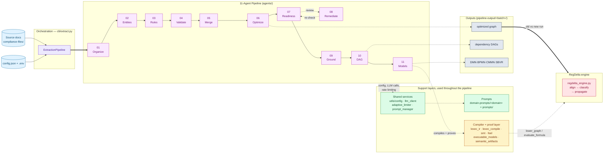
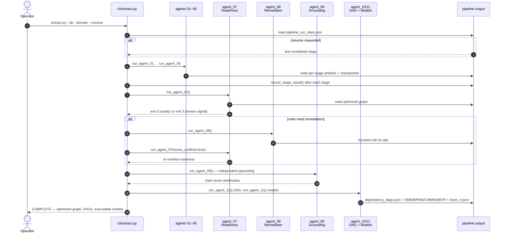
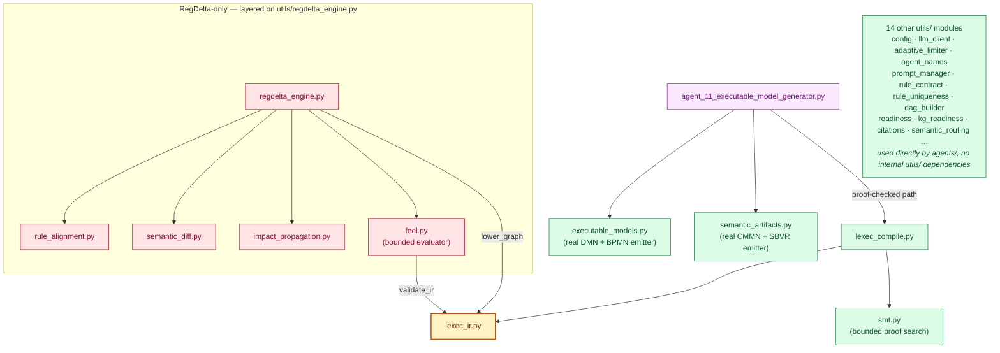
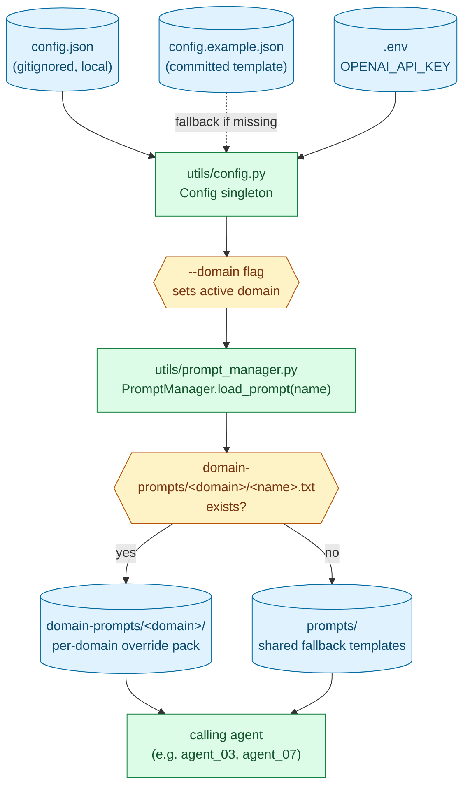
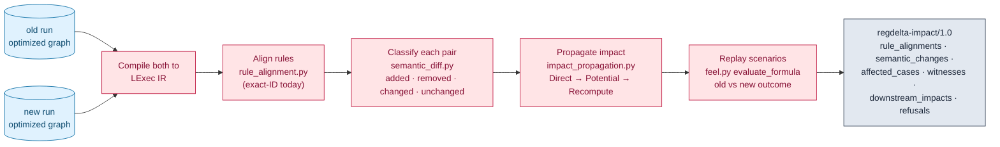

# Architecture

This document describes how Policy Logic Forge is put together: the
eleven-agent extraction pipeline, the shared services and compiler layer
underneath it, the RegDelta differential-execution engine layered on top,
and how configuration and prompts flow through all of it. For setup and CLI
usage, see [`README.md`](README.md).

## 1. System overview

Policy Logic Forge turns compliance policy text into a typed,
source-grounded knowledge graph, then optionally compares two versions of
that graph to report what actually changed. There are three moving parts:

- **The extraction pipeline** (`agents/`, orchestrated by `cli/extract.py`)
  — eleven agents run in a fixed sequence, each consuming the previous
  stage's output and writing its own artifacts under
  `pipeline-output/<batch>/`.
- **Shared services and the compiler layer** (`utils/`) — configuration,
  the LLM client, prompt resolution, and (for rules the compiler can
  represent) a fail-closed lowering to an intermediate representation with
  bounded proof search.
- **RegDelta** (`utils/regdelta_engine.py` and friends) — a
  differential-execution engine that compiles two graphs, aligns their
  rules, classifies what changed, and propagates impact through the
  dependency graph.



Two things worth noticing immediately:

1. **The compiler layer is additive, not required.** Agents 01–10 and most
   of agent_11 (the review-projection DMN/BPMN/CMMN/SBVR) never touch
   `lexec_ir.py`/`lexec_compile.py`/`smt.py`. Only the proof-checked side
   output (`lexec_ir.json`, `compilation_report.json`, `proof_records.json`)
   goes through the compiler, and a failure there never blocks or replaces
   the review-projection output.
2. **RegDelta consumes the pipeline's output, it doesn't run inside it.**
   It reads two already-completed runs' optimized graphs; nothing in
   `agents/` or `cli/extract.py` imports from `utils/regdelta_engine.py` or
   its dependencies.

## 2. The eleven-agent pipeline

### 2.1 Stage responsibilities

| Stage | Agent | Responsibility | Primary output |
| --- | --- | --- | --- |
| 01/11 | `agent_01` | Document organization | `agent_01-organized-documents/` |
| 02/11 | `agent_02` | Entity and relationship extraction | `agent_02-entities/` |
| 03/11 | `agent_03` | Business-rule extraction | `agent_03-rules/` |
| 04/11 | `agent_04` | Advisory rule validation | `agent_04-validation/` |
| 05/11 | `agent_05` | Rules/entities merge | `agent_05-rules-with-entities/` |
| 06/11 | `agent_06` | Knowledge-graph optimization (dedup + dependency analysis) | `agent_06-07-08-09-optimized/optimized_compliance_knowledge_graph.json` |
| 07/11 | `agent_07` | Executable-readiness gate (four invariants) | readiness report, embedded in the shared optimized directory |
| 08/11 | `agent_08` | Readiness remediation (only if agent_07 requests it) | focused rule fix-ups |
| 09/11 | `agent_09` | Independent grounding verification | claim-level certification |
| 10/11 | `agent_10` | Dependency-DAG generation, 100%-coverage guarantee | `agent_10-dag-generation/dependency_dags.json` |
| 11/11 | `agent_11` | DMN/BPMN/CMMN/SBVR generation + LExec compile | `agent_11-executable-models/` |

Stages 07–09 share one directory (`agent_06-07-08-09-optimized/`) because
they all read and write the same optimized graph; their stage IDs and
checkpoints stay distinct. The stage number and agent identifier are always
the same value — `--stage 9` and `--agent agent_09` select the same stage.

### 2.2 Execution flow, including the readiness/remediation loop



**Readiness exit code 3 is a review signal, not a crash.** The full
orchestrator runs remediation, then continues to independent grounding and
DAG generation once all four readiness invariants pass; affected rules
remain `requires_review: true` in the final artifacts rather than blocking
the run. A structural invariant failure (not remediable) still stops it.

### 2.3 Resume and checkpointing

Two independent mechanisms cooperate:

- **Stage-level resume.** After every stage, `ExtractionPipeline` writes
  `pipeline_run_state.json` at the batch root recording which of the nine
  resumable units (agents 01–06 individually, the 07→08→09 loop as one
  unit, then 10 and 11) completed successfully. `--resume` reads this file
  and restarts at the first incomplete unit; `--resume-from <stage>`
  overrides that explicitly. The 07→08→09 loop is always resumed from its
  start, never mid-loop.
- **Item-level resume, inside a single stage.** Agents 01, 03, 07, 08, and
  09 each maintain their own append-only JSONL checkpoint
  (`agent_07_rule_checkpoint.jsonl` and similar) keyed by a content
  fingerprint, so an interrupted stage skips already-processed items on its
  next invocation instead of redoing them — independent of whether the
  outer orchestrator is resuming or running that stage fresh.

A shared adaptive concurrency limiter (`utils/adaptive_limiter.py`) governs
API request pacing across every agent subprocess in a run, backed by a
SQLite file so concurrently running batches share one budget.

## 3. Module architecture (`utils/`)

Most of `utils/` is used directly by one or more agents with no interesting
inter-module structure. The part worth diagramming is the compiler layer,
because it is a genuine hub: `lexec_ir.py` is imported both by agent_11's
proof-checked compile path and by every RegDelta module that needs to read
or evaluate that IR.



Note the two independent DMN/BPMN emitters, which is easy to conflate:

- `utils/executable_models.py` + `utils/semantic_artifacts.py` produce the
  **real** `compliance_decisions.dmn`, `compliance_workflows.bpmn`,
  `compliance_reviews.cmmn`, and `semantic_vocabulary_profile.json` in
  every run. This path never touches the compiler.
- `lexec_compile.py` → `lexec_ir.py`/`smt.py` produce a **separate**,
  proof-checked `lexec_ir.json` for the subset of rules the compiler can
  represent (no unsupported `scope.predicate`, no unproved hit-policy
  table). It is additive and best-effort: a compiler failure never blocks
  or replaces the review-projection output above.

## 4. Configuration and prompt resolution



`config.json` is gitignored and local-only; `config.example.json` is the
committed, portable source of truth checked by `scripts/validate_config.py`.
`Config` is a process-level singleton (`utils/config.py`), mutated in place
by `set_batch_name`/`domain` — a real constraint for anything that might
want to launch concurrent batches from the same Python process: each batch
must be its own OS process, never an in-process call into
`ExtractionPipeline`. Six domains are registered in
`config.example.json`'s `domain.available` list; five have a dedicated
`domain-prompts/<domain>/` override pack, and `mortgage` falls back entirely
to the shared `prompts/` templates. `scripts/generate_benchmark_domain_prompts.py`
is the source of truth for the generated `.txt` packs — regenerate from it
rather than hand-editing the committed files.

## 5. RegDelta: differential-execution engine

Given two already-completed runs (an "old" and a "new" optimized graph),
RegDelta answers *what changed, for whom, and what else does it affect* —
without re-running the extraction pipeline.



Key design choices, since they're easy to get wrong by assumption:

- **Alignment is exact-ID only, today.** `rule_alignment.py` implements
  only the first stage of a five-stage alignment ladder (exact ID →
  source-section signature → predicate structure → semantic similarity →
  explicit review). It is sufficient when both runs share an ID namespace
  (a hand-edited fork of one graph); two independently re-extracted runs of
  the same document will not align well yet.
- **`Potential` is narrative reachability, not proven dependency.** It
  walks `agent_10`'s dependency-DAG edges, which are extraction judgment
  calls about *narrative* dependency between rules, not a shared data-flow
  symbol. `Recompute` is `Potential` minus anything still
  `requires_review`, so a rule that can't be safely re-evaluated is held
  for review rather than silently resolved.
- **RegDelta deliberately does not use `utils/feel.py`'s `evaluate_ir`.**
  That entry point forces `unknown` whenever a rule's scope carries
  jurisdiction/party/effective-date metadata (a tested safety property —
  the evaluator has no real-world runtime context). RegDelta instead calls
  the same module's side-effect-free `evaluate_formula` directly, because
  it's asking "does this rule's own logic differ between two snapshots,"
  not "is this rule in force for a real transaction."
- **Four-way status vocabulary, nothing silently dropped.** Every rule in
  scope resolves to exactly one of `changed`, `unchanged`,
  `unresolved-review`, or `refused-unsupported-construct` — refused and
  review-held rules stay in the denominator of every reported metric.

See [`plan/regdelta-product-plan.md`](plan/regdelta-product-plan.md) for the
full rollout plan and acceptance criteria.

## 6. Directory reference

```text
cli/                         orchestrators
  extract.py                   agent_01–agent_11 pipeline runner
  generate_executable_models.py  regenerate DMN/BPMN from an existing graph + DAGs
agents/                      one zero-padded module per pipeline agent
utils/                       shared services, compiler/proof layer, RegDelta engine
compliance-files/<domain>/   source documents (gitignored, local)
domain-prompts/<domain>/     per-domain extraction prompt overrides
prompts/                     shared prompts (v2 rule contract, readiness/grounding/remediation)
scripts/                     fixture builders, config/prompt-pack validators
fixtures/regdelta/           hand-labeled fixtures for RegDelta's acceptance tests
results/aggregates/          retained run-evidence manifests (metadata only)
docs/                        compiler/semantics notes + retained validation records
plan/                        RegDelta product plan + LExec IR schema
pipeline-output/<batch>/     run output (gitignored, regenerable)
tests/                       pytest suite
```

### `pipeline-output/<batch>/` layout

Mirrors the stage table in §2.1 exactly:

```text
pipeline-output/<batch>/
├── pipeline_run_state.json                    resume checkpoint
├── agent_01-organized-documents/
├── agent_02-entities/
├── agent_03-rules/
├── agent_04-validation/
├── agent_05-rules-with-entities/
├── agent_06-07-08-09-optimized/
│   ├── optimized_compliance_knowledge_graph.json
│   ├── kg_readiness_report.{json,md}
│   ├── kg_grounding_report.{json,md}
│   └── agent_0{7,8,9}_*_checkpoint.jsonl
├── agent_10-dag-generation/
│   └── dependency_dags.json
└── agent_11-executable-models/
    ├── compliance_decisions.dmn
    ├── compliance_workflows.bpmn
    ├── compliance_reviews.cmmn
    ├── semantic_vocabulary_profile.json
    └── lexec_ir.json, compilation_report.json, proof_records.json
```

## 7. Testing

No API key is required to run the suite — it tests contract validation,
readiness/grounding logic, dependency-DAG partitioning, prompt-pack
consistency, the LExec compiler/evaluator/proof search, and RegDelta's
alignment/diff/propagation engine against fixed graphs and prompt files, not
live extraction runs.

- **Unit/contract tests** (`tests/test_agent_*`, `test_lexec_*`,
  `test_smt_*`, `test_feel*`, `test_readiness*`) — one file per
  agent/module, run against synthetic fixtures.
- **RegDelta acceptance tests** (`test_regdelta_engine.py`,
  `test_mortgage_tier1_fixture.py`, `test_regdelta_tier1_fixtures.py`,
  `test_mortgage_tier2_extraction.py`) — assert 100% agreement with
  hand-labeled outcomes over `fixtures/regdelta/`, including that
  incremental recomputation exactly matches full replay.
- **Retained-run regression tests** (`test_pipeline_smoke_manifest.py`,
  `test_full_smallest_run_manifest.py`) — pin configuration, stage status,
  and content hashes from real provider-backed runs, retained under
  `results/aggregates/`.

```bash
.venv/bin/python scripts/validate_config.py
pytest
```
