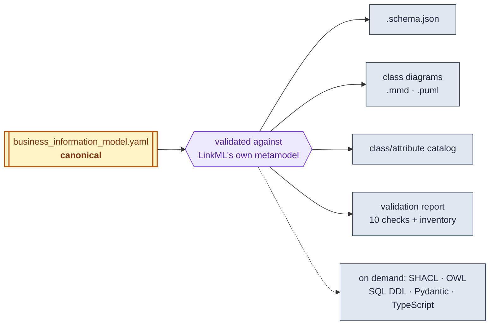

# Policy Logic Forge

**Live site:** [rrahimi-uci.github.io/policy-logic-forge](https://rrahimi-uci.github.io/policy-logic-forge/)

Turns compliance policy text into a typed, source-grounded knowledge graph:
every rule is extracted with structured conditions and outcomes,
independently verified against the source document, and partitioned into
dependency DAGs with a 100%-coverage guarantee. A differential-execution
engine (RegDelta) can then compare two versions of a policy and report which
rules and downstream cases actually changed.

For a detailed technical reference — per-stage responsibilities and
algorithms, module dependency graphs, configuration/prompt resolution, and
real DMN/BPMN/CMMN/SBVR examples — see [`ARCHITECTURE.md`](ARCHITECTURE.md).

```mermaid
flowchart LR
    classDef src fill:#e0f2fe,stroke:#0369a1,color:#0c4a6e,stroke-width:1px
    classDef ext fill:#fae8ff,stroke:#a21caf,color:#701a75,stroke-width:1px
    classDef gate fill:#fef3c7,stroke:#b45309,color:#78350f,stroke-width:2px
    classDef gen fill:#dcfce7,stroke:#15803d,color:#14532d,stroke-width:1px
    classDef out fill:#e2e8f0,stroke:#334155,color:#1e293b,stroke-width:1px

    DOC[("policy documents")]:::src

    subgraph EXTRACT["Extract · 01–06"]
        direction LR
        E["organize → entities → rules<br/>→ validate → merge → optimize"]:::ext
    end

    subgraph PROVE["Prove · 07–09"]
        direction LR
        R{{"readiness<br/>4 invariants"}}:::gate
        F["remediate"]:::gate
        V{{"independent<br/>grounding"}}:::gate
        R -.->|"review"| F -.->|"re-check"| R
        R --> V
    end

    subgraph PROJECT["Project · 10–13"]
        direction LR
        D["dependency DAGs"]:::gen
        M["DMN · BPMN · CMMN · SBVR"]:::gen
        I["LinkML information model"]:::gen
        P["self-contained HTML report"]:::gen
        D --> M --> I --> P
    end

    DOC --> EXTRACT --> PROVE --> PROJECT
    P --> OUT[("one report,<br/>every claim traceable")]:::out
```



**Extract** is the part an LLM does. **Prove** is the part that decides whether
to believe it — `agent_09` rebuilds each claim's evidence from the raw corpus
rather than trusting the citation a rule carries, so a hallucinated citation
cannot pass. **Project** turns what survived into standards-compliant models
and one report.

## What's here

**The extraction pipeline** — thirteen canonical agents, `agent_01` through
`agent_13` (document organization → entity/relationship extraction →
business-rule extraction → validation → merge → deduplication + dependency
analysis → four-invariant executable-readiness gate → focused remediation →
independent grounding certification → dependency DAG generation → DMN/BPMN/
CMMN model generation → LinkML business information model → self-contained business knowledge report). A lean CLI
orchestrator (`cli/extract.py`) runs them in order.

**RegDelta** — a rule-change/version differential-execution engine layered on
top: compile old and new versions of a policy to LExec IR, align rules,
classify semantic changes, and propagate impact through the dependency
graph. See [`plan/regdelta-product-plan.md`](plan/regdelta-product-plan.md).

**No UI.** This is a CLI-and-library tool; there is currently no web
frontend or backend service.

**Agent 12 business information model** — the typed picture of the business
*data* the rules operate on. Its canonical form is a [LinkML](https://linkml.io)
schema, because a schema can be **checked** where a UML diagram can only be read:



The schema is loaded back through LinkML's metamodel *before it is written*, and
every other artifact is generated from it — so the diagram, the catalog and the
JSON Schema cannot drift from the model or from each other.

Types come from what the rules declare, never from a name: a declared `unit`
gives `Money`, `Percentage` or `Duration`; a closed value set gives a named
enumeration even when the rule said `string`; only a variable with nothing
declared falls through to its name, and that is always flagged. Attributes the
pipeline cannot confidently place are held for review rather than filed under a
guess.

Two grouping axes need no domain knowledge to derive — classes by what kind of
thing they are (`entity`, `actor`, `event`, `process`, `value_object`), and
attributes by what kind of value they hold (`identifier`, `quantity`,
`temporal`, `categorical`, `flag`, `descriptive`). Both ship as LinkML
`subsets`, are counted in an `inventory` block, and become catalog columns. On a
real 832-rule privacy corpus that inventory says something useful immediately:
**70% of modelled attributes are `flag`s** — booleans recording whether a rule
passed rather than business state.

Where two rules describe the same attribute at different precisions — a closed
value set in one, a bare string in another — the narrower reading wins and the
difference is reported for review. Only genuinely irreconcilable types
(`Boolean` against an enumeration, `Money` against `Percentage`) are errors.

**Agent 13 report layer** — after Agents 11 and 12 have produced their bundles,
`agents/agent_13_business_knowledge_report.py` creates one self-contained
`business_knowledge_report.html`. The report provides tabbed SBVR vocabulary,
rule and score exploration, DMN/BPMN/CMMN coverage, dependency views, the
Agent 12 information model (class explorer, value-category distribution,
validation results and the embedded LinkML schema), embedded source chunks,
search/filter controls, and inline SVG visualizations. Each rule
receives a transparent 0–100 automation-readiness score derived from grounding,
contract, evidence, execution, and relationship signals. Agent 13 assigns no
pass/fail label or universal threshold; deployment owners interpret the score
for their environment and domain. It uses only graph-derived facts.

### Defects found and fixed along the way

Worth knowing about if you're comparing behaviour against an earlier version.

**Found by auditing the running pipeline's own output:**

- **Stage 12's exit 3 cost every run its report.** Exit 3 is the documented
  data-quality signal agents 07/08/09 use, and `agent_12` follows it — but the
  orchestrator treated it as fatal, so `agent_13` never ran on any graph with a
  validation finding.
- **Two agents reported success for work they did not do.** `agent_02` and
  `agent_03` printed "No documents found" and exited **0**, so an empty corpus
  passed three further stages before `agent_05` stopped it, blaming its own
  inputs rather than the stage that produced none.
- **The certified graph shipped references to rules that do not exist.**
  `related_rules` is written by the extraction model and was validated by
  nothing: an 832-rule run carried 18 references to 17 missing rule ids — 9 to
  rules deduplication had deleted, and **8 that never existed in any graph at
  any stage**. `agent_10` discarded them silently and reported
  `dropped_edges: 0`.
- **`--skip-optimize` was documented as working and was not** — `agent_09`
  hard-coded the optimized-graph path and died on an unhandled
  `FileNotFoundError`.
- **Type conflicts were over-reported 7×.** A closed value set in one rule and a
  bare string in another is an under-specification, not a contradiction; 24 of
  28 reported errors on a real run were of that kind.

**Found earlier, while building the extraction contract:**

- **P2** — the extraction prompt used to instruct the model to emit both v1
  prose (`conditions`/`consequences`) and the v2 structured contract
  (`condition_predicates`/`outcomes`/...) in the same request. Fixed at the
  source (`scripts/generate_benchmark_domain_prompts.py`) for every domain
  pack.
- **P3** — `contract_issues`/`requires_review` were stamped once at
  extraction time and never recomputed after `agent_07` normalizes legacy
  operator/value-type aliases, so a structurally clean rule could still carry
  stale "invalid operator" errors. `agent_07` now re-validates after
  normalization.
- **P6** — BPMN eligibility was first gated on a hardcoded, mortgage-shaped
  `rule_type` set and later over-corrected to `responsible_party` plus an
  output variable. Neither establishes process order. BPMN now requires a
  grounded, source-explicit trigger, actor role, direct evidence, and at
  least two ordered workflow steps. Rules without those semantics remain in
  DMN and record their BPMN omission reasons instead of becoming invented
  linear workflows.

## Quickstart

```bash
python3 -m venv .venv && source .venv/bin/activate
pip install -r requirements-dev.txt
cp config.example.json config.json
cp .env.example .env   # add your OPENAI_API_KEY

# The committed template defaults to gpt-5.6-luna with high reasoning.
# If config.json already exists, update its model/effort fields or recreate it
# from config.example.json; config.json is intentionally ignored.

# Put your own source documents under compliance-files/<domain>/ — no sample
# corpora are bundled. Pick one of the supported domains (see below), e.g.:
mkdir -p compliance-files/nda_confidentiality
cp /path/to/your/*.txt compliance-files/nda_confidentiality/

python3 cli/extract.py --dir nda_confidentiality --domain nda_confidentiality --target-rules 20
```

**Supported domains**: `nda_confidentiality`, `privacy_policy`,
`mobile_app_privacy`, `commercial_contracts`, `deonticbench` (each with its
own `domain-prompts/<domain>/` pack), and `mortgage` (uses the shared
`prompts/` fallback). `--dir` accepts either an absolute path or a name under
`compliance-files/`.

**Model provider**: OpenAI by default. Pass `--provider anthropic` (or set
`KG_PROVIDER=anthropic`) to run against Claude models instead — every agent
subprocess picks it up automatically. Requires `ANTHROPIC_API_KEY` (see
`.env.example`) and the `anthropic.models.*` block in `config.json` (see
`config.example.json`; defaults to `claude-sonnet-5`). Anthropic calls are
routed through [litellm](https://docs.litellm.ai/); OpenAI calls are
unaffected — they still use the OpenAI SDK directly, exactly as before. See
`utils/llm_client.py`'s module docstring for exactly what does and doesn't
translate across providers (`reasoning_effort`, token budgets, cost/cache
tracking).

The default runtime profile is tuned for high-throughput execution: 80
scheduling workers, 32 in-flight API requests (the shared adaptive limiter
starts at 16 and ramps to 32), and 32 document workers. Stage pools can queue
up to 80 tasks while the request gate bounds provider work. Requests have a
300-second timeout, a 900-second shared lease,
a 30-second watchdog margin, and a 10-second connection backoff. Grounding uses
12 relationship packets per request to keep prompts bounded. Operators can
override these values through the `KG_*` environment variables exported by
`cli/extract.py` (for example, `KG_GROUNDING_LLM_CONCURRENCY` or
`KG_OPENAI_TIMEOUT`).

Output lands under `pipeline-output/<batch-name>/`. When `--batch-name` is
omitted, a fresh run uses `<source-basename>-run-YYYY-MM-DD-HH-MM` in US
Pacific time (PST/PDT), for example `mortgage-run-2026-09-01-09-05`. Use an
explicit batch name when resuming a previous run.

- `agent_06-07-08-09-optimized/optimized_compliance_knowledge_graph.json` — the final,
  grounding-certified knowledge graph.
- `agent_06-07-08-09-optimized/kg_readiness_report.{json,md}` and
  `agent_06-07-08-09-optimized/kg_grounding_report.{json,md}` — the
  four-invariant self-report and the
  independent claim-level certification.
- `agent_10-dag-generation/dependency_dags.json` — every rule partitioned into
  one or more dependency DAGs, with an explicit, checked coverage guarantee.
- `agent_11-executable-models/` — DMN/BPMN/CMMN/SBVR review projections, plus
  a compiled, proof-checked LExec IR document for rules the compiler can
  represent (`lexec_ir.json`, `compilation_report.json`, `proof_records.json`).
- `agent_12-business-information-model/business_information_model.yaml` — the
  canonical LinkML schema of the business data the rules operate on, with
  `.schema.json`, Mermaid/PlantUML class diagrams, a class/attribute catalog and
  a validation report generated from it.
- `agent_13-business-knowledge-report/business_knowledge_report.html` — the
  self-contained human-review and exploration report generated from the Agent
  11 bundle. Open it directly in a browser; no server or network access is
  required.

### Numbering contract

The pipeline has one canonical sequence of thirteen stages. The stage number and
agent identifier are the same value, so `Stage 09/13` always means
`agent_09` (grounding verification). Use `--stage N` when selecting by number
or `--agent agent_NN` when selecting by identifier:

| Stage | Agent | Responsibility |
| --- | --- | --- |
| 01/13 | `agent_01` | Document organization |
| 02/13 | `agent_02` | Entity and relationship extraction |
| 03/13 | `agent_03` | Business-rule extraction |
| 04/13 | `agent_04` | Advisory rule validation |
| 05/13 | `agent_05` | Rules/entities merge |
| 06/13 | `agent_06` | Knowledge-graph optimization |
| 07/13 | `agent_07` | Executable-readiness gate |
| 08/13 | `agent_08` | Readiness remediation |
| 09/13 | `agent_09` | Independent grounding verification |
| 10/13 | `agent_10` | Dependency-DAG generation |
| 11/13 | `agent_11` | DMN/BPMN/CMMN model generation |
| 12/13 | `agent_12` | Business information model (LinkML schema; classes, typed attributes, enumerations) |
| 13/13 | `agent_13` | Self-contained business knowledge report |

Stages 07–09 intentionally write reports into the shared
`agent_06-07-08-09-optimized/` directory because they operate on the same optimized
graph. Their stage IDs and checkpoints remain distinct. The deprecated
`--step` option is retained only for older scripts; its fractional aliases do
not define the current pipeline numbering. Readers also accept the former
`agent_06-optimized/` name for retained historical bundles; new runs always
write the descriptive shared-directory name above.

Agent 13 is the post-pipeline presentation stage and is part of the canonical
extraction numbering contract. Generate it for an existing batch with:

```bash
KG_BATCH_NAME=my-batch KG_DOMAIN=privacy_policy \
  .venv/bin/python agents/agent_13_business_knowledge_report.py
```

Optional `--graph`, `--dags`, `--models-dir`, `--information-model-dir`,
`--organized-dir`, and `--output-dir` arguments allow generation from an
explicitly selected bundle.

Run a single stage with `--stage 9` or a single agent with `--agent agent_09`
(for example, to re-run grounding certification), or multiple stages in one
invocation with `--stages 7-12` (also accepts a list or a mix, e.g. `3,5,7`).
`--skip-optimize` skips `agent_06`–`agent_08`; independent `agent_09`
grounding still runs before `agent_10` DAG generation. There is no separate
`--resume` flag: re-running only the remaining stage(s) against the same
`--batch-name` reuses the earlier stages' already-written output and *is*
the resume workflow — see [`docs/cli.md`](docs/cli.md#recovering-from-a-mid-run-failure-no-separate---resume-flag)
for a worked example. The deprecated numeric `--step` selector remains
accepted for backwards compatibility and prints the canonical stage it maps
to. Every run also writes a `run_metrics.json` next to its other output with
per-stage/total timing, token, cost, and cache-hit metrics — see
[`docs/cli.md`](docs/cli.md) for the full CLI reference, output modes
(`--output json` for scripting), and troubleshooting guidance.

**Exit code 3 is a review signal, not a crash** — for agents 07, 08, 09 and 12.
The stage did its work and wrote its output; the result needs review. The
orchestrator runs remediation, then continues to grounding, DAG generation, the
information model and the report; affected rules keep `requires_review: true`
in the final artifacts. Structural invariant failures still stop the run.

Agent 03 uses the same code for the opposite meaning — extraction was
incomplete, partial artifacts are kept for resume — and there the run must
stop so no later stage consumes a partial graph. Exit **2** means a required
upstream artifact is missing, and every agent uses that one code for that one
condition, so a missing input is never mistaken for a crash. The full contract
is in [`ARCHITECTURE.md`](ARCHITECTURE.md#exit-code-contract).

## Structure

```text
cli/extract.py              `agent_01`–`agent_13` orchestrator
agents/                     one zero-padded module per extraction agent, ending in the
                            Agent 12 information model and the Agent 13 report layer
utils/                      config, LLM client, adaptive rate limiter,
                            rule contract + validator, readiness/grounding
                            helpers, dependency-DAG partitioning, the LExec
                            compiler/evaluator, and the RegDelta engine
prompts/                    shared prompts (the v2 rule contract, readiness/
                            grounding/remediation prompts) — apply to every domain
domain-prompts/<domain>/    per-domain extraction prompts, one dir per domain
                            with an override pack
scripts/generate_benchmark_domain_prompts.py
                            source of truth for the domain-prompt packs —
                            regenerate after editing a template, don't hand-edit
                            the committed .txt files
fixtures/regdelta/          hand-labeled fixtures for RegDelta's acceptance tests
tests/                      pytest suite
```

## Testing

```bash
.venv/bin/python scripts/validate_config.py
pytest
```

No API key needed — the suite tests contract validation, readiness/grounding
logic, dependency-DAG partitioning, and prompt-pack consistency against fixed
graphs and prompt files, not live extraction runs.

For a provider-backed one-document configuration smoke run, follow
[`docs/pipeline_smoke.md`](docs/pipeline_smoke.md).

## Author & License

© 2026 [Reza Rahimi](https://github.com/rrahimi-uci). Licensed under the
[MIT License](LICENSE).
