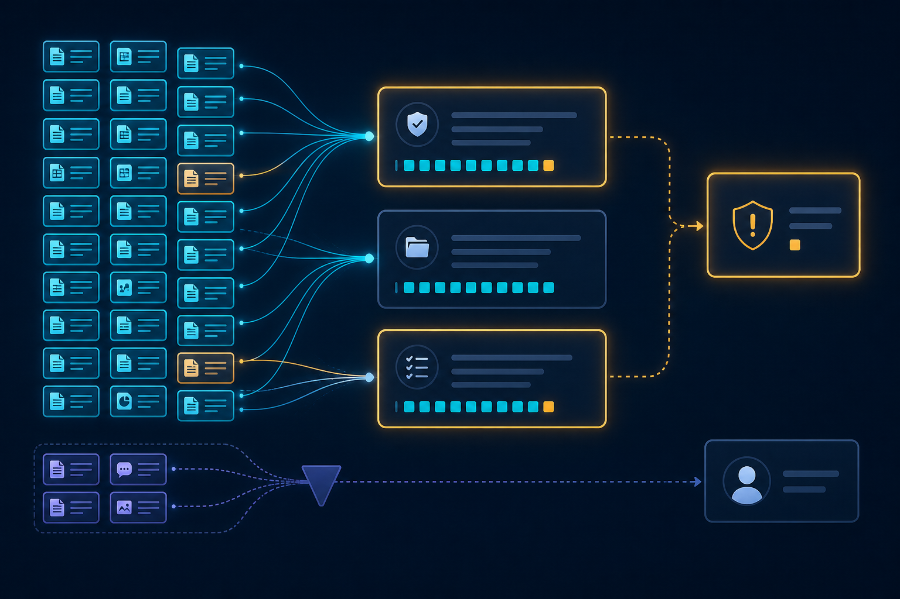
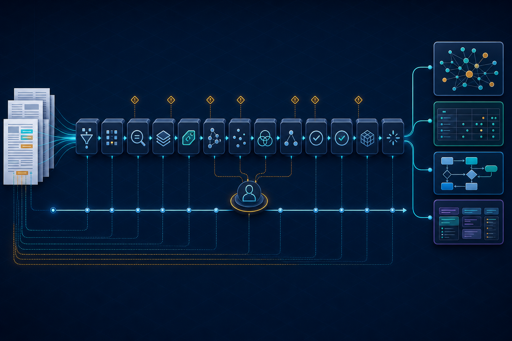

# 83% of My AI-Extracted Rules Failed Review. That Was the Most Valuable Result.

I fed a 1,191-page mortgage policy guide into an AI pipeline and asked it to turn the document into structured, executable business knowledge.

The result looked alarming:

**522 of 628 rules—83.1%—were placed on quality hold.**

My first reaction was probably the same as yours: *If 83% failed, did we build anything useful?*

But that number exposed a much more important problem than model accuracy. We were collapsing several fundamentally different questions into one metric:

- Does a rule point to a source?
- Is each claim supported by that source?
- Is the complete rule safe to execute automatically?
- Does a human actually need to make a judgment?

Those questions are not interchangeable.

Once we separated them, the same pipeline snapshot told a very different—and much more useful—story:

- **100%** of rules had source pointers.
- **91.9%** of individual grounding claims were supported.
- **17.7%** of complete rules passed strict whole-rule grounding certification.
- **13.1%** of rules required actual human review.
- **83.1%** remained on an automated quality hold.

The system was not saying, “A human must manually review 83% of everything.”

It was saying, “Most rules are not yet safe to promote into unattended execution.”

That distinction changed the architecture.

## The dangerous shortcut: treating a citation as proof

A source link proves that the pipeline found a passage. It does **not** prove that every part of the extracted rule is entailed by that passage.

Consider a seemingly simple policy rule:

> A lender must perform an annual review, retain evidence for seven years, notify the borrower within 30 days, and escalate unresolved exceptions to compliance.

That is not one claim. It may contain claims about:

- the responsible party;
- the triggering condition;
- the required action;
- the frequency;
- the retention period;
- the notification deadline;
- the exception path;
- the escalation recipient;
- the applicability scope; and
- the final outcome.

If the source directly supports nine claims but never states the seven-year retention period, the rule is mostly grounded—but it is not safe to execute as written.

This is why whole-rule certification falls much faster than claim-level support.

As a rough illustration, if a rule contains 26 required claims and each claim has a 91.9% chance of being supported, then under a simplifying independence assumption:

> Probability that the whole rule is supported ≈ 0.919²⁶ ≈ **11.1%**

Real claims are not independent, so this is not a performance estimator. It simply demonstrates the compounding effect: **high claim accuracy can coexist with low whole-rule certification.**

That is not a reason to weaken the gate. It is a reason to improve the representation.

## What we built: an evidence spine, not a chain of prompts

The project evolved into a 12-stage pipeline called **Policy Logic Forge**.

It does more than ask an LLM to “extract rules.” It progressively transforms documents into a typed, source-grounded knowledge system:

1. Organize and chunk source documents without losing corpus coverage.
2. Extract business entities and relationships.
3. Extract rules into a structured contract: conditions, outcomes, exceptions, scope, parties, variables, and test vectors.
4. Run advisory validation without hiding findings.
5. Merge rules and concepts into a knowledge graph.
6. Normalize, deduplicate, and analyze dependencies.
7. Test executable-readiness invariants.
8. Remediate only the identified readiness gaps.
9. Independently verify grounding at the claim level.
10. Partition every rule into dependency DAGs.
11. Generate standards-aligned decision, process, case, and vocabulary models.
12. Produce a self-contained HTML report for business review.

The important part is not the number of agents. It is the **evidence spine** connecting every transformation.

A reviewer should be able to move in both directions:

**Source passage → Concept → Rule → Decision or process model**

and

**Model element → Rule → Claim → Exact supporting passage**

Without that bidirectional trace, a beautiful diagram is just another hallucination surface.

## Why SBVR, DMN, BPMN, and CMMN belong together

Using only BPMN and DMN initially sounds sufficient: one models processes; the other models decisions.

In practice, two pieces are missing.

**SBVR gives the domain a shared language.** It separates governed business concepts from the thousands of low-level variables used inside individual decisions. This matters because a decision variable is not automatically a business concept, and a repeated label is not automatically a new concept.

One early report effectively presented more than 3,000 items as “concepts.” After separating semantic layers, the same snapshot showed **26 governed SBVR concepts** and **3,148 executable decision variables**. The volume had not disappeared; it had been classified honestly.

**CMMN represents work that cannot be reduced to a fixed flow.** Evidence collection, exception resolution, investigations, and human judgment are often case-driven. Forcing them into BPMN invents an order the source never specified.

The resulting division of responsibility is much cleaner:

- **SBVR:** What do the business terms mean?
- **DMN:** What decision follows from these inputs?
- **BPMN:** What explicitly ordered process does the source define?
- **CMMN:** What case work unfolds according to evidence and judgment?

The crucial phrase is **“when the source supports it.”**

The exporter deliberately refuses to generate BPMN for an obvious one-step obligation or for a rule with no source-evidenced sequence. A dependency graph is not a process model. Two rules being related does not prove that one happens after the other.

Sometimes the most accurate diagram is no diagram.

## The bugs that taught us the most

The hardest failures were rarely dramatic model hallucinations. They were contract mismatches between stages.

### 1. The prompt and validator disagreed

During a live Anthropic smoke test, entity extraction repeatedly failed because five entity categories had no `source_evidence` field.

At first, this looked like a provider-specific weakness.

The real cause was more embarrassing—and more valuable: the extraction prompt never requested the evidence field that the downstream validator required. One model had happened to volunteer it; another did not.

Changing providers did not create the bug. It revealed a hidden dependency on model behavior.

The fix was not “retry harder.” We corrected the shared prompt generator, regenerated every domain prompt pack, increased the output budget for the larger evidence-bearing contract, and added tests that pin the prompt to the validator schema.

### 2. Review flags became stale

Some rules were normalized successfully but retained old extraction-time errors. The pipeline was treating `requires_review` as permanent state instead of a derived result.

The fix was to recompute validation after normalization and remediation. Review status must describe the current artifact, not its history.

### 3. We almost invented workflows

An early BPMN rule used broad categories and dependency order as a proxy for process semantics. That produced plausible diagrams—but plausibility is exactly the danger.

Now BPMN requires a grounded trigger, an actor, direct evidence, and at least two explicitly ordered steps. Otherwise, the rule remains available in DMN or the knowledge graph, and the report records why BPMN was omitted.

### 4. Operational failures looked like quality failures

Long-running stages encountered empty responses, token-limit truncation, connection-pool pressure, and provider outages. If those failures are silently converted into “unsupported,” the quality metric becomes meaningless.

The pipeline now distinguishes:

- provider or transport failure;
- incomplete model response;
- schema or contract failure;
- insufficient source evidence;
- contradiction requiring judgment; and
- successful certification.

Checkpoints are bound to source and semantic fingerprints so a rerun can resume without reusing stale results from another corpus, model configuration, or contract version.

## Five principles I would carry into any enterprise AI system

### 1. Measure at the smallest defensible unit

“Rule accuracy” hides too much. Verify the condition, action, exception, scope, party, value, timing, and dependency claims independently.

### 2. Separate automation holds from human judgment

Missing evidence should block automatic execution. It should not automatically create a human-review ticket. Humans should receive ambiguity, contradiction, conflict, and explicit judgment work—not every mechanical defect.

### 3. Make uncertainty structural

Do not bury uncertainty in prose. Carry it through schemas, model exports, graphs, reports, and execution gates.

### 4. Generate less when less is truer

Do not create BPMN because the UI has a BPMN tab. Do not turn every variable into an SBVR concept. Do not infer a relationship merely to make the graph denser.

Precision is a feature.

### 5. Treat the model as a component, not the architecture

Provider portability is useful, but only behind stable internal contracts. A provider switch should test your prompts, schemas, token assumptions, finish reasons, usage accounting, retries, and grounding behavior—not simply change a model name.

## What “good” looks like now

The goal is not to force the review rate below 10% by relaxing thresholds.

That would improve the dashboard and weaken the system.

The goal is to reduce avoidable holds through:

- better concept normalization;
- smaller and more precise claims;
- explicit field-level evidence;
- bounded evidence packets;
- deterministic validation before model judgment;
- targeted remediation rather than full regeneration;
- correct separation of decision, process, and case semantics; and
- honest reporting of what remains unresolved.

A trustworthy pipeline should be allowed to say:

> “I found the rule, I can show you the passage, I understand most of its structure—and I still cannot prove this one part.”

That is not failure.

That is the beginning of accountable automation.

## The bigger lesson

Generative AI makes it easy to produce something that looks like knowledge.

Enterprise systems need something harder: **knowledge with provenance, contracts, uncertainty, and refusal boundaries.**

The most valuable moment in this project was not when the pipeline generated hundreds of rules, a knowledge graph, or polished DMN/BPMN/CMMN views.

It was when the dashboard showed 83.1% and forced us to ask what that number actually meant.

If your AI system cannot explain the difference between “found,” “supported,” “certified,” and “needs a human,” it is not ready to make business decisions—no matter how impressive its demo looks.

I’m continuing to develop [Policy Logic Forge](https://github.com/rrahimi-uci/policy-logic-forge) as an experiment in source-grounded, standards-aligned policy intelligence.

**What is the hardest trust problem you have encountered when moving an LLM prototype toward production?**

---

*Measurement note: The mortgage figures in this article describe one dated pipeline/report snapshot, not a general benchmark or a claim about all compliance domains. “SBVR” refers to the project’s SBVR-aligned semantic vocabulary profile, not a claim of complete SBVR interchange conformance. Generated models remain review projections unless independently validated in their target engines.*
