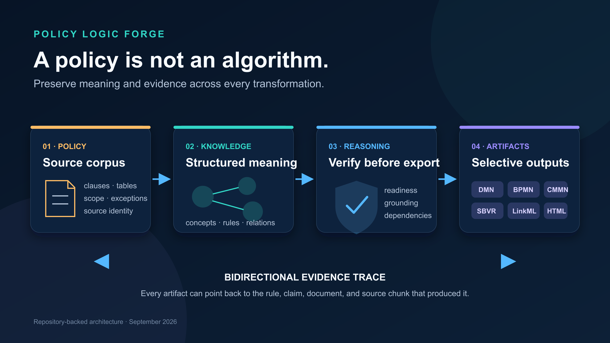
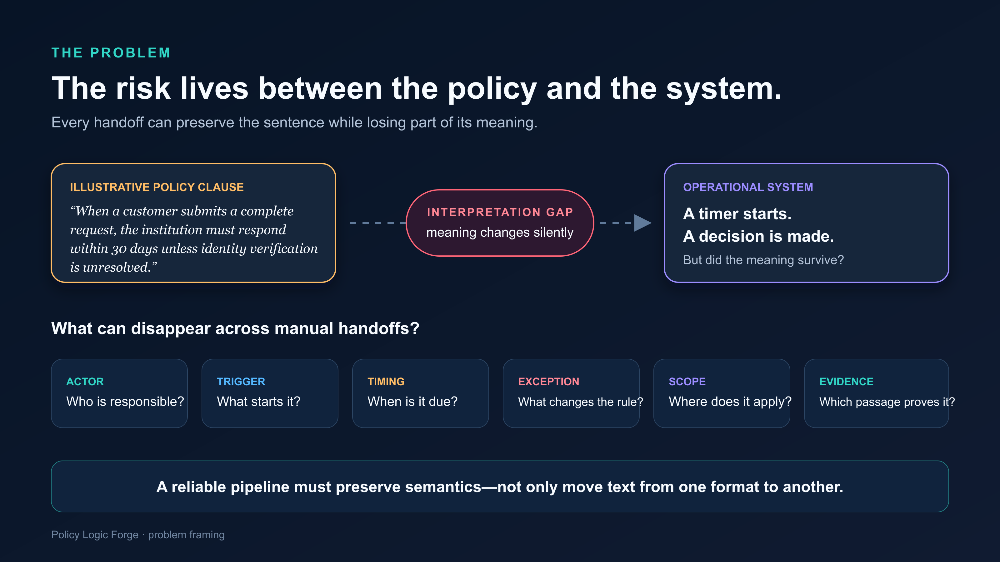
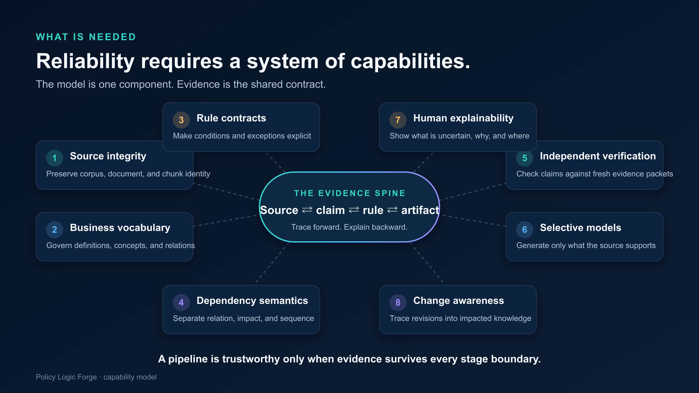
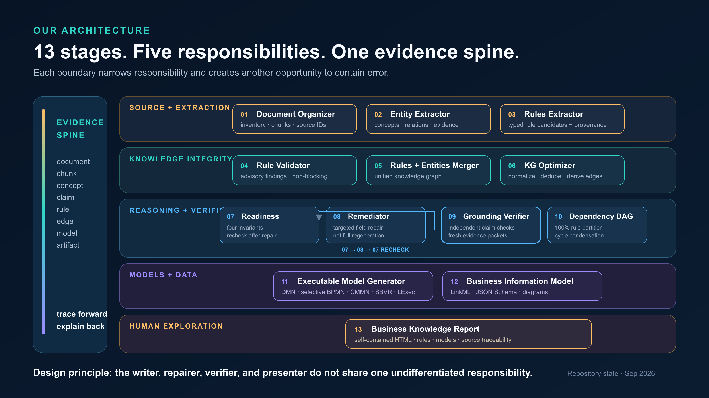
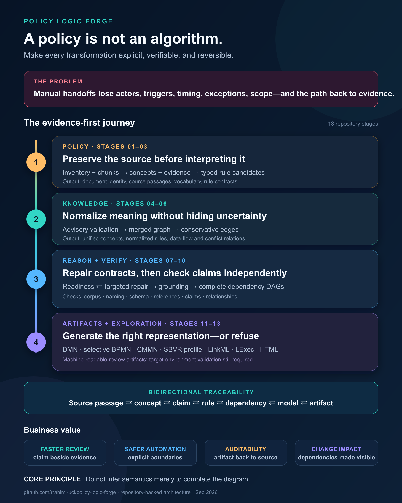

# A Policy Is Not an Algorithm: What It Takes to Turn Regulation Into Executable Systems

Most business systems do not implement a policy.

They implement **someone's interpretation of a policy**.

That distinction matters. Between a paragraph written by a regulator and a decision made by software, people must identify the governed concepts, separate obligations from exceptions, resolve dependencies, translate prose into logic, and decide what is safe to automate. Every handoff creates another opportunity to lose meaning.

This is already difficult for one document. In a regulated enterprise, the source material may span statutes, guidance, contracts, internal procedures, amendments, and product-specific instructions. The result changes over time, must survive audit, and may control decisions that affect a person's money, privacy, eligibility, or legal rights.

The challenge is therefore not simply:

> Can an AI read a policy document?

It is:

> Can a system transform policy into operational knowledge without breaking the chain of evidence—and can it show exactly where it is uncertain?

That is the problem behind **Policy Logic Forge**.

## The problem: policy meaning is lost in translation

Consider this illustrative clause:

> When a customer submits a complete request, the institution must respond within 30 days unless identity verification remains unresolved.

A person can read that sentence in seconds. A reliable system must make several meanings explicit:

- Who is responsible: the institution or a specific role?
- What event starts the clock: submission, receipt, or confirmation of completeness?
- What qualifies as a “complete request”?
- Is the deadline 30 calendar days or business days?
- Does unresolved identity verification pause the clock or remove the obligation?
- What response is required?
- Which products, customers, regions, and effective dates are in scope?
- Which exact source passage supports each answer?

Dropping only one of those details can change the outcome. A rule with the right action but the wrong trigger is not “mostly correct” when software executes it.

### Why the manual approach does not scale

Traditional policy implementation often resembles a relay race:

**Policy author → subject-matter expert → analyst → architect → developer → tester → auditor**

Each person creates a new representation: notes, spreadsheets, requirements, diagrams, tickets, code, and test cases. Those artifacts are useful, but the connection to the original evidence weakens with every translation.

The consequences are familiar:

- **Slow change:** a revised clause triggers a new round of analysis across teams and systems.
- **High cost:** scarce experts repeatedly explain the same policy in different formats.
- **Interpretation gaps:** conditions, exceptions, and scope qualifiers disappear between prose and code.
- **Inconsistent implementations:** two teams can encode the same clause differently.
- **Difficult audits:** reconstructing why a system behaved a certain way becomes forensic work.
- **Fragile maintenance:** teams know that a rule changed, but not which decisions, processes, data fields, or tests depend on it.

In highly regulated domains, these are not documentation inconveniences. They are operational and governance risks.

## What a reliable solution actually needs

An LLM that emits a list of plausible rules solves only the first few minutes of the problem. A dependable policy-to-system pipeline needs a set of connected capabilities.

| Capability | Question it must answer | Failure it helps prevent |
|---|---|---|
| Source integrity | Did we ingest and preserve the complete corpus? | Missing pages, tables, sections, or attachments |
| Shared business vocabulary | What do the governed concepts mean? | Duplicate terms and inconsistent interpretation |
| Structured rule contracts | What are the actor, trigger, conditions, action, exception, scope, and outcome? | Attractive prose that cannot be tested or executed |
| Dependency semantics | Which rules use, produce, constrain, or conflict with the same facts? | Hidden downstream impact and invented sequence |
| Independent verification | Does the cited evidence support each extracted claim? | Treating a nearby citation as proof |
| Selective model generation | Is this a decision, an ordered process, a case, or only a rule? | Forcing every requirement into the wrong notation |
| Human review and explainability | What is uncertain, why, and where is the evidence? | Review queues with no actionable context |
| Change awareness | What could a policy revision affect? | Revalidating everything—or overlooking impact |

These capabilities need a common backbone: an **evidence spine** that survives every transformation.

The system should support both directions of travel:

**Source passage → concept → rule → dependency → model → artifact**

and

**Artifact element → model → rule claim → exact supporting passage**

Without that reverse path, a polished decision table or process diagram is simply another place for unsupported meaning to hide.

## Our approach: separate extraction, reasoning, verification, and presentation

Policy Logic Forge is an open-source CLI and Python library built around a 13-stage pipeline. It is deliberately not one large prompt. Each stage has a narrower responsibility, a defined input/output contract, and a different opportunity to detect or contain error.

The stages form five architectural layers.

### 1. Preserve the source before interpreting it — Stages 01–03

The pipeline first inventories and chunks the corpus, preserving document and chunk identities. It then extracts a source-linked concept catalog and converts policy statements into structured rule candidates.

A rule contract can carry:

- natural-language description;
- conditions and logic trees;
- outcomes and effects;
- exceptions and scope;
- responsible parties;
- typed variables and predicates;
- source references and field-level evidence; and
- test vectors where the source supports them.

The design choice is important: extraction produces **candidates with provenance**, not declarations of truth.

### 2. Normalize the knowledge without hiding uncertainty — Stages 04–06

An advisory validator surfaces structural and source-pointer problems. Rules and concepts are then merged into a knowledge graph, normalized, and conservatively deduplicated. Deterministic logic derives relationships such as data flow, conflict candidates, and shared associations only where the available semantics justify them.

The system avoids using graph proximity as evidence of business order. Two rules can be connected without one happening before the other.

### 3. Repair contracts, then verify claims independently — Stages 07–10

Executable-readiness checks enforce four deterministic invariants:

- corpus integrity;
- naming consistency;
- schema consistency; and
- referential integrity.

A targeted remediator repairs only identified gaps, followed by a readiness recheck. The pipeline then builds fresh evidence packets from the raw corpus and independently evaluates rule claims such as description, condition, outcome, party, scope, and exception.

This separation is intentional. The component that wrote a rule should not be the only component judging whether the source supports it.

Finally, the dependency stage assigns every rule to exactly one directed acyclic graph. Cycles are condensed and dangling or invalid edges are reported instead of silently discarded.

### 4. Generate the right representation—only when justified — Stages 11–12

The pipeline produces different artifacts for different questions:

- **DMN 1.3** review projections for decision logic;
- **BPMN 2.0** only when the source provides explicit, multi-step process semantics;
- **CMMN 1.1** review cases for case-oriented or human-review work;
- an **SBVR-aligned vocabulary profile** for governed concepts and verb relationships;
- an internal, best-effort **LExec intermediate representation** with compilation and proof records; and
- a validated **LinkML business information model**, plus JSON Schema and diagram views.

Stage 12 separates the business information model from the rule graph. This matters because executable rules need stable data concepts, attributes, types, and relationships—not only prose and predicates.

### 5. Make the knowledge explorable — Stage 13

The final stage generates a self-contained HTML business knowledge report. It brings together the vocabulary, rule explorer, dependency graph, inline models, information model, review signals, metrics, and source chunks.

This is a presentation and review artifact, not a full collaborative workflow application. Its purpose is to let a subject-matter expert move through the knowledge without reconstructing the pipeline's internal files.

## Why use SBVR, DMN, BPMN, CMMN, LinkML, and LExec together?

No single notation answers every business question.

| Representation | The question it answers | How Policy Logic Forge currently uses it |
|---|---|---|
| SBVR-aligned profile | What do the business terms mean, and how are they related? | A deterministic vocabulary profile linked to concepts and rules |
| DMN | What decision follows from these inputs? | Decision-table review projections with traceability metadata |
| BPMN | What explicitly ordered work must occur? | Selective generation for grounded, prescriptive, multi-step processes |
| CMMN | What work unfolds as a case rather than a fixed sequence? | Simple review/case projections for case-oriented rules |
| LinkML | What business data structure do the rules depend on? | A validated schema with JSON Schema and diagram projections |
| LExec | Which compiled rule claims can be checked mechanically? | An internal best-effort IR and proof channel alongside standard artifacts |

The refusal boundary is as important as the export format.

Policy Logic Forge does not generate BPMN merely because two rules have a dependency. It requires an evidenced trigger, responsible actor, and at least two explicitly ordered steps. If those semantics are absent, omitting the diagram is more accurate than inventing one.

The same principle applies to vocabulary. A low-level decision variable is not automatically a governed business concept. Separating those layers keeps the SBVR view meaningful instead of turning it into a catalog of every symbol in every rule.

## Traceability is the product, not a footnote

In this architecture, evidence is not attached at the end for audit. It is carried through the rule contract and checked again before artifacts are promoted.

For a generated element, a reviewer should be able to ask:

1. Which rule produced this decision row, process task, case item, or schema field?
2. Which structured claim does that element represent?
3. Which document and chunk were cited?
4. Does the quoted text literally occur in the source packet?
5. Did an independent verifier support, contradict, or find insufficient evidence for the claim?
6. What remains a projection that still needs validation in its target engine or environment?

That final question prevents a dangerous category mistake: **machine-readable is not the same as production-ready**.

## What exists today—and what does not

Technical credibility requires a clear boundary between implemented capability and aspiration.

| Implemented in the repository today | Current limitation or future work |
|---|---|
| A fixed 13-stage CLI pipeline with checkpointed stage outputs | It is not a hosted, multi-user governance platform |
| Structured rule contracts with field-level source references | Extraction quality still depends on source quality and model behavior |
| Deterministic readiness invariants and targeted remediation | Readiness does not prove legal correctness |
| Independent claim-level grounding and literal quote checks | Literal support is stricter than pointer presence but is not full legal entailment |
| Conservative relationship derivation and complete DAG partitioning | Cross-corpus semantic alignment is not inferred automatically |
| DMN, selective BPMN, CMMN, and SBVR-aligned outputs | The SBVR artifact is a project profile, not full SBVR interchange conformance; CMMN is intentionally simple |
| LinkML, JSON Schema, and diagram generation | Generated schemas still require environment-specific ownership and integration decisions |
| Best-effort LExec compilation and proof records | LExec is an internal IR, and failure does not block the standard model artifacts |
| A self-contained traceability and review report | It does not replace expert approval or target-engine validation |
| RegDelta comparison, impact propagation, and scenario replay | Current alignment is exact-ID based, so independent-run semantic alignment remains future work |

The repository does **not** yet establish a universal accuracy rate, complete concept recall, legal correctness, or automatic deployability. Those claims require curated expert benchmarks and target-environment validation. This article intentionally makes none of them.

## What this architecture changes for the business

The immediate value is not “remove every human.” It is to give humans and systems a more reliable object to work with.

- **Policy experts** can review a structured claim beside its evidence rather than search an entire corpus.
- **Analysts** can see definitions, conditions, exceptions, and dependencies in one connected model.
- **Developers** receive typed, code-ready schemas and decision/process projections instead of ambiguous prose alone.
- **Testers** can connect scenarios and predicates back to the rule that motivated them.
- **Auditors** can follow an operational artifact back to a document and source chunk.
- **Change teams** can inspect graph impact before deciding what must be revalidated.

The aim is selective automation with explicit boundaries: automate what is sufficiently supported for a specific environment, route real ambiguity to people, and retain the evidence for both decisions.

## The complete journey

The infographic below summarizes the system as one continuous transformation: from policy text, through structured knowledge and independent verification, into selective executable and review artifacts—with traceability running in both directions.

## The larger lesson

Generative AI makes it easy to produce something that **looks** like business knowledge.

Regulated systems need something harder: knowledge with provenance, contracts, dependency semantics, verification, and refusal boundaries.

The most useful question is no longer “Can the model extract this policy?” It is:

> Can every operational claim explain where it came from, how it was transformed, what checked it, and what the system refused to assume?

That is the standard Policy Logic Forge is designed to pursue.

I am continuing to develop [Policy Logic Forge](https://github.com/rrahimi-uci/policy-logic-forge) as an open-source exploration of evidence-first policy intelligence.

**Where does policy meaning most often get lost in your organization: interpretation, implementation, testing, or change management?**

---

## Technical grounding

The architectural claims in this article map to implemented repository components:

- [Canonical stages and names](https://github.com/rrahimi-uci/policy-logic-forge/blob/main/utils/agent_names.py)
- [Structured rule contract](https://github.com/rrahimi-uci/policy-logic-forge/blob/main/utils/rule_contract.py)
- [Dependency semantics](https://github.com/rrahimi-uci/policy-logic-forge/blob/main/utils/rule_dependencies.py)
- [Readiness invariants](https://github.com/rrahimi-uci/policy-logic-forge/blob/main/utils/kg_readiness.py)
- [Independent grounding verifier](https://github.com/rrahimi-uci/policy-logic-forge/blob/main/agents/agent_09_grounding_verifier.py)
- [Complete DAG builder](https://github.com/rrahimi-uci/policy-logic-forge/blob/main/utils/dag_builder.py)
- [DMN and selective BPMN generation](https://github.com/rrahimi-uci/policy-logic-forge/blob/main/utils/executable_models.py)
- [CMMN and SBVR-aligned artifacts](https://github.com/rrahimi-uci/policy-logic-forge/blob/main/utils/semantic_artifacts.py)
- [LinkML business information model](https://github.com/rrahimi-uci/policy-logic-forge/blob/main/utils/information_model.py)
- [Self-contained HTML report](https://github.com/rrahimi-uci/policy-logic-forge/blob/main/agents/agent_13_business_knowledge_report.py)
- [RegDelta change analysis](https://github.com/rrahimi-uci/policy-logic-forge/blob/main/utils/regdelta_engine.py)

*Scope note: This article describes the architecture and contracts currently implemented in the repository as of September 2026. Generated models are review projections unless validated in their target engines and operating environment. “SBVR” refers to the project's SBVR-aligned vocabulary profile, not complete OMG SBVR interchange conformance. No numerical extraction-quality benchmark is claimed here.*
