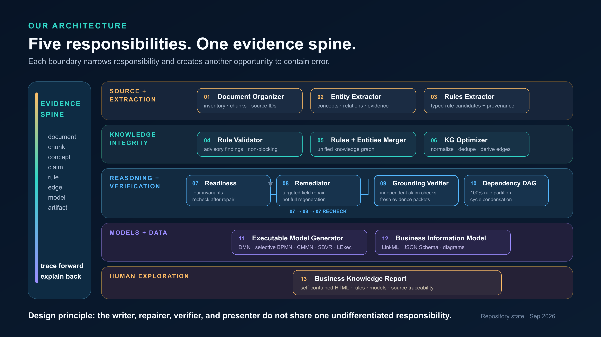
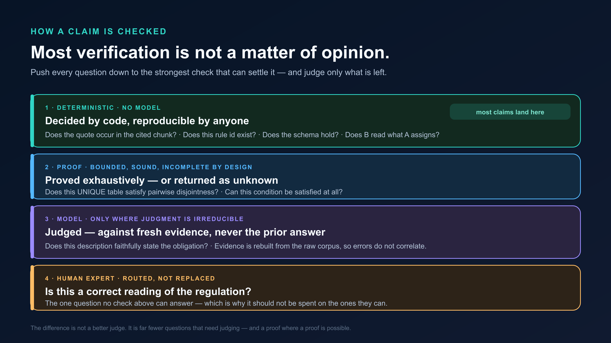
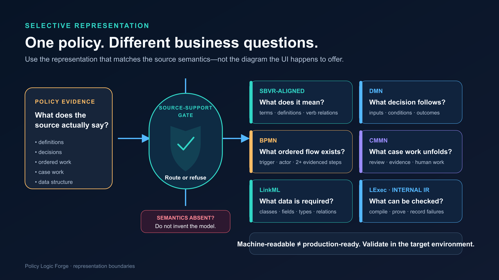
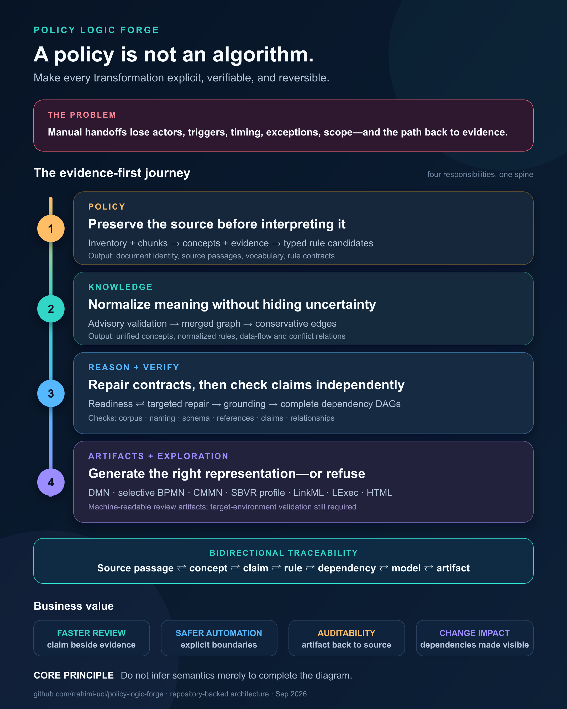

# AI Can Write the Rule. Where's the Proof?

For most of enterprise software's history, the expensive part was **producing** things. Writing the rule. Drawing the decision model. Designing the schema. Scarce experts, long timelines, a queue.

That constraint is dissolving. Hand a regulation to a model today and it returns all three in seconds — clean, structured, confident. So the interesting question is no longer *can it write the rule?* It is: **where's the proof?**

When anything can be generated, the artifact stops being the valuable thing. What becomes scarce is the ability to say where a claim came from, what independently checked it, and what the system refused to assume. In regulated industries, that is what decides whether you can deploy.

The danger is not output that is obviously wrong; review catches that. It is output that is **plausible**: a rule with the right action and the wrong trigger, or a condition that reads perfectly and cites a passage that does not support it. Fluency and correctness look identical on the page.

I built an open-source system to close that gap. What I learned was not how well it extracts, but how easily such a pipeline can look like it is working while producing confident nonsense.

## Most systems implement an interpretation, not a policy

Between a regulator's paragraph and a decision made by software sits a chain of people who must identify the governed concepts, separate obligations from exceptions, and decide what is safe to automate. Every handoff can lose meaning quietly, and nobody notices until an audit.

Take a clause common to every regulated domain:

> When a customer submits a complete request, the institution must respond within 30 days unless identity verification remains unresolved.

A person reads that in seconds. A system must make six things explicit before it can act:

- **Who** is responsible — the institution, or a role inside it?
- **What starts the clock** — submission, receipt, or confirmed completeness?
- **What counts** as a "complete request"?
- **Which days** — 30 calendar or 30 business?
- **What the exception does** — pause the clock, or remove the obligation?
- **Which exact passage** supports each answer?

Drop any one and the rule still reads correctly to a human — but once software executes it, the right action with the wrong trigger is not "mostly correct."

Traditional implementation is a relay race, and every runner rewrites the rule in a new form. So a revised clause triggers another full round of analysis, two teams encode the same rule differently, and when a rule changes, teams know *that* it changed but not which decisions, data fields, or tests depend on it. That is governance risk, not a documentation inconvenience.

An LLM does not fix this by writing the rules faster. If a model produces the same clean output whether or not the source supports it, then **no amount of prompting makes the output self-certifying** — you cannot ask the thing that wrote the rule whether the rule is true. The check has to come from somewhere the generation cannot reach: somewhere **deterministic**, giving the same verdict every time for reasons you can inspect, or **formal**, where a property is proved rather than assessed.

A trustworthy pipeline also needs an **evidence spine** running both ways — forward from source passage to artifact, and backward from any generated element to the exact passage behind it.

## The operating rule: decide, prove, judge, escalate

What matters is not the pipeline, but the rule it follows:

> **Decide as much as possible with code. Prove what can be proved. Ask a model only what genuinely requires judgment. Send a person only what survives all three.**

That ordering is the difference between output you can **re-derive** and output you can only **re-read**. It inverts the usual instinct: the model is the *last* resort before a human, and every stage exists to make its job smaller.

Five responsibilities, each a narrow stage with a defined contract:

- **Preserve the source before interpreting it.** Extraction produces rule *candidates with provenance* — conditions, exceptions, scope, source references — never declarations of truth.
- **Normalise knowledge without hiding uncertainty.** Rules and concepts merge into a conservatively deduplicated graph, where proximity is never treated as business order.
- **Repair contracts, then verify claims independently.** Deterministic invariants gate readiness; the system then rebuilds *fresh* evidence from the raw corpus and re-checks every claim, without trusting the citation the rule already carries.
- **Generate only the representation the source supports**, and refuse where it does not.
- **Make the result explorable** in one self-contained report an expert can navigate without opening an internal file.

One separation carries the weight: **whatever wrote a rule is never the only thing judging whether the source supports it.**

## "Isn't this just LLM-as-a-judge?"

Both familiar answers have problems. **LLM-as-a-judge** inherits the generator's blind spots, has no ground truth, and grades the quality the generator optimised for: plausibility. **Expert review** is the gold standard and does not scale — nobody reads several hundred rules by hand every time a policy changes.

The third position rests on one observation: **most verification questions are not matters of opinion.**

- *Does this quoted sentence literally occur in the cited chunk?* String resolution against the raw corpus — exact offsets, reproducible, no model.
- *Does every rule reference point at a rule that exists?* Set membership.
- *Does rule B actually read a value that rule A sets?* A mechanical dataflow test, not an impression of relatedness.
- *Can this condition be satisfied at all?* A solver question.

One obligation is settled by proof, not by a check. Every decision table declares a **hit policy**: `UNIQUE` means no two rules may ever match the same input, so an overlap is a live production bug — the kind that survives human review because you cannot see it by reading. That becomes a proof obligation of pairwise disjointness, discharged by exhaustive enumeration and recorded with its method, solver, and query hash, so anyone can re-run it. Where the domain is unbounded, the prover returns `unknown` rather than a comfortable green tick.

On a real corpus, **most relationship claims were settled by these checks alone** — not a better judge, but *far fewer questions that need judging.*

Where a model is genuinely required, it never sees the prior answer: evidence is rebuilt from the raw corpus, so its mistakes do not correlate with the generator's. Its verdict is labelled as a model verdict. The expert does not disappear; they get routed, and stop spending time on claims a string comparison could have settled.

One boundary matters more than any other: **none of this proves legal correctness.** The checks establish structure, provenance, and internal logical properties — never that a rule is a correct reading of the regulation. That judgment stays with a person — which is why it should not be spent on mechanically decidable questions.

### Proved, not tested

A test checks that one example behaved; a **proof** checks that no example can misbehave. Six properties here are proved by checking every case in a finite domain, not a sample — and the most legible one reads better as a decision table than as notation.

Rules 1–5 are instances; rules 6 and 7 are the property. **`Money` and `Percentage` are incomparable**: both are decimals, and a system that quietly reconciles them will eventually read a 3% rate as $3. That *cannot* happen here: the refusal is proved for every pair of types, not tested on the pairs someone thought of. If a system's whole argument is *"you can check my work,"* that has to include checking the checker.

## One quality score hides three questions

Ask *"is the extraction good?"* of a real corpus and there is no single honest answer, because it is three questions:

- **Does every rule point at a source?** Nearly always. Pointers are easy.
- **Is each claim supported by the source it points at?** Usually — a much stricter test.
- **Does the whole rule pass every check, end to end?** Far less often, because it fails if *any* claim falls short.

Lead with the first and the system looks finished; lead with the third and it looks broken. Both are true, which is why the system reports them separately rather than averaging them into one reassuring score.

**"Accuracy" is close to meaningless for evidence-critical AI unless you say which question you are answering.**

### The failure that changed my mind

The knowledge graph carried per-rule "related rules" lists written by the extraction model, and nothing validated them. Some pointed at rules that deduplication had removed. Others pointed at rules that had **never existed in any version of the graph at all.** The model had invented identifiers, every downstream stage passed them along, and the dependency builder discarded them while reporting nothing dropped.

Nothing crashed. No output looked wrong. Every artifact still rendered beautifully.

An integrity check now validates those references and records every drop with a reason. The lesson generalises: **in evidence-critical systems, the checks you do not write are the failures you do not see.**

## The right representation — or none at all

No single notation answers every business question, so the system picks the one the source can actually support: SBVR vocabulary for what terms mean, DMN for what decision follows, BPMN for explicitly ordered work, CMMN for case work, LinkML for the data behind the rules, and a compiled formal representation for what can be proved.

**The refusal boundary matters as much as the export format.** The pipeline will not emit a process model because two rules share a dependency; it requires an evidenced trigger, a responsible actor, and at least two explicitly ordered steps in the source.

On privacy policies that withholds the diagram for most rules — the correct outcome, because a privacy policy states obligations and rarely describes workflows. Sometimes the most accurate diagram is no diagram.

One more boundary: **machine-readable is not the same as production-ready.** A generated decision table is a reviewable projection, not a deployed artifact; it still has to be validated in its target engine.

## Where this goes

The competitive question in regulated AI is about to invert. For the last few years it has been *how much can we generate?* The next few will be about the question this article opened with — **where's the proof?** — which unpacks into: can every claim explain where it came from, what checked it, and what the system refused to assume?

Organisations that can answer will deploy. Those that cannot will keep producing impressive artifacts that never leave the review queue — not because the models were not good enough, but because nobody could defend the output.

One quieter property matters most in regulated work: **a deterministic check gives the same answer next quarter that it gave today** — which an audit depends on, and a model verdict cannot promise.

**Provenance is not documentation you add at the end. It is the thing you are actually building** — and you build it unglamorously, by moving claims out of judgment and into decision, one at a time, until what is left is the part that genuinely needed a person.

So, concretely: where does policy meaning most often get lost in your organisation — interpretation, implementation, testing, or change management?
