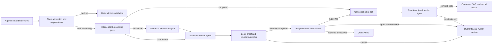

# Quality-Hold Reduction Program

> **Historical implementation plan.** This document preserves the terminology,
> stage numbering, and mortgage baseline used when the quality-improvement work
> was proposed. The current pipeline has 13 canonical stages and the public
> article uses a neutral Automation Readiness Score rather than presenting every
> unresolved signal as a “quality hold.” Treat the figures below as a dated
> diagnostic cohort, not as current product performance or a general benchmark.

## From 83.1% to 10% or less without weakening grounding

Status: Phase 0 and non-mutating Phase 1 foundation in development

Scope: domain-independent Policy Logic Forge pipeline behavior

Baseline cohort: `mortgage-full-2026-08-30`

Primary baseline artifact: `agent_06-07-08-09-optimized/kg_grounding_report.json`

Implementation status in the first PR:

| Foundation deliverable | Status |
| --- | --- |
| Exact integer quality budget and denominator reconciliation | Implemented and tested |
| Frozen mortgage baseline hashes and counts | Implemented and tested |
| Non-mutating target-consumer claim classification | Implemented and tested |
| Automatic quarantine | Deliberately not enabled until lineage and fixed-cohort gates exist |
| Evidence recovery, semantic repair, and independent re-certification | Planned for later isolated PRs |

Reproduce the baseline budget without running an LLM:

```bash
.venv/bin/python -m utils.quality_budget \
  --report pipeline-output/mortgage-full-2026-08-30/agent_06-07-08-09-optimized/kg_grounding_report.json \
  --target-rate 10 \
  --output pipeline-output/mortgage-full-2026-08-30/quality_budget_report.json
```

This command is diagnostic only. It validates the report contract and writes
the exact cohorts and integer delivery budget; it never changes a verdict,
review flag, graph, or generated model.

## 1. Executive decision

An 83.1% strict quality-hold rate is not acceptable for meaningful automation. The pipeline currently provides useful extraction and traceability, but most canonical rules cannot be promoted into unattended execution. Adding more generic LLM agents will not solve this by itself. More unconstrained generation would create more claims, more opportunities for unsupported detail, more latency, and a larger certification surface.

The recommended program adds **specialized, bounded roles** inside the existing 12-stage numbering contract:

1. Claim Requiredness Classifier
2. Evidence Recovery Agent
3. Semantic Repair Agent
4. Logic Proof and Counterexample Agent
5. Enrichment Quarantine Agent
6. Relationship Admission Agent
7. Independent Re-certification Agent

These are internal roles within Agents 06, 08, and 09—not new top-level stage numbers. This preserves the established rule that Stage 09 always means `agent_09` and avoids repeating the earlier numbering confusion.

The target is not achieved by hiding failures. It is achieved by changing the canonical knowledge lifecycle:

```text
extracted candidate
    -> classify each claim as required, optional, or derived
    -> validate derived claims deterministically
    -> recover source evidence for unresolved required claims
    -> minimally repair contradicted or malformed required claims
    -> quarantine unsupported optional claims and speculative edges
    -> independently re-certify the resulting canonical rule
    -> promote only certified execution profiles
```

The success threshold is:

- no more than **10% canonical rule quality holds** on a fresh full-corpus run;
- no more than **10% human-review routing**;
- no reduction in rule/source coverage;
- no increase in false certification on a fixed expert-adjudicated cohort;
- no promotion of quarantined claims or relationships into DMN, BPMN, CMMN, SBVR, LExec, or dependency DAG execution paths.

## 2. What the 83.1% baseline actually contains

The current mortgage artifact contains 628 rules:

| Metric | Baseline |
| --- | ---: |
| Strictly certified rules | 111 / 628 (17.7%) |
| Failed rules | 517 / 628 (82.3%) |
| Rules carrying any quality hold | 522 / 628 (83.1%) |
| Human-review rules | 82 / 628 (13.1%) |
| Total grounding claims | 22,303 |
| Supported claims | 20,703 (92.8%) |
| Contradicted claims | 174 |
| Insufficient-evidence claims | 1,426 |
| Invalid evidence records | 312 |
| Near-match evidence records repaired to corpus text | 3,136 |

The report contains 1,322 failed rule-level claims: 125 contradicted claims across 82 rules and 1,197 insufficient-evidence claims across 454 rules. Their union is 474 claim-bearing failed rules. The remaining 43 failed rules contain no failed claim verdict; they fail because verifier-returned evidence quotes cannot be matched literally to the cited corpus. All 517 failure records have unique rule IDs, so the report reconciles once evidence-authenticity failures are treated as a separate family. Relationship verification contributes another 278 failed claims.

| Rule-failure family | Affected rules | Required response |
| --- | ---: | --- |
| Contradicted or insufficient claim verdict | 474 | Recover evidence, minimally repair, or retain hold |
| Evidence-authenticity failure only | 43 | Bind evidence by immutable span ID; never accept model-generated quote text |
| All failed rules | 517 | Reconciled to the headline count |

### 2.1 Failed rule claims by semantic type

| Claim type | Failed claims | Affected rules | Main implication |
| --- | ---: | ---: | --- |
| Party | 376 | 274 | Actor/counterparty schema is over-broad; referenced objects are often treated as counterparties |
| Scope | 213 | 168 | Inferred applicability dimensions exceed what the cited passage states |
| Exception | 315 | 159 | Conjoined prohibitions and alternate outcomes are sometimes split into invalid independent exceptions |
| Description | 89 | 89 | Generated narrative is stricter or broader than the executable rule |
| Outcome | 142 | 87 | Polarity, enum/boolean normalization, or consequence boundaries drift |
| Condition | 91 | 60 | Predicate boundaries or conjunction/disjunction semantics drift |
| Test vector | 38 | 35 | Derived example is inconsistent with the declared rule contract |
| Execution projection | 58 | 29 | Derived model metadata is structurally incomplete |

Important cohort facts:

- 307 of the 474 claim-bearing failed rules fail only outside the current description/condition/outcome dimension.
- 157 rules fail only on party or scope claims.
- 102 rules fail only on description or party claims.
- 79 rules fail only on party claims.
- 256 rules have a failed condition, outcome, or exception claim.
- 348 rules have a failed decision-material claim when condition, outcome, exception, and scope are considered.

This establishes that there is no single threshold problem. There are at least five different failure families: optional metadata pollution, applicability ambiguity, logical extraction defects, evidence retrieval/alignment defects, and evidence-authenticity failures caused by quote text that is not a literal corpus span.

### 2.2 Relationship failures are a separate graph-quality problem

The report checks 5,956 relationship claims:

| Relationship metric | Baseline |
| --- | ---: |
| Deterministically supported | 5,247 |
| Sent to model verification | 709 |
| Failed model verification | 278 |
| Failed dependency claims | 239 |
| Failed conflict claims | 39 |
| Rules touched by failed relationships | 304 |

The current source already avoids blanket-failing independently grounded rules solely because an edge failed. That behavior must remain. The next improvement is to stop unverified candidate edges from entering the canonical dependency graph at all. Failed or unresolved edges belong in a relationship-candidate ledger, not in executable DAGs.

### 2.3 The numerical delivery budget

Ten percent of 628 rules is 62.8. Because the count must be an integer and the
rate must be 10% or less, the maximum acceptable final hold count is **62
rules**; 63 / 628 is 10.03% and does not pass.

The current failed-rule count is 517. Therefore the program must genuinely resolve or safely quarantine failures on at least:

```text
517 - 62 = 455 rules
```

Because the report has 522 total quality-hold rules, the end-to-end quality
route must clear at least 460 held rules to reach 62. Any plan that does not
account for roughly 455–460 rules cannot reach the target.

Human review must fall from 82 to at most 62 rules, requiring at least 20
contradicted-rule cases to be corrected, proven non-conflicting, or explicitly
withdrawn from the canonical knowledge graph. They cannot simply be
reclassified as machine repair.

## 3. Why the current architecture produces excessive holds

## 3.1 One strict status covers claims with different execution consequences

The verifier reports dimensions, but `grounding.status` still fails when any claim fails. A generated description, a referenced entity labeled as a counterparty, and an incorrect decision outcome can all produce the same whole-rule result.

That is correct for a claim that remains inside the canonical rule, but the pipeline lacks a first-class admission decision. Optional unsupported enrichment should not stay in the canonical rule and poison it. It should be removed into an auditable quarantine before final certification.

## 3.2 Requiredness is implicit instead of target-specific

Different execution targets require different semantics:

| Target | Required source-grounded semantics |
| --- | --- |
| DMN | applicability or equivalent predicates, conditions, condition logic, outcomes, material exceptions, types |
| BPMN | DMN/core rule where applicable, plus explicit trigger, actor, ordered steps, and workflow evidence |
| CMMN | case trigger, evidence requirements, discretionary/human tasks, milestones, and exit criteria |
| SBVR | concept kind, preferred term, definition, relationship, and concept-specific evidence |
| LExec | only constructs supported by the declared IR semantics and proof layer |

The responsible party may be essential for BPMN but irrelevant to a calculation-only DMN. A narrative description is useful for humans but should not determine whether typed predicates and outcomes can execute. A material exception, however, is always decision-critical and cannot be treated as optional enrichment.

## 3.3 Extraction creates plausible metadata that the source does not state

The largest failure cohorts are party, scope, and exception fields. The sample failures show recurrent patterns:

- an object or affected entity is emitted as a `counterparty`;
- a document-level or inferred scope is emitted as if the cited passage explicitly stated it;
- a multi-predicate exception is split into several independent exceptions;
- an outcome value is copied back as an exception predicate;
- a broad generated description asserts more than the structured conditions and outcomes.

Retries reproduce these structural mistakes because the same prompt contract asks for the same over-complete object.

## 3.4 Evidence selection is too late

Extraction proposes a complete rule and attaches evidence afterward. When evidence is missing, later stages attempt to prove an already-expanded object. The safer order is evidence-first for every source-bearing field:

```text
candidate evidence spans -> atomic claim -> structured representation
```

not:

```text
large generated rule -> search for something that may support it
```

## 3.5 Relationship generation overstates semantic edges

Shared subject matter, co-occurrence, or a plausible operational ordering does not establish a dependency. Candidate graph relationships need an admission contract that distinguishes:

- deterministic data dependency;
- explicit source-stated ordering;
- shared-variable interaction;
- possible semantic association;
- unresolved candidate.

Only the first three, with their required evidence, should enter the canonical graph.

## 3.6 Repair happens before independent grounding reveals the actual failures

Agent 08 remediates readiness findings, then Agent 09 performs independent grounding. The pipeline has no bounded post-grounding recovery loop. As a result, recoverable evidence gaps become final holds even when a targeted evidence search or minimal patch could resolve them.

## 4. Target architecture



### 4.1 Preserve the 12 canonical stages

The specialized roles are components, not new numbered pipeline stages:

| Existing stage | Added internal responsibility |
| --- | --- |
| Agent 03 | evidence-first atomic claim extraction and claim requiredness hints |
| Agent 04 | deterministic claim/schema validation and coverage checks |
| Agent 06 | relationship candidate generation and deterministic admission |
| Agent 08 | readiness repair plus grounding-failure patch application when invoked by the bounded loop |
| Agent 09 | independent verification, recovery orchestration, re-verification, and final certification |
| Agent 10 | DAG generation from admitted relationships only |
| Agent 11 | target-profile admission and model export |
| Agent 12 | strict, automation-profile, quarantine, and human-review metrics |

## 5. New claim lifecycle and data contracts

Every atomic claim receives a stable `claim_id` and one lifecycle state:

```json
{
  "claim_id": "scope:loan_types:0",
  "field_path": "applicability_scope.loan_types[0]",
  "claim_type": "scope",
  "value": "manufactured home loan",
  "origin": "model_extracted",
  "required_for": ["dmn"],
  "requiredness_reason": "not represented by any admitted condition predicate",
  "evidence_ids": ["EV-..."],
  "verification": {
    "status": "supported",
    "verifier_model": "...",
    "corpus_sha256": "..."
  },
  "admission": "canonical"
}
```

Allowed admission states:

- `canonical`: supported source claim or deterministically valid derived claim;
- `quarantined_optional`: unsupported claim not consumed by any execution target;
- `unresolved_required`: required claim that blocks its target profile;
- `human_conflict`: contradicted or ambiguous material claim;
- `withdrawn_duplicate`: duplicate content retained only in the audit ledger.

### 5.1 Requiredness rules

Requiredness must be deterministic and schema-driven. It must not be decided by the same LLM that wants to remove a failed claim.

Examples:

- `description`: presentation-only; never required for execution certification.
- `counterparties`: optional unless referenced by a condition, outcome, workflow actor, case role, or permission boundary.
- `responsible_party`: required for BPMN/CMMN; optional for a pure DMN calculation when no actor semantics are consumed.
- `applicability_scope`: required when its values are not already represented by admitted predicates. If equivalent predicates exist, scope metadata is derived and checked deterministically.
- `exceptions`: required whenever they change applicability, conditions, or outcomes.
- `test_vectors`: derived; validated against variables, conditions, exceptions, and outcomes rather than quoted from source prose.
- `recommended_hit_policy`: derived; proved against the admitted decision rows.

### 5.2 Quarantine contract

Quarantine is not deletion. Each entry records:

```json
{
  "rule_id": "...",
  "claim_id": "counterparty:0",
  "original_value": "LENDER",
  "reason": "no eligible evidence entails a counterparty role",
  "required_for": [],
  "source_candidate_hash": "...",
  "repair_attempts": 2,
  "adjudication": "quarantined_optional",
  "created_at": "..."
}
```

Agent 11 and the compiler must assert that no quarantined claim is consumed by an exported model. Agent 12 must display quarantined claims and their reasons.

## 6. Specialized agent designs

## 6.1 Claim Requiredness Classifier

Type: deterministic service, not an LLM call.

Responsibilities:

1. Decompose each rule into stable atomic claims.
2. Map claims to execution consumers.
3. Detect when scope/party metadata is already represented in typed predicates or workflow semantics.
4. Mark claims required, optional, or derived for each model target.
5. Fail closed on unknown consumer mappings.

Proposed module: `utils/claim_admission.py`.

Required tests:

- every exported DMN field maps to an admitted claim;
- material exceptions can never be optional;
- scope is optional only when equivalent admitted predicates exist;
- an unrecognized field defaults to required/unresolved, never optional;
- claim IDs remain stable under JSON key ordering.

## 6.2 Evidence Recovery Agent

Type: retrieval plus bounded LLM selection.

It receives only unresolved required claims, not whole rules. It cannot change the claim. It can only return immutable evidence IDs from the indexed corpus.

Retrieval sequence:

1. Existing field evidence.
2. The cited chunk.
3. Adjacent chunks in the same section.
4. Section-title and cross-reference targets.
5. Hybrid lexical/entity/predicate search over the corpus.
6. Bounded reranking.

The model selects from evidence IDs. Deterministic code owns the quote. A selected evidence record must be a literal corpus span.

Limits:

- maximum 12 candidate spans per claim;
- maximum 8,000 evidence characters per claim;
- maximum two recovery attempts;
- no generated quotations;
- no corpus-wide text packet;
- checkpoint key includes claim value, corpus hash, retrieval version, model, provider, and prompt hash.

Proposed module: `utils/evidence_recovery.py`; prompt: `grounding_evidence_recovery.txt`.

## 6.3 Semantic Repair Agent

Type: bounded patch proposer.

It receives one contradicted or still-insufficient required claim, admitted evidence, and the surrounding rule contract. It returns a minimal JSON Patch plus a justification. It cannot add an assertion without an evidence ID.

Permitted operations:

- correct a predicate operator/value/type;
- restore conjunction/disjunction grouping;
- normalize outcome polarity or enum value;
- merge incorrectly split exception predicates;
- remove an unsupported optional value;
- move an entity from `counterparties` to a non-executable referenced-entity sidecar;
- narrow a generated description to the admitted structured semantics.

Forbidden operations:

- add an uncited condition, outcome, exception, scope, actor, or deadline;
- weaken a prohibition or obligation;
- silently remove a required claim;
- change more than one semantic unit per patch;
- certify its own patch.

Proposed module: `utils/semantic_repair.py`; prompt: `grounding_semantic_repair.txt`.

## 6.4 Logic Proof and Counterexample Agent

Type: deterministic validators first; model explanation only when necessary.

Every proposed patch must pass:

- Rule v2 schema validation;
- predicate-reference integrity;
- variable type consistency;
- outcome domain checks;
- exception reachability;
- test-vector execution;
- DMN hit-policy analysis;
- pairwise overlap/contradiction checks where supported by the SMT layer;
- before/after counterexamples proving the exact semantic change.

For a repair that merges `A` and `B` into exception `A AND B`, the ledger must record a counterexample showing why treating `A` alone as an exception was over-broad.

Proposed changes: extend `utils/rule_contract.py`, `utils/smt.py`, and `utils/feel.py`.

## 6.5 Enrichment Quarantine Agent

Type: deterministic policy engine.

After recovery and repair are exhausted:

- unsupported optional claims move to quarantine;
- unsupported required claims remain on quality hold;
- contradicted required claims route to human review;
- the raw candidate remains immutable in the audit ledger;
- the canonical rule is regenerated from admitted claims only and independently re-certified.

This agent is the largest opportunity for safely clearing rules that fail only on display text, unused counterparties, or other non-consumed metadata. It must never quarantine material scope or exception semantics merely to improve the rate.

## 6.6 Relationship Admission Agent

Type: deterministic gate plus bounded independent verification.

Candidate edges enter one of these states:

- `admitted_deterministic`;
- `admitted_source_explicit`;
- `admitted_shared_variable`;
- `candidate_unverified`;
- `rejected`.

Only admitted edges enter Agent 10 DAGs. A dependency requires one of:

- an output-to-input variable link;
- an explicit source-stated ordering or dependency;
- a structurally proved prerequisite.

Shared topic, similar entities, or plausible workflow order is insufficient. Conflict admission requires overlapping applicability and contradictory typed outcomes, not merely different values with unknown co-firability.

Proposed changes: `agents/agent_06_knowledge_graph_optimizer.py`, a new `utils/relationship_admission.py`, Agent 09 relationship packets, and Agent 10 input filtering.

## 6.7 Independent Re-certification Agent

The final verifier must be independent from evidence recovery and repair:

- fresh request context;
- no repair rationale exposed as proof;
- immutable post-patch claim packet;
- optionally a different model/provider for high-risk claims;
- exact one-response-per-claim protocol;
- no certification when responses are missing, duplicated, or truncated.

The final verifier writes both strict knowledge certification and target-specific automation certification.

## 7. Grounding and automation statuses

Do not replace the existing strict status. Add explicit statuses:

```json
{
  "grounding": {
    "strict_status": "partial",
    "decision_automation_status": "certified",
    "process_automation_status": "not_applicable",
    "case_automation_status": "not_applicable",
    "presentation_status": "partial",
    "quarantined_claim_count": 1
  }
}
```

Definitions:

- `strict_status=certified`: every canonical claim and admitted relationship is certified.
- `decision_automation_status=certified`: every field consumed by DMN/LExec is certified and no material applicability/exception gap remains.
- `process_automation_status=certified`: all BPMN-consumed semantics are certified.
- `case_automation_status=certified`: all CMMN-consumed semantics are certified.
- `presentation_status=partial`: non-executable narrative or vocabulary enrichment is unresolved.

The headline **quality-hold rate** remains based on canonical required claims. Optional quarantined claims are reported separately and visibly. A rule cannot be counted as automation-ready if its target consumes a quarantined or unresolved claim.

## 8. Bounded post-grounding recovery loop

Agent 09 should orchestrate this loop:

```text
initial independent verification
    -> classify failures
    -> recover evidence for insufficient required claims
    -> propose minimal patches for contradicted/malformed claims
    -> deterministic proof and contract validation
    -> quarantine optional unresolved claims
    -> independent re-verification
    -> stop after success or two passes
```

Stop conditions:

- all required claims certified;
- no valid patch is produced;
- the same semantic patch repeats;
- repair would remove or weaken a required obligation;
- two passes are exhausted;
- provider response protocol is incomplete;
- corpus or schema hash changes mid-run.

Every pass writes `repair_ledger.jsonl`; only the last independently certified graph becomes canonical.

## 9. Coverage and anti-gaming invariants

The hold rate is invalid unless all invariants pass:

1. **Rule retention:** final canonical rules / baseline candidate rules >= 99%, excluding proved duplicates with ledger entries.
2. **Source coverage:** every source chunk included in the baseline remains processed; no dropped batches.
3. **Required-claim coverage:** every detected obligation/prohibition/permission retains its material conditions, outcomes, exceptions, and applicability.
4. **Quarantine isolation:** no quarantined claim reaches an executable model or DAG.
5. **No silent deletion:** every removed field value appears in the quarantine or duplicate ledger.
6. **Evidence authenticity:** every quoted span is a literal substring of the indexed corpus.
7. **Response completeness:** zero missing, duplicate, or unexpected verifier results.
8. **Checkpoint compatibility:** corpus, schema, prompt, provider, model, requiredness policy, and retrieval versions are fingerprinted.
9. **Fixed-cohort non-regression:** before/after precision is evaluated on the same frozen expert-labeled rules.
10. **Cross-domain acceptance:** no domain-specific prompts, thresholds, field names, or mortgage vocabulary in shared logic.

Any failed invariant makes the run ineligible for the <=10% success claim.

## 10. Evaluation protocol

## 10.1 Freeze the baseline

Create `quality-baselines/mortgage-20260830.json` containing:

- source corpus hash;
- candidate rule IDs and hashes;
- baseline grounding report hash;
- model/provider/reasoning configuration;
- prompt and schema versions;
- counts in Section 2;
- a stratified sample manifest.

No implementation is evaluated against a moving extraction cohort.

## 10.2 Expert-adjudicated sample

Sample at least 300 rules, stratified by:

- certified versus failed;
- claim type;
- rule type;
- source section;
- human, case-management, and machine routes;
- short and long claim packets;
- relationship involvement.

For each required claim, label supported, contradicted, insufficient, or incorrectly decomposed. Use two independent reviewers for material conditions, outcomes, exceptions, and conflicts; adjudicate disagreements.

Primary quality criterion:

- zero critical false certifications;
- automation precision point estimate >=97%;
- lower 95% confidence bound >=95%;
- no more than a 2-point non-inferiority loss in required-claim recall versus baseline;
- inter-reviewer agreement reported, not hidden.

## 10.3 Cross-domain regression suite

Run fixed cohorts from:

- mortgage;
- privacy policy;
- mobile-app privacy;
- commercial contracts;
- NDA/confidentiality;
- DeonticBench.

No shared change is accepted when it improves mortgage by relying on mortgage-specific vocabulary or worsens another domain beyond the non-inferiority margin.

## 10.4 Required metrics

| Metric | Target |
| --- | ---: |
| Canonical quality-hold rate | <=10% |
| Human-review rate | <=10% |
| Required-claim support | >=99% |
| Invalid evidence records | 0 |
| Missing/duplicate verifier responses | 0 |
| Source chunk coverage | 100% |
| Rule retention | >=99% |
| Quarantined claim leakage into models | 0 |
| Unverified edge leakage into DAGs | 0 |
| Critical false certifications in expert sample | 0 |

The 10% hold target is a release criterion, not a threshold used inside the classifier. Internal thresholds must be chosen on a separate calibration cohort.

## 11. Implementation sequence

Each phase is a separate PR. Do not combine schema migration, LLM repair, graph admission, and metric changes into one unreviewable patch.

### Phase 0 — Baseline and quality budget

Deliverables:

- `utils/quality_budget.py`;
- baseline manifest schema;
- field/rule/route/relationship cohort report;
- fixed-cohort hashes;
- CI test that fails if denominators or source coverage disappear.

Exit gate: current 83.1% is reproduced from artifacts, and all improvement claims use the same denominator. The first PR satisfies the deterministic measurement portion of this gate; the expert sample manifest remains a follow-up before automatic quarantine is enabled.

The gate also reconciles all 517 rule failures as 474 claim-verdict failures plus 43 evidence-authenticity-only failures. A report with duplicate rule IDs, missing failure records, or unexplained claim-free failures is rejected rather than scored.

### Phase 1 — Claim admission and requiredness

Deliverables:

- `utils/claim_admission.py`;
- claim lifecycle schema;
- execution-consumer mapping;
- target-specific certification fields;
- Agent 11 hard assertion against quarantined inputs;
- Agent 12 strict versus automation metrics.

Behavior remains fail-closed. No automatic quarantine yet.

Exit gate: every claim has one requiredness/admission state and every exported field has a certified lineage.

### Phase 2 — Safe optional quarantine

Start with the lowest-risk cohorts:

- generated descriptions;
- unused counterparties;
- duplicated referenced entities;
- presentation-only metadata;
- rejected relationship candidates.

Exit gate: all removals are ledgered, no required claim is quarantined, and fixed-cohort recall is non-inferior.

### Phase 3 — Evidence recovery

Deliverables:

- hybrid evidence retrieval;
- section adjacency/cross-reference traversal;
- immutable evidence-ID selection;
- bounded recovery prompts and checkpoints;
- retrieval recall evaluation.

Exit gate: evidence recovery resolves a material share of insufficient required claims without increasing invalid evidence.

### Phase 4 — Semantic repair and proof

Prioritized cohorts:

1. outcome polarity and enum/boolean normalization;
2. conjunction/disjunction errors;
3. incorrectly split exceptions;
4. redundant versus material scope;
5. actor/reference-role normalization.

Exit gate: every applied patch passes deterministic proof, independent re-verification, and before/after semantic-diff recording.

### Phase 5 — Relationship admission

Deliverables:

- candidate/admitted relationship stores;
- deterministic data-flow edges;
- source-explicit ordering checks;
- conflict co-firability checks;
- Agent 10 admitted-edge-only DAGs.

Exit gate: no unverified relationship enters executable DAGs, while dependency recall on the expert sample remains within the non-inferiority margin.

### Phase 6 — Bounded recovery orchestration

Deliverables:

- Agent 09 recovery loop;
- Agent 08 grounding patch mode;
- pass-level metrics and ledger;
- checkpoint invalidation;
- retry/cost/time ceilings;
- safe selective rerun command.

Exit gate: interrupted runs resume safely; no agent certifies its own repair; provider failures remain operational failures, not grounding verdicts.

### Phase 7 — Full evaluation and release gate

Run the frozen mortgage baseline and every cross-domain cohort. Generate Agent 12 reports from fresh outputs. Publish:

- strict and target-specific hold rates;
- before/after claim confusion matrices;
- quarantine counts and reasons;
- false-certification audit;
- cost and elapsed time;
- unresolved limitations.

Exit gate: every criterion in Section 10.4 passes. Otherwise the result remains experimental and the previous default stays active.

## 12. Test plan

### Unit tests

- claim decomposition and stable IDs;
- requiredness mapping for every schema field;
- exception materiality cannot be downgraded;
- scope/predicate equivalence;
- immutable corpus evidence IDs;
- JSON Patch allowlist and one-semantic-unit bound;
- quarantine isolation;
- relationship admission states;
- checkpoint fingerprint changes;
- strict versus target-profile metrics.

### Property and metamorphic tests

- reordering JSON keys does not change claim IDs;
- adding optional presentation text does not change DMN semantics;
- removing a required exception always blocks automation;
- negating an outcome is detected as a semantic change;
- splitting `A AND B` into independent exceptions produces a counterexample;
- duplicated evidence does not increase support;
- unrelated corpus text cannot satisfy an eligible-evidence constraint.

### Integration tests

- insufficient claim -> recovery -> independent certification;
- contradicted exception -> minimal repair -> proof -> re-verification;
- unresolved optional claim -> quarantine -> no model leakage;
- unresolved required claim -> hold retained;
- failed relationship -> candidate ledger only -> DAG unaffected;
- truncated or empty model response -> operational failure, no verdict;
- provider change -> checkpoint invalidation;
- selective rerun from Agent 09 preserves upstream artifacts.

### End-to-end tests

- a small deterministic fixture for every domain;
- fixed mortgage cohort;
- full fresh mortgage run;
- full fresh privacy and commercial-contract regression runs;
- Agent 11 XML validation;
- Agent 12 metric reconciliation against JSON artifacts.

## 13. Configuration

Proposed defaults:

```json
{
  "grounding_recovery": {
    "enabled": true,
    "max_passes": 2,
    "max_evidence_candidates_per_claim": 12,
    "max_evidence_chars_per_claim": 8000,
    "repair_patch_max_operations": 3,
    "independent_reverification": true,
    "quarantine_optional_claims": true,
    "require_proof_for_semantic_patch": true
  },
  "relationship_admission": {
    "canonical_states": [
      "admitted_deterministic",
      "admitted_source_explicit",
      "admitted_shared_variable"
    ],
    "unverified_candidate_policy": "quarantine"
  }
}
```

All limits are domain-independent. Provider/model choices remain in the existing provider configuration. A high-risk independent verifier may use a separate configured model, but the architecture must work with one provider when a second is unavailable.

## 14. Observability and artifacts

Every run writes:

- `claim_inventory.jsonl`;
- `claim_admission_report.json`;
- `evidence_recovery_ledger.jsonl`;
- `semantic_repair_ledger.jsonl`;
- `quarantined_claims.jsonl`;
- `relationship_candidates.jsonl`;
- `relationship_admission_report.json`;
- `quality_budget_report.json`;
- `fixed_cohort_evaluation.json`;
- existing grounding/readiness/model reports.

Agent 12 adds views for:

- strict certification;
- decision/process/case automation certification;
- required versus optional failure cohorts;
- recovered claims;
- applied patches with before/after semantics;
- quarantined claims;
- rejected relationship candidates;
- human-review queue;
- anti-gaming invariants.

## 15. Risks and mitigations

| Risk | Mitigation |
| --- | --- |
| Hold rate falls because claims were dropped | Requiredness is deterministic; retention, coverage, and quarantine leakage gates block release |
| Repair model persuades verifier | Fresh independent context; verifier sees claims/evidence, not repair rationale |
| Optional metadata is actually material | Consumer mapping defaults unknown fields to required; expert sample tests requiredness |
| Scope removal broadens a rule | Scope is optional only when equivalent admitted predicates exist |
| Exception repair weakens policy | Exceptions are always material; deterministic counterexamples and independent re-verification required |
| Cross-domain overfitting | Fixed cohorts across all supported domains; no domain vocabulary in shared code |
| More agents multiply latency/cost | Agents operate only on failed atomic claims, use two-pass ceilings, and reuse immutable evidence/checkpoints |
| Relationship quarantine reduces useful graph recall | Candidate ledger remains visible; expert-labeled edge recall has a non-inferiority gate |
| Provider outage becomes a quality verdict | Operational and semantic statuses remain separate; incomplete protocols cannot certify or contradict |

## 16. Recommended first development slice

The first code PR should implement **Phase 0 and the non-mutating portion of Phase 1 only**:

1. Add `utils/quality_budget.py` to reproduce the baseline cohorts.
2. Add `utils/claim_admission.py` with target-consumer mappings.
3. Emit target-specific readiness metrics without changing `requires_review` or current exports.
4. Add lineage assertions in dry-run/report mode.
5. Add tests for all requiredness rules and denominator preservation.
6. Generate a before-state quality-budget artifact from the mortgage report.

This creates the measurement and safety foundation. Automatic quarantine or semantic repair should not ship until the fixed expert cohort and invariants exist.

The second code PR can safely introduce optional quarantine for the lowest-risk cohorts. The evidence recovery and semantic repair agents follow only after those gates prove that the reported improvement is real.

## 17. Definition of done

The program is complete only when a fresh full pipeline run demonstrates all of the following:

- <=10% canonical quality holds;
- <=10% human review;
- >=99% required-claim support;
- 100% source chunk coverage;
- >=99% rule retention;
- zero invalid evidence records;
- zero incomplete verifier protocols;
- zero quarantined-claim leakage;
- zero unverified-edge leakage;
- zero critical false certifications in the frozen expert cohort;
- cross-domain non-inferiority;
- all artifacts, hashes, costs, and elapsed time recorded;
- Agent 12 reconciles exactly with the underlying reports.

Until those conditions are met, the pipeline should continue to show the remaining holds. The purpose of this program is not to make the number attractive. It is to make the automation defensible.
