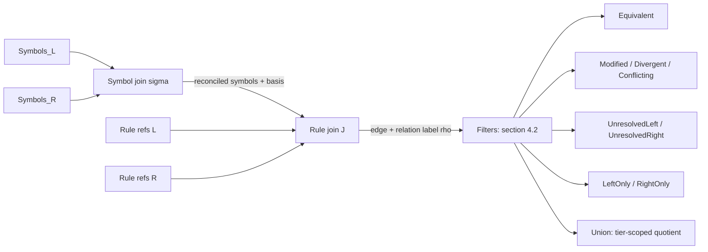

# Formalizing the comparison model as a join over reconciled rules

**Status:** proposal / addendum — documentation and internal-design
clarification only. No new bucket, relation, or schema field; the
`regdelta-comparison/1.0` contract in [`plan-extend.md`](plan-extend.md)
Section 5.3 is unchanged.
**Extends:** `plan-extend.md` Sections 3.4, 3.5, 4.3, 4.4, 4.4.2, 4.5, 4.5.2,
5.2, WP0, WP1. Read alongside that document; this file does not repeat its
product rationale.
**Baseline:** `plan-extend.md` as committed on `main` (`7c00688`, header
"revision 2"). Citations below use **section numbers**, not line numbers,
because the author has an uncommitted "revision 3" draft in progress locally
that reflows most sections; section numbering is identical between the two
(verified 2026-09-07), but a few bucket *names* differ. Where that matters, it
is called out explicitly (Section 6).
**Origin:** this document is the deep-review pass on a chat discussion that
asked whether the comparison model's intersection/union/delta/contradiction
buckets imply a "join" operation. Section 3 corrects two claims made in that
chat before Section 4 proposes the formalization those corrections motivate.

## 1. What this proposes

`plan-extend.md` already defines, in prose plus equations, a nine-bucket
partition of two rule sets (`Equivalent` with four evidence tiers, `Modified`,
`Divergent`, `Conflicting`, `UnresolvedLeft`/`UnresolvedRight`, `LeftOnly`/
`RightOnly`) plus a derived `Union`. Every one of those buckets is already a
filtered view over one underlying structure: the alignment ledger (Section
4.3), which is a **join table** between the left and right rule sets. Nothing
in this proposal changes what gets computed. It proposes naming the join
explicitly, at the two levels the document already implies but does not name,
because doing so turns several already-stated facts (Section 4.4.2's
conservation equations, WP0's disjointness requirement, Section 4.4's
"Union quotienting collapses only supported equivalence") from independent
assertions that must each be verified into corollaries of one structure that
need only be verified once.

The two levels:

1. **Symbol join** — `symbol_reconciliation` (Section 4.5.2): a join between
   the left and right rule sets' *symbol tables*, keyed by alias/unit
   metadata, producing a reconciled symbol per matched pair and an
   `unreconciled` marker otherwise.
2. **Rule join** — the alignment ledger (Section 4.3): a join between the
   left and right *rule reference* sets, keyed by a graded score computed
   over features that only make sense once symbols are reconciled, producing
   an accepted edge, a live unresolved/proposed candidate, or no edge at all.

## 2. Why this is useful

**It replaces nine separately-argued invariants with one partition property.**
Section 13.2's defect ledger records that revision 1 of the comparison plan
got exactly this class of thing wrong five separate times: `Equivalent` had no
accounting term (defect 1), the two intersection tiers were double-counted
(defect 2), an `accepted` + `unrelated` pair fell through every bucket (defect
3), a `proposed` edge failed to block a directional claim (defect 4), and the
bucket precedence order demoted accepted pairs (defect 6). All five are
instances of one mistake: writing the buckets as separate predicates instead
of as an exhaustive, mutually exclusive case-split over one join. Once the
buckets are defined that way (Section 4.2 below), disjointness and
"nothing falls through" stop being things to test after the fact — they hold
because the case-split is exhaustive by construction, the same way a `match`
with no wildcard case cannot silently drop a value. WP0 already states the
target ("reject any artifact whose `sets` overlap, or whose `views` are not
subsets of `sets.equivalent`"); this proposal is about implementing that
target as a property of the partition function's type, not as a validator
that runs after five buckets have each been computed independently.

**It derives Section 4.4.2's conservation equations instead of asserting
them.** Section 4.3 works this out below: `|Union| = |L| + |R| -
collapsed_pairs` is not a separate fact to remember and check — it is the
node count of a quotient graph, and it falls out of the join definition
directly. A future reader extending the model does not need to re-derive
which equation changes when `cardinality` stops being `one_to_one`; Section
4.4.2 already anticipates this ("a later release that introduces hyperedges
must replace them with `|Union| = |L| + |R| - sum over classes of (|class| -
1)`"), and the join framing makes that replacement mechanical rather than a
fresh derivation.

**It surfaces one currently-implicit fact that is easy to get wrong in
implementation.** `Union` and `Corresponded` (the accepted-alignment bucket)
are not built from the same predicate over the same edge set, even though
both are "views over the join." `Corresponded` is every accepted edge,
regardless of relation. `Union`'s quotienting step uses a **strictly
narrower** predicate — only edges whose relation is in the selected
intersection tier — and Section 4.4 is explicit that the rest are *not*
collapsed: "Union quotienting collapses only supported equivalence. It never
collapses modified, divergent, conflicting, or unresolved rules." An
implementer who reuses "the accepted-edge filter" for both `Corresponded` and
`Union`'s quotienting step will silently merge a `Modified` or `Conflicting`
pair into one node — exactly the destructive-merge failure Section 3.4
rejects Policy-to-Knowledge for. Naming the two predicates separately (broad
join vs. tier-scoped join) makes this a documented distinction instead of a
trap two similarly-named functions can fall into.

**It matches an extensibility path the plan already commits to.** Section
5.2 reserves `split`/`merge` cardinalities "after its UI and conservation
rules are specified and tested." Under this framing, that is "add a
cardinality other than 1:1 to the rule join," and Section 4.3 below shows
exactly which derived equation (the quotient node count) needs re-deriving —
narrowing what "specified and tested" has to cover.

## 3. Deep review: corrections to the chat framing

The prior chat turn described the buckets using relational-join vocabulary
informally. Checked against `plan-extend.md`'s actual text, two of those
descriptions were imprecise enough to mislead an implementer, and one
implicit assumption was wrong. Recorded here in the same evidence/correction
form as Section 13.2, because getting this wrong is exactly the kind of thing
worth flagging before it is repeated in code.

| # | Claim made in chat | Defect | Evidence | Correction |
| --- | --- | --- | --- | --- |
| 1 | "Union: full outer join, keeping both rows (not merged)" | Self-contradictory once checked: an `Equivalent`-tier pair *is* merged into one `Union` member; only `Modified`/`Divergent`/`Conflicting`/unresolved pairs are left unmerged | Section 3.4: "An equivalence class keeps both complete payloads and both provenance chains"; Section 4.4: "Union quotienting collapses only supported equivalence. It never collapses modified, divergent, conflicting, or unresolved rules" | `Union` applies two predicates, not one: the broad `Corresponded` predicate decides what counts as "not directional-only," and a strictly narrower, tier-scoped predicate decides what actually gets quotiented into a single node (Section 4.2 below) |
| 2 | "Anti-join = LeftOnly/RightOnly directly" | Too simple: the anti-join condition is not merely "no accepted alignment" | Section 4.4: `LeftOnly = non-refused left rules with no Corresponded pair and no live unresolved or proposed candidate edge` — this is the same fact Section 13.2 defect 4 records the draft getting wrong the first time | `LeftOnly` anti-joins against the *union* of the accepted-edge match and a semi-join existence check against live unresolved/proposed candidates, not against accepted edges alone |
| 3 | (implicit) the symbol join and the rule join are two sequential, independent stages | Section 4.5.2 warns against exactly this simplification | "Do not reuse the alias map as an alignment signal *and* as a proof precondition without recording it." The alias map is a scoring input to the rule join (Section 5.1 stage 4 needs comparable symbols) *and* a soundness precondition for `bounded_proof` at the symbol join. Section 5.3's contract records `alias_map_sha256` in **both** `policy` and `manifest` for this reason, not by accident | The two joins share an input; Section 4.1 below keeps the alias/reconciliation hash visible at both call sites instead of presenting a clean two-stage pipeline |

One claim from the same discussion checked out and needed no correction:
"contradiction requires a positive witness, not just different literals" is
exactly Section 4.5's "`conflicting` requires a witness," so it is retained
unchanged below.

## 4. Formalization

### 4.1 Two joins, not one

Let `Symbols_L`, `Symbols_R` be the typed symbols each side's rules reference
(`input_symbols`/`output_symbols` in the fingerprint, Section 4.2), and let
`L`, `R` be the complete input rule-reference sets, including refused rules
(Section 4.1's "keep every input rule in coverage accounting").

**Symbol join** `σ`: a partial mapping from `Symbols_L ⊎ Symbols_R` to
reconciled symbol identifiers, computed by the alias/unit matching Section
4.5.2 specifies, where every reconciled symbol carries a `basis` (`identical`
/ `alias_map` / `unit_conversion` / `unreconciled`) and a merged domain. `σ`'s
own matching is a smaller-scale version of the same problem the rule join
solves — symbol identity is also not guaranteed by ID, hence "never assigned
a shared symbol" (Section 4.5.2) — so it is itself join-shaped, one level
down.

**Rule join** `J ⊆ L × R`: the alignment ledger. An edge `(l, r) ∈ J` exists
only once accepted per the five-step procedure in Section 5.2
(filter → match → margin → accept → reject), constrained to `cardinality:
one_to_one` for release 1 (Section 4.3). Its score is a function of `(l, r,
σ)` — features that are only comparable once `σ` has reconciled their
symbols. Every accepted edge carries a relation label `ρ(j) ∈ {identical,
behaviorally_equivalent, modified, divergent, conflicting, unrelated,
unknown}`, mode-constrained by Section 4.4's legality table.

`σ` is a genuine prerequisite for `J`'s deterministic stages beyond exact ID
and source identity, and for every `ρ(j)` that claims `bounded_proof`
evidence — not merely for the solver step, which is why Section 4.5.2 calls
it "a prerequisite, not a caveat." Both joins are recorded and hashed
(`symbol_reconciliation_sha256`, `alias_map_sha256`) so that a comparison
result is replayable from its manifest (Section 5.3).



### 4.2 Named views as filters over the join

Every bucket in Section 4.4 is one of two operations over `(L, R, J, ρ)`: a
**filter** (select edges or rules matching a predicate, keep both sides
distinct) or a **quotient** (merge matched pairs into one node). Only `Union`
quotients; everything else filters.

| Bucket (Section 4.4 name) | Operation | Predicate |
| --- | --- | --- |
| `Corresponded` | filter (broad) | `J` — every accepted edge, any relation |
| `Equivalent` | filter | `{j ∈ J : ρ(j) ∈ {identical, behaviorally_equivalent}}` |
| `E_canonical`/`E_proved`/`E_observed`/`E_reviewed` | filter | `Equivalent` further split by evidence level — a sub-filter of a filter |
| `Modified` | filter, version mode only | `{j ∈ J : ρ(j) = modified}` |
| `Divergent`, `Conflicting` | filter, peer mode only | `{j ∈ J : ρ(j) ∈ {divergent, conflicting}}` |
| `UnresolvedLeft` | semi-join | `{l ∈ L : l ∉ π_L(J), ∃ \text{ live unresolved/proposed edge on } l}` (symmetric for `UnresolvedRight`) |
| `RefusedLeft`/`RefusedRight` | filter | `compile_status = refused`, evaluated before either join (Section 4.4.1) |
| `LeftOnly` | anti-join | `L ∖ (π_L(J) ∪ π_L(\text{UnresolvedLeft-inducing edges}) ∪ RefusedLeft)` (symmetric for `RightOnly`) |
| `Union` | **quotient**, on a narrower predicate | `J_tier = \{j \in J : \rho(j) \in \text{Equivalent}, \text{evidence} \in \text{selected tier}\}`; merge each edge's endpoints into one node retaining both payloads; every rule not in `π_L(J_tier) \cup \pi_R(J_tier)` — including *both* endpoints of every `Modified`/`Divergent`/`Conflicting` edge — remains its own singleton |

The precedence order Section 4.4 already specifies — "refused, then
corresponded, then unresolved, then directional-only" — is exactly the
exhaustive, mutually-exclusive case-split that makes every rule land in
*exactly one* row of this table's left-hand column (excluding `Union`, which
is a second pass over the same input, not part of the same partition).

### 4.3 Conservation as a corollary, not an invariant to check

Because `J_tier` is a 1:1 matching restricted to tier-qualifying edges,
`|π_L(J_tier)| = |π_R(J_tier)| = |J_tier| = collapsed_pairs`. Quotienting
merges each such edge's two endpoints into one node, so:

```text
|Union| = |quotiented nodes| + |L not in J_tier| + |R not in J_tier|
        = |J_tier| + (|L| - |J_tier|) + (|R| - |J_tier|)
        = |L| + |R| - |J_tier|
        = |L| + |R| - collapsed_pairs
```

That is Section 4.4.2's `|Union| = |L| + |R| - collapsed_pairs`, derived
rather than asserted. Likewise, `|L| = corresponded + left_only +
unresolved_left + refused_left` holds *by construction* once the four
predicates in Section 4.2's table are implemented as one exhaustive
if/elif-style case-split per rule reference, in the stated precedence order,
rather than as four independently written predicates that each have to be
individually shown not to overlap and not to leave a gap — which is what
went wrong five separate times in Section 13.2.

## 5. How to implement

This is a design clarification, not a new capability. Nothing here adds a
work package or changes `regdelta-comparison/1.0`'s persisted shape
(`alignments`, `sets`, `views` already hold exactly what Section 4.2's table
describes). It changes how WP0/WP1 should be built so the invariants above
hold by construction.

### 5.1 Documentation

Add a short subsection (proposed: `4.4.3`, though the exact number is the
author's call once revision 3 lands) to `plan-extend.md` stating the
broad-vs-narrow predicate distinction in Section 2's third paragraph above,
with a one-line pointer to this file for the full derivation. This document
is intentionally kept standalone rather than inlined — see Section 7.

### 5.2 Code shape (WP0 `utils/comparison_contract.py`, WP1 `utils/set_projection.py`)

Implement one partition function that visits every rule reference exactly
once and assigns it to exactly one bucket via the precedence order already
specified, instead of five bucket-specific functions each re-deriving
membership independently:

```python
def partition_rules(
    left_refs, right_refs,
    accepted_edges,       # J: the alignment ledger, one relation label each
    live_candidate_edges, # unresolved/proposed edges, for the semi-join
    refused_left, refused_right,
) -> ComparisonPartition:
    """One exhaustive, mutually exclusive case-split per rule reference, in
    the precedence order Section 4.4 specifies: refused -> corresponded ->
    unresolved -> directional-only. Returns disjoint buckets by construction;
    there is no separate step that could produce an overlapping or
    incomplete partition."""

def project_union(partition: ComparisonPartition, tier: str) -> list[UnionClass]:
    """Second pass, over the *narrower* tier-scoped predicate only. Quotients
    J_tier's matched pairs into one class each (both payloads retained);
    every other rule reference in `partition` -- including both endpoints of
    every Modified/Divergent/Conflicting edge -- becomes its own singleton
    class."""
```

Keeping `project_union` a visibly separate pass from `partition_rules`, with
its own narrower predicate parameter, is the concrete fix for the failure
mode in Section 3's defect 1: it removes the option to accidentally reuse the
broad accepted-edge filter for quotienting.

### 5.3 Testing

Replace bucket-specific unit assertions with one property-based check:
every rule reference in `left_refs ∪ right_refs` appears in exactly one of
`partition_rules`'s output buckets, and `len(project_union(partition, tier))`
equals the derived formula in Section 4.3 for an arbitrary accepted-edge set
and an arbitrary tier filter. This is the same style of check
`proofs/check_properties.py` already runs for other repository invariants
(Section 8's required test commands), and it directly implements WP0's exit
criterion ("reject any artifact whose `sets` overlap") as a property of the
partition function rather than a separate post-hoc validator.

### 5.4 Sequencing

No new work package. This lands inside WP1, where `utils/set_projection.py`
is already being written (Section 7, WP1's file list), and should be settled
before WP2 adds real candidate edges — retrofitting the partition shape after
five bucket-specific functions already exist is exactly the harder direction.

## 6. Non-goals

- Does not add a new bucket, relation, evidence level, or schema field.
- Does not change any numeric release gate in Section 9.
- Does not depend on, or block, the author's in-progress revision-3 rewrite
  of `plan-extend.md`. The formalization is defined over structure
  (predicates over a join), not bucket names, so it holds under both the
  committed `Corresponded`/four-tier `E_*` vocabulary and the draft revision's
  renamed `Paired` — see Section 7.
- Does not itself implement anything; Section 5 is a recommendation for
  WP0/WP1, not a substitute for them.
- Does not claim this is the only useful formalization — it is offered
  because it makes five already-found defect classes structurally
  unrepresentable, not because relational-join vocabulary is required
  reading for this codebase.

## 7. Open decisions for the author

1. **Placement.** This document recommends staying standalone and
   cross-linked, rather than inlined into `plan-extend.md`, because that
   document is already long enough that Section 13 exists specifically to
   track reconciliation defects across revisions; a rarely-changing
   formalization note is easier to keep correct in isolation. This is a
   preference, not a requirement — folding a shortened version into a new
   `4.4.3` costs only a cross-reference update here if the author prefers one
   document.
2. **Terminology drift.** The author's uncommitted revision-3 draft renames
   `Corresponded` to `Paired` and separates a `relation_status` field from
   evidence level — worth noting, without over-claiming about unfinished
   work, that `relation_status: accepted` vs. `proposed`/`unresolved` reads as
   exactly the broad join-membership predicate this document names in
   Section 4.2, applied one layer more explicitly than revision 2 does. If
   that observation holds once revision 3 is committed, updating this file's
   terminology should be a mechanical rename, not a re-derivation.
