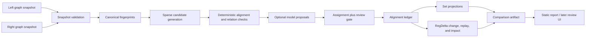

# Extending Policy Logic Forge with evidence-bounded semantic graph comparison

**Status:** implementation plan; proposed work is not implemented by this document  
**Decision:** proceed, but adapt the comparison concepts rather than porting the Policy-to-Knowledge implementation  
**Policy Logic Forge baseline:** `1964c00` (`main`, inspected 2026-09-07)  
**Policy-to-Knowledge reference baseline:** `f6185bef` (`main`, inspected 2026-09-07)
**Review pass:** revision 2, 2026-09-07 — 46 defects found and corrected against
the code; each correction states its reason inline, and Section 13 is the ledger.
**Intended location:** this file belongs at `plan/regdelta-comparison-plan.md`
alongside `plan/regdelta-product-plan.md`, indexed from `plan/README.md`. It sits
at the repository root only because that is where the first draft landed;
`plan/README.md` is the documented index of plans and currently does not mention
it.

## 1. Executive direction

Policy Logic Forge should add semantic intersection, union, left-only, right-only,
and conflict views. They fit the existing RegDelta direction and would make its
old/new analysis much easier to inspect. The correct architecture is not to add
four more extraction agents or copy Policy-to-Knowledge Agents 7-10. It is to
build one post-extraction comparison service on top of Policy Logic Forge's
existing typed rule graph, fail-closed LExec compiler, exact-ID alignment,
semantic change classifier, differential executor, and impact propagation.

The upstream ideas divide into two groups:

- **Reuse the product concepts:** graph selection, comparison as an asynchronous
  job, behavior-based candidate blocking, directional set views, a conflict
  view, side-by-side evidence, progress reporting, and downloadable artifacts.
- **Replace the semantic core:** all-pairs LLM matching, greedy pairing,
  LLM-error-to-`UNRELATED` fallback, destructive “merged rule” construction,
  and set counts that omit uncertainty do not meet this repository's evidence
  and refusal standards.

The extension should support two explicitly different modes:

1. **Version mode:** two revisions from the same policy lineage. Results are
   unchanged/equivalent, modified, added, removed, unresolved, or refused, plus
   differential witnesses and downstream impact.
2. **Peer mode:** two policies from different issuers in the same domain.
   Results are shared/equivalent, **divergent**, left-only, right-only,
   conflicting, unresolved, or refused.

`divergent` is a required peer-mode bucket, not an optional refinement.
**Reason:** two issuers can address the same obligation with different
requirements that are simultaneously satisfiable. A 78% LTV trigger and an 80%
LTV trigger for the same mortgage-insurance obligation coexist, because a lender
can comply with both by following the tighter one. Without `divergent`, every
such pair must either be forced into `conflicting` — asserting a contradiction
that `utils.smt.query_overlap` would immediately falsify — or be left out of
every bucket, which breaks the conservation checks in Section 4.4. `conflicting`
is reserved for pairs carrying a demonstrated joint-unsatisfiability or
incompatible-effect witness.

Direction labels mean **condition breadth, not regulatory stringency**.
**Reason:** [`utils/semantic_diff.py`](utils/semantic_diff.py) reports
`strengthening`/`weakening` about the *predicate*: `_ORDERED_DIRECTION` treats a
raised `gt`/`ge` literal as narrowing the inputs that satisfy the condition, and
its own docstring calls the result "best-effort". That is not the claim "the
policy got stricter". Lowering `ltv_ratio_percent gt 80` to `gt 78` is
`weakening` under that definition (the condition matches more loans) while
making the insurance obligation apply to *more* borrowers — a stricter policy.
The artifact must therefore name this field `condition_direction`, and no
surface may render it as "stricter"/"weaker" policy language. A stringency claim
requires condition direction *and* effect polarity *and* a witness; it is a
non-goal for release 1 (Section 11).

Keeping these modes separate matters. A missing rule in a newer version is a
possible removal; a missing rule in another issuer's policy is a coverage gap,
not a regulatory change. Likewise, conflicting peer policies can coexist,
while two revisions from one lineage represent replacement over time.

### Terminology assumption

The request's “left and right negative” is interpreted as the two directional
differences, `left − right` and `right − left`. The UI should call them
**Only in left** and **Only in right** (or **Removed** and **Added** in version
mode), because “negative” is easy to confuse with logical negation or negative
test cases.

## 2. What is actually present today

### 2.1 Policy Logic Forge

The repository already has the stronger half of the required semantic core:

| Capability | Current evidence | Boundary |
| --- | --- | --- |
| Typed, source-grounded rules | v2 rules carry predicates, condition logic, outcomes, variables, scope, exceptions, field evidence, readiness, and grounding | Many extracted rules remain review-required or outside the current LExec subset |
| Fail-closed compilation | [`utils/lexec_ir.py`](utils/lexec_ir.py), [`utils/lexec_compile.py`](utils/lexec_compile.py), and [`utils/smt.py`](utils/smt.py) | The bounded queries already exist — `query_overlap`, `query_counterexample`, `query_witness`, `query_conflicts`, `query_coverage`, covered by [`tests/test_smt_queries.py`](tests/test_smt_queries.py). What is missing is a *reconciled symbol table* across two independently extracted graphs (Section 4.5) |
| Pair alignment | [`utils/rule_alignment.py`](utils/rule_alignment.py) | Exact rule ID only; independent extractions do not align by ID |
| Semantic change classification | [`utils/semantic_diff.py`](utils/semantic_diff.py) | Precise for selected single-field IR changes; complex changes use honest catch-all labels |
| Differential execution | [`utils/regdelta_engine.py`](utils/regdelta_engine.py) | Works only for rules that compile on both sides and scenarios with sufficient inputs |
| Impact propagation | [`utils/impact_propagation.py`](utils/impact_propagation.py) | DAG reachability is extracted/narrative dependency, not always shared-symbol dataflow |
| Controlled validation | mortgage Tier 1: 65-rule universe, 45 compiled per side, 20 refusals, 16/16 labeled expectations; mobile Tier 1: 88-rule universe, 18 compiled per side, 70 refusals, 7 scenarios; mortgage Tier 2 recovered 3/3 planned field edits from an independent extraction | These are fixture-level results, not corpus-level alignment or semantic-comparison accuracy |
| Product surface | architecture and static documentation | No comparison CLI, API, or review UI exists in code, but [`plan/regdelta-product-plan.md`](plan/regdelta-product-plan.md) Phase 6 already owns the review-UI plan and Phase 7 the product gate — see Section 2.3 |

The retained result claims are in
[`results/aggregates/regdelta/`](results/aggregates/regdelta/). They establish
that controlled diff and replay work; they do not establish that arbitrary
independently extracted graphs can be semantically aligned.

### 2.2 Policy-to-Knowledge

The reference repository has a complete comparison-shaped workflow:

```text
graph A + graph B
  -> Agent 7: behavior clusters
  -> Agent 8: LLM pair classification
  -> Agent 9: intersection / left difference / right difference / union / conflicts
  -> Agent 10: HTML reports
  -> FastAPI job endpoints + React comparison page
```

Its retained Fannie Mae/Freddie Mac artifact demonstrates the output shape:
384 left rules and 371 right rules were rendered as 13 shared pairs, 371
left-only rules, 358 right-only rules, 12 reported contradictions, and a
742-item union. Those numbers are historical implementation output, not
ground-truth accuracy evidence; no labeled alignment protocol accompanies the
artifact.

Useful implementation references are:

- `apps/pipeline/agents/agent_7_rule_type_clusterer.py`
- `apps/pipeline/agents/agent_8_semantic_rule_matcher.py`
- `apps/pipeline/agents/agent_9_set_operations.py`
- `apps/pipeline/agents/agent_10_set_visualization.py`
- `apps/pipeline/cli/compare.py`
- `apps/pipeline/ui/backend/routers/compare.py`
- `apps/shell/src/pages/GraphComparison.tsx`

These paths are in the sibling `../policy-to-knowledge` checkout and are listed
as design evidence, not dependencies to import at runtime.

The Fannie Mae 384-rule and Freddie Mac 371-rule graph sizes are sourced from
`docs/research/policy-to-dmn-bpmn.md` in that checkout. **The 13/371/358/12/742
comparison output above is not a retained artifact there** — no committed
comparison result, and no gitignored output directory, contains it. It is
reconstructed from the graph sizes plus a reported 13-match count, and this plan
must not cite it as retained evidence. What *is* code-verifiable in that
checkout is the mechanism, and that is what Section 3 relies on.

### 2.3 Relationship to the existing RegDelta plan

[`plan/regdelta-product-plan.md`](plan/regdelta-product-plan.md) is the current
plan of record and already owns overlapping ground. This document must be read
as an extension of it, not a parallel roadmap.

| Existing plan | This document | Reconciliation |
| --- | --- | --- |
| §6.3 change taxonomy | Section 4.3 `change` block | Reuse `classify_change`'s closed taxonomy verbatim; add no new labels |
| §6.4 rule alignment (staged ID → citation → structure → constrained similarity → review) | Section 5.1 candidate ladder | Section 5.1 is the concrete specification of §6.4's stages 2-5, not a replacement ladder |
| §6.5 open question: two independently extracted rules were never assigned a shared symbol (`fannie_mae_required_insurance_or_loan_guaranty` vs `primary_mortgage_insurance_policy_required`) | Sections 4.2, 4.5, WP3 | **This is a hard prerequisite, not a detail.** WP3 cannot emit `bounded_proof` evidence until symbol reconciliation is decided and recorded |
| Phase 5: expand to remaining domains | — | Out of scope here |
| Phase 6: review UI ("Compare versions"), stack undecided | WP6 | WP6 *is* Phase 6. Its endpoint list is a proposal to be settled in Phase 6's decision record, not a competing decision |
| Phase 7: real end-to-end product workflow, two real full documents | Section 9 product gate | Section 9's product gate *is* Phase 7's gate. Do not track two product gates |
| §9: no external acquisition except Phase 7.1's second Selling Guide edition | Peer mode | **Peer mode has no data plan.** See Section 7, WP7 |

**Reason for insisting on this:** the failure mode of two overlapping planning
documents is that each one's gates are satisfied against the other's fixtures
and neither is ever actually met. Every gate in Section 9 must resolve to a
phase number in the plan of record.

## 3. Why a direct port would be wrong

### 3.1 Model failure currently becomes a false absence

The upstream matcher converts a missing batch result, parse error, or LLM call
failure into `UNRELATED`. Agent 9 then treats the affected rules as left-only
and right-only. A provider outage can therefore look like a policy difference.
Policy Logic Forge's current contract does the opposite: uncertainty and
unsupported constructs remain visible as `unresolved-review` or refusal.

**Required change:** operational failures, incomplete responses, low margins,
and unsupported semantics must enter an `unresolved` bucket. They must never
create definitive directional differences.

### 3.2 Behavior labels are useful blockers, not identity

The upstream clusterer assigns one of eight behaviors and compares every left
rule with every right rule within that behavior. This reduces some work but has
two problems:

- semantically corresponding rules can receive different behavior labels; and
- large clusters still require `O(|L_b| × |R_b|)` model comparisons.

**Required change:** use behavior as one candidate-retrieval signal alongside
citation, source section, responsible party, scope, typed inputs/outputs,
predicate structure, and lexical/embedding retrieval. Never reject a candidate
solely because its behavior label differs.

### 3.3 Greedy matching is order-sensitive

The upstream matcher sorts positive pairs by model confidence and greedily
claims both nodes. Confidence is model self-report, not a calibrated matching
probability. Greedy selection can choose a plausible pair and prevent the
globally better alignment; it also has no split/merge representation.

**Required change:** score a sparse candidate graph, solve deterministic
maximum-weight one-to-one assignment for the first release, and send close
alternatives or one-to-many cases to review. Add explicit `split` and `merge`
cardinalities later; do not silently force them into one-to-one pairs.

### 3.4 The upstream union loses executable meaning

For a matched pair, the upstream set calculator copies the left rule, gives it
a `MERGED_...` ID, and stores a short summary of the right rule in provenance.
It also concatenates entity arrays without semantic entity resolution. That is
a useful display shortcut, but it is not a lossless or executable union.

**Required change:** union must be a projection over references to immutable
source rules. An equivalence class keeps both complete payloads and both
provenance chains. It must not invent a canonical executable rule unless a
separate, reviewed synthesis workflow produces and revalidates one.

### 3.5 Contradiction is a relation, not an error-free set operation

In the upstream flow, contradictory rules are not marked as matched, so the
same rules can remain in directional differences while also appearing in the
contradiction report. The batch prompt also omits detailed conflict fields that
the downstream calculator expects, which explains why the retained comparison
records all 12 conflicts as `UNKNOWN` type.

**Required change:** comparison buckets need a documented partition, and every
conflict edge needs typed evidence. Version-mode modification and peer-mode
conflict must not be conflated.

### 3.6 The visual layer is valuable but coupled

The upstream HTML visualizer is a large monolithic generator, while its React
page offers a good information hierarchy: selectors, asynchronous progress,
summary bar, metric cards, conflicts, directional lists, and side-by-side rule
details.

**Required change:** reuse that information architecture, not its generated
HTML implementation. Produce a stable JSON contract first, a small static
renderer second, and only then choose a durable interactive UI stack.

### 3.7 The same failure mode already exists in this repository

Section 3.1 rejects the upstream design because an unsupported or failed
comparison becomes a definitive absence. That criticism also lands on the
current engine, and the plan is not credible unless it says so.

[`utils/regdelta_engine.py:97`](utils/regdelta_engine.py#L97) `build_changes`
aligns *compiled* IR rules only. `utils/impact_propagation.py`'s
`resolve_statuses` reports `refused-unsupported-construct` only when a rule
compiled on **neither** side. A rule that compiles on the left and is refused by
the compiler on the right therefore has no right-side IR entry, so `align_by_id`
classifies it `removed` — a directional difference produced by a compiler
refusal, not by a policy edit. The symmetric case yields `added`.

The current Tier 1 fixtures do not expose this: both are hand-edited forks of
one graph, so refusals are symmetric (mortgage: 20 rule IDs refused on both
sides; `results/aggregates/regdelta/mortgage_tier1.json` reports one pair-level
`refused_count: 20`). It will expose itself the moment two independently
extracted snapshots are compared, which is exactly what this extension is for.

**Required change:** `refused` must be evaluated per side *before* alignment
kind is decided. A rule refused on exactly one side is
`unresolved` — specifically `unresolved_one_sided_refusal` — never `added` or
`removed`. This is a behavior change to the existing engine's semantics for a
case the current fixtures cannot reach, so it belongs behind the WP5
compatibility adapter with an explicit test, and Section 8's "existing diff
outcomes retained" check must be read as "retained on the existing fixtures",
which remain symmetric and therefore unaffected.

## 4. Product semantics

### 4.1 Inputs

Each side is an immutable `GraphSnapshot`:

```json
{
  "snapshot_id": "mortgage-2025-04-02",
  "domain": "mortgage",
  "lineage_id": "fannie-mae-selling-guide",
  "graph_path": ".../optimized_compliance_knowledge_graph.json",
  "graph_sha256": "...",
  "dag_path": ".../dependency_dags.json",
  "source_manifest_sha256": "...",
  "pipeline_commit": "...",
  "contract_version": "2.0",
  "issuer_id": "fannie-mae",
  "effective_date": "2025-04-02",
  "snapshot_role": "baseline",
  "readiness_stage": "agent_10_complete"
}
```

`contract_version` is the v2 rule contract asserted by
`utils.rule_contract.RULE_SCHEMA_VERSION`, and `readiness_stage` uses the
canonical identifiers in [`utils/agent_names.py`](utils/agent_names.py). Closed
values for release 1: `agent_09_complete` (optimized graph, no DAGs) and
`agent_10_complete` (optimized graph plus `dependency_dags.json`).

Three fields are added here because the original draft could not express its own
product semantics without them:

- `issuer_id` — Section 1 defines peer mode as "different issuers", and Section
  4.5 conflict detection is scoped per actor and issuer. `domain` and
  `lineage_id` cannot carry that: two Fannie Mae editions share an issuer, and
  two issuers in one domain may each have a `lineage_id`.
- `effective_date` and `snapshot_role` (`baseline` | `candidate`) — version mode
  reports **Removed** and **Added**, and `condition_direction` reports
  old-versus-new. Both require a declared temporal order. Nothing in
  `--left`/`--right` argument position asserts which side is older, and relying
  on argument order silently inverts every direction label when a caller swaps
  them. `snapshot_role` is authoritative; `effective_date` is cross-checked
  against it and a disagreement is a validation error, not a warning.

Validation rules:

- Reject cross-domain comparison before candidate generation.
- Version mode requires the same non-empty `lineage_id`, exactly one `baseline`
  and one `candidate`, and `baseline.effective_date <= candidate.effective_date`.
- Peer mode requires the same `domain` and **different** `issuer_id`; it must
  not assign `snapshot_role`, and it must not emit added/removed/direction
  labels, because there is no temporal order to justify them.
- Comparing a snapshot with itself is explicitly legal and is a required test
  (Section 8, WP1); the equal-`snapshot_id` case must not be rejected.
- Record absent DAGs as `impact_unavailable`, not as an empty impact graph.
  This is reachable only at `readiness_stage: agent_09_complete`; at
  `agent_10_complete` an absent DAG file is a corrupt snapshot, not a coverage
  gap, and must exit nonzero.
- Keep every input rule in coverage accounting, including review-required,
  grounding-failed, duplicate-ID, and compiler-refused rules.
- Hash all inputs and comparison configuration so results are replayable.
- `snapshot_id` is a pipeline batch identifier and must resolve to a real batch
  directory. The committed convention is `<domain>-run-<YYYY-MM-DD-HH-MM>`
  (`pipeline-output/mortgage-run-2026-09-02-20-12`); the short forms used in the
  examples below are illustrative labels only and must not be hardcoded as a
  resolution format.

### 4.2 Normalized comparison record

Do not compare descriptions alone. Build a `RuleFingerprint` beside each
original rule. It is a **derived, deliberately lossy index**, not a lossless
encoding — the original v2 rule and its LExec IR remain the only authoritative
payloads, and every comparison conclusion must be reproducible from them.

A fingerprint carries two structurally different kinds of field, and conflating
them was a defect in the first draft:

- **Equality keys** — terminal `sha256` digests, usable only for exact
  match/no-match.
- **Graded features** — structure a scorer can compare *partially*.

A digest cannot yield a partial score. `condition_signature: "sha256:..."` and a
`score_components.condition` of `0.8` are incompatible by construction: two
conditions differing in one literal produce two unrelated digests, so the only
derivable score is 1.0 or 0.0. Any graded signal must therefore come from
retained structure, not from the digest.

```json
{
  "rule_ref": {"snapshot_id": "...", "rule_id": "..."},

  "equality_keys": {
    "canonical_rule_sha256": "sha256:...",
    "condition_sha256": "sha256:...",
    "exception_sha256": "sha256:...",
    "effect_sha256": "sha256:..."
  },

  "features": {
    "behavior_labels": ["threshold", "mandate"],
    "actor": "LENDER",
    "scope": {"loan_types": ["conventional"], "occupancy": ["primary"]},
    "condition_leaves": [
      {"op": "gt", "symbol": "ltv_ratio_percent", "literal": 80}
    ],
    "effect_leaves": [
      {"symbol": "primary_mortgage_insurance_policy_required", "value": true}
    ],
    "input_symbols": ["ltv_ratio_percent"],
    "output_symbols": ["primary_mortgage_insurance_policy_required"]
  },

  "provenance": {
    "source_keys": ["section_id", "chunk_path", "normalized_span_hash"],
    "evidence_hashes": ["sha256:..."]
  },

  "readiness": "ready",
  "requires_review": false,
  "grounding_status": "verified",
  "compile_status": "compiled"
}
```

Notes and reasons for each correction:

- **`scope` is retained as its dimension mapping, not hashed.** The rule
  contract represents scope as `dimension -> admitted values`
  ([`utils/scope.py`](utils/scope.py)), and Section 4.5's conflict test needs
  *overlap*, which `utils.scope.scopes_may_overlap` computes from that mapping.
  `{loan_types: [conventional, FHA]}` and `{loan_types: [conventional]}` overlap
  while having different digests, so a `scope_signature` digest cannot express
  the predicate the conflict rules depend on. Reuse
  `normalized_scope`/`populated_scope`/`scopes_may_overlap` rather than
  reimplementing scope comparison.
- **`provenance` is excluded from every equality key.** Section 8 requires this,
  and `utils.semantic_diff._without_provenance` already establishes the
  precedent: compiling the same unedited rule out of two document snapshots
  legitimately yields different provenance. `source_keys` and `evidence_hashes`
  are retrieval signals and display data only. `canonical_rule_sha256` must be
  computed over the provenance-stripped canonical form, or self-comparison of
  two independently extracted snapshots will report every rule as changed.
- **`readiness`, `requires_review`, and `grounding_status` use the values the
  pipeline actually emits** — `ready` / `review_required` from
  `utils.kg_readiness.mark_readiness`, the boolean `requires_review` the
  RegDelta engine already consumes, and `verified` / `failed` / `unverified`
  from agent_09. Inventing a fingerprint-local vocabulary would silently
  decouple the comparison gate from the pipeline gate.
- Equality keys must canonicalize commutative `and`/`or` children, aliases
  accepted by an explicit symbol map, units, enums, and harmless ordering, while
  retaining operator direction, values, negation, exception position, scope, and
  effects. The alias map is an input to the comparison, is hashed into
  `config_sha256`, and must be recorded in the artifact — an unrecorded alias
  map makes every equality claim unreplayable.

### 4.3 Alignment ledger

Alignment and semantic relation are separate decisions. Every candidate edge
must retain both:

```json
{
  "alignment_id": "aln-<sha256 of left refs + right refs + config_sha256>",
  "left_rule_ids": ["R-120-004"],
  "right_rule_ids": ["B1-R001-HIGH-LTV-MI-REQUIREMENT"],
  "cardinality": "one_to_one",
  "alignment_status": "accepted",
  "alignment_method": "citation_effect",
  "relation": "modified",
  "evidence_level": "structural",
  "score": 0.91,
  "weights_version": "cmp-weights/1",
  "score_components": {
    "citation": 1.0,
    "scope": 0.9,
    "condition": 0.8,
    "effect": 1.0,
    "text": 0.7
  },
  "left_runner_up_margin": 0.24,
  "right_runner_up_margin": 0.31,
  "rejected_sibling_alignment_ids": ["aln-..."],
  "change": {
    "taxonomy": "threshold_or_constant_change",
    "op": "gt",
    "symbol": "ltv_ratio_percent",
    "old_literal": 80,
    "new_literal": 78,
    "condition_direction": "weakening"
  },
  "evidence_refs": ["..."],
  "review": null
}
```

Field-level corrections and their reasons:

- **`score` and `weights_version`.** Section 5.2 requires that an edge "crosses
  the configured acceptance threshold", which is unrepresentable when only
  per-component scores are stored. `weights_version` is required because the
  same components under different weights give a different total, so a stored
  score without the weight set is not replayable.
- **`left_runner_up_margin` and `right_runner_up_margin`.** Section 5.2 requires
  the margin to hold "on both nodes". A single `runner_up_margin` cannot express
  a bidirectional condition: a left rule may have a clear best candidate while
  that right rule has two near-equal left suitors, which is precisely the
  ambiguous case that must go to review.
- **`rejected_sibling_alignment_ids`.** Accepting an edge must explicitly reject
  every other candidate edge on both of its nodes (Section 5.2). Without that
  transition recorded, an accepted pair still carries live `unresolved`
  candidates, and Section 4.4's precedence would then demote the accepted pair
  to unresolved and break conservation.
- **`change` carries `op` and `symbol`.** `utils.semantic_diff.classify_change`
  returns `{taxonomy, detail}` where `detail` is
  `{op, symbol, old_literal, new_literal, direction}`. Dropping `op` and
  `symbol` makes the change neither interpretable nor reproducible: `80 -> 78`
  has opposite meaning under `gt` and `lt`, which is exactly what
  `_ORDERED_DIRECTION` encodes.
- **`direction` is renamed `condition_direction`** for the reason given in
  Section 1. The value shown (`weakening` for `gt` 80 -> 78) is what
  `classify_change` emits and is correct *as a predicate-breadth label*; it is
  wrong as a stringency label, since the same edit widens who must carry
  mortgage insurance.
- **`alignment_id` is content-addressed**, because Section 9 requires
  "deterministic provider-free runs produce the same semantic payload hash". A
  random or sequence-assigned id defeats that gate.

Closed values for the first release:

- `cardinality`: `one_to_one` only. (Omitted from the first draft while
  Sections 4.4/5.2 both depend on it being closed; `split` and `many_to_one`
  are reserved and must not appear in a release-1 artifact.)
- `alignment_status`: `accepted`, `proposed`, `rejected`, `unresolved`
- `alignment_method`: `exact_id`, `source_identity`, `citation_effect`,
  `canonical_equality`, `structural`, `semantic_model`, `human_review`
- `relation`: `identical`, `behaviorally_equivalent`, `modified`, `divergent`,
  `conflicting`, `unrelated`, `unknown`
- `evidence_level`: `canonical`, `bounded_proof`, `differential_witness`,
  `structural`, `model_proposed`, `human_reviewed`

Two enum corrections:

- `alignment_status: refused` is removed. "Refused" in this repository means the
  LExec compiler declined a *rule*
  (`refused-unsupported-construct`), which is a per-rule property of a snapshot,
  not a state of a candidate edge. Keeping one word for both invites the
  artifact to report a refusal count that no existing consumer can reconcile
  with `regdelta-impact/1.0`'s pair-level `refusals[]`.
- `alignment_method: canonical_equality` is added because WP1 is specified to
  "produce exact-ID and canonical-equality relations" and the original enum had
  no value for the method that establishes it.

**Legality matrix.** `alignment_status`, `relation`, and `evidence_level` are
independent fields in the schema and were left unconstrained, which is what
produced the partition holes fixed in Section 4.4. The schema must enforce:

| `alignment_status` | Permitted `relation` | Permitted `evidence_level` |
| --- | --- | --- |
| `accepted` | `identical`, `behaviorally_equivalent`, `modified`, `divergent`, `conflicting` | any except `model_proposed` |
| `proposed` | any except `unknown` | `model_proposed` only |
| `unresolved` | `unknown` only | any |
| `rejected` | `unrelated`, `unknown` | any |

Consequences the matrix makes explicit: an `accepted` edge is never `unrelated`
or `unknown` (those are `rejected`/`unresolved`), and `model_proposed` evidence
can never appear on an `accepted` edge in release 1 — which is what WP4's exit
criterion promises and what the unconstrained schema silently allowed.

`behaviorally_equivalent` must always state its boundary. Canonical IR equality
is stronger than agreement on a finite scenario suite; a bounded proof is only
as broad as its declared finite domains; observed agreement is not proof.

### 4.4 Set definitions

For release 1, accepted alignments are one-to-one. Let `L` and `R` be all input
rule references and `A` the accepted alignment edges.

```text
Equivalent   = accepted pairs whose relation is identical or behaviorally_equivalent
               (ALL of them, at any evidence level)

  E_canonical = Equivalent with evidence_level canonical
  E_proved    = Equivalent with evidence_level bounded_proof
  E_observed  = Equivalent with evidence_level differential_witness or structural
  E_reviewed  = Equivalent with evidence_level human_reviewed
  -- these four are mutually disjoint and partition Equivalent

  intersection_strict   = E_canonical + E_proved            (tier: strict)
  intersection_reviewed = intersection_strict + E_reviewed   (tier: reviewed)
  -- REPORTING ONLY. These are nested views, not accounting buckets.

Modified     = accepted pairs whose relation is modified     (version mode only)
Divergent    = accepted pairs whose relation is divergent    (peer mode only)
Conflicting  = accepted pairs whose relation is conflicting  (peer mode only)

Corresponded = Equivalent + Modified + Divergent + Conflicting
               (every accepted one-to-one pair, by the Section 4.3 legality matrix)

RefusedLeft  = left rules with compile_status refused
RefusedRight = right rules with compile_status refused

UnresolvedLeft  = non-refused left rules that are not in Corresponded and carry
                  at least one live unresolved OR proposed candidate edge
UnresolvedRight = the same, on the right

LeftOnly  = non-refused left rules with no Corresponded pair and no live
            unresolved or proposed candidate edge
RightOnly = the same, on the right

Union = equivalence classes induced by the selected intersection tier,
        plus every other source rule as an immutable singleton
```

Five defects in the first draft's definitions and why each fix is required:

1. **`Equivalent` had no accounting term.** The draft defined only `I_strict`
   and `I_reviewed` and then used `equivalent_pairs` in the conservation
   equations. An accepted `behaviorally_equivalent` pair whose evidence is a
   `differential_witness` (agreement across the scenario suite) sits in neither
   view, so it was accepted — hence not directional-only, not unresolved, not
   refused — and counted nowhere. `Equivalent` is now the accounting bucket and
   the two tiers are explicitly reporting views over it.
2. **The two tiers were double-counted.** `intersection_reviewed` contains
   `intersection_strict` by definition, so the `sets` object in Section 5.3
   cannot be summed. They are now labelled reporting-only, and the artifact
   carries the disjoint `E_*` counts for anything that adds up.
3. **`accepted` + `unrelated`/`unknown` fell through every bucket.** Such a pair
   gives its rules "an accepted correspondence", excluding them from
   `LeftOnly`/`RightOnly`, while belonging to no relation bucket. Section 4.3's
   legality matrix now forbids the combination outright.
4. **A `proposed` edge did not block a directional claim.** WP4 keeps
   model-only results `proposed`, which is neither `accepted` nor `unresolved`;
   under the draft definition the left rule was therefore reported **Only in
   left** while the same artifact carried a proposed equivalent match for it.
   That is the exact failure Section 3.1 rejects, reintroduced through the set
   definitions. `UnresolvedLeft`/`LeftOnly` now key off *live unresolved or
   proposed* candidates.
5. **Peer mode had nowhere to put a divergent pair.** See Section 1.

**Relations are mode-scoped, and the schema must enforce it.** Section 1 lists
different result sets per mode and Section 3.5 requires that version-mode
modification and peer-mode conflict never be conflated, but nothing constrained
`relation` by `mode`, so a version comparison could emit `conflicting` and a
peer comparison could emit `modified`:

| `relation` | version mode | peer mode |
| --- | --- | --- |
| `identical`, `behaviorally_equivalent` | yes | yes |
| `modified` | yes | **no** — "modified" asserts one rule became the other, which requires a lineage |
| `divergent` | **no** | yes |
| `conflicting` | **no** — a revision replaces its predecessor, so two editions of one rule cannot contradict each other | yes |
| `unrelated`, `unknown` | yes | yes |

The version-mode counterparts of a peer conflict are already covered by
`classify_change`: an inverted exception is `exception_added` /
`exception_removed`, and an incompatible output is `output_effect_change`. Both
are `modified` with a differential witness, which is the honest label — the
change is real, and calling it a contradiction would misdescribe a replacement
as a coexistence.

**Precedence, corrected.** The draft's order was "refused, then unresolved, then
an accepted relation, then directional-only", which demotes an accepted pair to
unresolved whenever any other candidate edge on either node is still
`unresolved`. Since Section 5.2 already prevents acceptance when a rival
candidate is close, the surviving rivals are not close, and the correct
transition is to *reject* them. The order is:

```text
1. refused        (per side, from compile_status, before alignment)
2. corresponded   (accepted relation; accepting an edge rejects all sibling
                   candidate edges on both of its nodes)
3. unresolved     (live unresolved or proposed candidate remains)
4. directional-only
```

Other consequences:

- A modified, divergent, or conflicting pair has a correspondence, so it is not
  also left-only/right-only.
- Unresolved rules are not directional differences.
- Union quotienting collapses only supported equivalence. It never collapses
  modified, divergent, conflicting, or unresolved rules.
- A union member stores complete references to both source rules; it is not a
  synthesized policy rule.

### 4.4.1 Refusal is per side, and readiness must not silently shrink the intersection

`refused` is now evaluated per side from `compile_status`, before alignment, and
two cases must be distinguished:

- **Refused on both sides.** Matches the existing engine's
  `refused-unsupported-construct` (`utils/impact_propagation.py`
  `resolve_statuses`: "compiled on neither side"). Reported as
  `refused_both`.
- **Refused on exactly one side.** Reported as `unresolved_one_sided_refusal`,
  never as added/removed. See Section 3.7 for why the existing engine gets this
  wrong and why the change is safe on the current fixtures.

Because `regdelta-impact/1.0` reports refusals *pair-level*
(`refusals[] = {rule_id, old_code, new_code}`, `refused_count = 20` for mortgage
Tier 1), the comparison artifact must publish `refused_both` alongside
`refused_left`/`refused_right` so a reviewer can reconcile the two documents
without arithmetic. On a symmetric fixture all three are 20; on independently
extracted snapshots they diverge, and that divergence is the signal.

**The readiness policy must not be applied as a blanket acceptance gate.** The
draft's Section 5.2 listed "required readiness/grounding policy passes on both
sides" among the auto-accept conditions with no method exemption, and Section
5.3 defaults `readiness_policy: ready_and_grounded`. Applied literally, that
contradicts
Section 8's "current mortgage/mobile fixtures retain their existing diff
outcomes" and Section 9's "100% retained RegDelta Tier 1 expectations remain
matched". Measured on the committed fixture:

- `fixtures/regdelta/mortgage_tier1/review_status.json` marks **24 of 65** rules
  `requires_review`.
- `results/aggregates/regdelta/mortgage_tier1_full_report.json` reports 8 of
  those as `refused-unsupported-construct`, 3 as `unresolved-review`, and
  **13 as `unchanged`** — i.e. 13 review-required rules are in today's
  equivalent set.
- A `ready_and_grounded` acceptance gate moves all 13 to unresolved, dropping
  strict intersection from 45 compiled pairs to at most 32 on a fixture two
  separate gates require to be reproduced exactly.

This is not an accident of the fixture. `resolve_statuses` deliberately narrows
`unresolved-review` to review-required rules that are *also downstream of an
actual change*, on the stated ground that "an untouched review-required rule
that is not downstream of anything that changed is not being asked to trust a
newly-propagated fact, so its own (unedited, therefore `unchanged`) comparison
stands." The comparison service must preserve that rule:

- Readiness and grounding are **recorded on every alignment and reported in
  coverage**.
- They do **not** gate acceptance of a deterministic alignment. A pair aligned
  by `exact_id`, `source_identity`, or `canonical_equality` is accepted
  regardless of readiness, because the evidence for the alignment is identity,
  not model judgement.
- They do **not** gate the evidence level either. `canonical` means two
  provenance-stripped canonical payloads are equal, and `bounded_proof` means a
  bounded enumeration found no counterexample over the reconciled domains. Both
  are claims about the IR. Readiness and grounding are claims about *source
  fidelity* — whether the IR faithfully represents the document — which is a
  different axis and belongs beside the evidence level, not multiplied into it.
  Making readiness gate the evidence level would fail WP1's own exit criterion,
  since 13 of the mortgage fixture's compiled rules are review-required.
- `readiness_policy` therefore selects the **coverage denominator and headline
  population**. `ready_and_grounded` means the headline overlap figure is
  reported over ready-and-grounded rules, with the full population always shown
  beside it. It never changes an alignment's evidence level, its bucket, or any
  conservation total.
- The one place readiness *is* an acceptance gate is `semantic_model` and
  non-deterministic `structural` alignment, where a review-required rule's own
  extracted fields are the thing being trusted.

### 4.4.1.1 The comparison bucket and the impact status are different projections

Working the conservation equations against the committed fixture exposes a
reconciliation the draft never addressed. For mortgage Tier 1,
`results/aggregates/regdelta/mortgage_tier1_full_report.json` reports 40
`unchanged`, 2 `multi_field_change`, 3 `unresolved-review`, and 20
`refused-unsupported-construct`. The comparison artifact for the same pair
reports `equivalent: 43`, `modified: 2`, `refused_left/right: 20`.

43 versus 40 is not a discrepancy. Those 3 rules were **not edited** — their own
comparison is `unchanged`, which is why `resolve_statuses` has to *override* it —
but they are review-required and downstream of an actual change, so their
*computed results* cannot be trusted until reviewed. The two artifacts answer
two different questions:

- `sets.equivalent` answers "did this rule's own logic change?"
- `downstream_impacts.statuses` answers "can this rule's result be trusted after
  the change?"

A rule can legitimately be `equivalent` in the first and `unresolved-review` in
the second. Therefore:

- The comparison artifact must **not** re-derive impact status; it references
  `regdelta_impact_ref` and leaves that projection to the existing engine.
- Every alignment carries `impact_status` copied from the impact artifact so the
  UI can show both, and `coverage` reports the cross-tabulation of comparison
  bucket against impact status.
- The report must never present a single "equivalent" count without saying which
  question it answers. The Shared/equivalent tab shows both figures.
- Conservation is checked over the comparison buckets only. The impact statuses
  are not a partition of the same universe — a rule appears in exactly one
  comparison bucket and exactly one impact status, and the two are independent.

### 4.4.2 Conservation

For one-to-one release-1 alignments, enforce conservation checks:

```text
corresponded = |Equivalent| + |Modified| + |Divergent| + |Conflicting|

|L| = corresponded + left_only + unresolved_left + refused_left
|R| = corresponded + right_only + unresolved_right + refused_right

|Union| = |L| + |R| - collapsed_pairs
          where collapsed_pairs = |intersection_strict| under tier "strict"
                                  |intersection_reviewed| under tier "reviewed"
```

- `|Equivalent|` is the accounting term, not a tier count. Substituting
  `|intersection_strict|` here is what left `E_observed` pairs uncounted.
- `refused_left` counts left rules with `compile_status refused`, whether or not
  the same rule ID is refused on the right; `refused_both` is a separate
  reported figure and is *not* a term in these equations.
- `collapsed_pairs` is tier-dependent, so `|Union|` is only meaningful beside
  the declared `policy.intersection_tier`. The artifact must record both.
- These equations hold only for `cardinality: one_to_one`. A later release that
  introduces hyperedges must replace them with
  `|Union| = |L| + |R| - sum over classes of (|class| - 1)` and re-derive the
  per-side identities; the release-1 schema must reject any other cardinality
  rather than silently mis-add.

Any failed conservation check invalidates the comparison artifact.

### 4.5 Conflict semantics

Conflict classification should be deterministic where possible:

- same scope and output symbol with incompatible output values;
- overlapping conditions with mutually exclusive effects;
- incompatible numeric bounds over a shared normalized variable;
- prohibition versus permission/mandate over the same actor, action, object,
  scope, and time.

The draft's fifth item — "exception changes that invert behavior for a
demonstrable witness" — is removed from this list. It describes a *version-mode
modification* (`classify_change` already labels it `exception_added` /
`exception_removed` / `exception_change_other`), and Section 3.5 correctly
insists that version-mode modification and peer-mode conflict not be conflated.
An inverted exception between two revisions of one lineage is a `modified` pair
with a differential witness, not a `conflicting` one.

`conflicting` requires a witness. `divergent` (Section 1) is the peer-mode
result when two aligned rules differ but no witness of joint unsatisfiability or
incompatible effect is found. `unknown` — hence `unresolved` — is the result
when the search itself was inconclusive. Collapsing these three into one bucket
is what produced the upstream artifact's 12 undifferentiated `UNKNOWN` conflicts.

### 4.5.1 Reuse the existing bounded queries

[`utils/smt.py`](utils/smt.py) already implements every query this needs, and
they are covered by [`tests/test_smt_queries.py`](tests/test_smt_queries.py).
WP3 must compose them, not reimplement them:

| Need | Existing function |
| --- | --- |
| Do two rule conditions hold at one assignment? | `query_overlap(left_rule, right_rule, symbols)` — returns `overlap: true/false/None`, preserving `unknown` |
| Is there a counterexample to equivalence? | `query_counterexample(violation_formula, symbols)` — `status == "sat"` means found; `unknown`/`timeout` are preserved as themselves |
| Witness for a claimed conflict | `query_witness(formula, symbols)` |
| Overlapping rules with different outputs | `query_conflicts(rules, symbols)` |
| Scope overlap | `utils.scope.scopes_may_overlap(left, right)` |

Bounded pairwise equivalence needs no new solver: build the violation formula
`or(and(left_condition, not right_condition), and(not left_condition, right_condition))`
over the reconciled symbol table, and pass it to `query_counterexample`.
`unsat` is a bounded proof of condition equivalence within the declared finite
domains; `sat` yields the counterexample assignment; `unknown` and `timeout`
must be recorded verbatim.

`SolveResult.status` has **four** values — `sat`, `unsat`, `unknown`,
`timeout` — and a budget overrun surfaces as `unknown` with a `reason`. The
artifact must store the status and reason as returned rather than collapsing
everything non-`sat` into `unknown`, or a budget problem becomes
indistinguishable from an open domain and the fix for each is different.

Use `query_overlap` pairwise on aligned candidates. Do **not** call
`query_conflicts` across a whole graph: it is `itertools.combinations` over
every rule pair, so it is quadratic in the graph and would reintroduce the
all-pairs cost Section 3.2 rejects.

### 4.5.2 Symbol reconciliation is a prerequisite, not a caveat

"Use the bounded solver only after symbol and domain alignment" understates a
blocking dependency. `utils.smt` takes **one** `symbols` table; two
independently extracted graphs do not share one.
[`plan/regdelta-product-plan.md`](plan/regdelta-product-plan.md) §6.5 records
this as an open design question with a concrete instance: `R-120-003`'s
condition references `fannie_mae_required_insurance_or_loan_guaranty` while
`R-120-004`'s edit changes `primary_mortgage_insurance_policy_required` — "the
two rules were extracted independently and never assigned a shared symbol."

Therefore:

- WP3 must produce an explicit `symbol_reconciliation` record — per symbol, the
  left id, the right id, the reconciled id, the merged domain, and the basis
  (`identical`, `alias_map`, `unit_conversion`, `unreconciled`).
- A pair with any `unreconciled` symbol in its condition or effects cannot
  receive `bounded_proof` evidence. It is `unresolved`, reason
  `unresolved_symbols_unreconciled`.
- Domains must be merged conservatively and the merge recorded. If the left
  declares `ltv_ratio_percent` over `[0, 100]` and the right over `[0, 120]`, a
  proof over the narrower domain is not a proof over the wider one. Use the
  **union** of declared domains, record
  `symbol_reconciliation_sha256` in the manifest, and state the merged domain in
  every `bounded_proof` evidence record. Without this, "bounded proof" names a
  boundary no reader can recover.
- Do not reuse the alias map as an alignment signal *and* as a proof
  precondition without recording it: an unrecorded alias map makes every
  equivalence claim unreplayable (Section 4.2).

A model can propose a conflict and explain candidate evidence, but it cannot
move a pair into the accepted conflict bucket without deterministic support or
human review in the first release.

## 5. Proposed architecture



The comparison system remains outside `agents/` and outside extraction
orchestration. Both graph snapshots must already exist. This preserves the
current architecture in which RegDelta consumes pipeline outputs without
changing or re-running them.

### 5.1 Candidate ladder

Run candidate generation in decreasing-confidence stages:

1. exact stable ID within a declared lineage;
2. exact source identity: document/section/span hash;
3. normalized citation plus compatible actor/effect signature;
4. compatible typed condition/effect/scope structure;
5. sparse lexical or embedding retrieval within domain and broad behavior;
6. optional model adjudication over the bounded candidate packet;
7. explicit review when the winner is ambiguous or semantics are unsupported.

Stages 1-4 are deterministic. Stage 5 retrieves candidates but does not decide
identity. Stage 6 proposes a relation with evidence citations. Stage 7 is a
state transition recorded in the ledger, not an edit to either source graph.

Candidate retrieval must be bounded and measurable, and it must be
**symmetric**. Initial defaults:

- at most 20 candidates per left rule *and* at most 20 per right rule, with the
  candidate set being the **union** of both directions' top-k;
- at most 5 model-adjudicated candidates per unresolved rule, again as a union
  over both directions;
- evidence packet capped by character and record count;
- candidates deduplicated by `(left_rule_id, right_rule_id)`;
- no pair evaluated twice after a valid checkpoint hit;
- checkpoints invalidated by input hash, schema version, prompt hash, model,
  comparison-policy change, weights version, or alias-map hash.

**Reason for the symmetry requirement.** A left-anchored top-k is not
side-swap invariant: a right rule that appears in no left rule's top 20 would be
reported **Only in right**, and swapping the arguments could produce a different
answer. Section 8 makes "side-swap symmetry" a required alignment check and WP1
makes "swapping sides swaps only the directional labels" an exit criterion, so a
left-anchored ladder makes two of this plan's own gates unsatisfiable. Taking the
union of both directions' top-k restores symmetry at roughly double the
candidate cost, which is still sparse.

Retrieval limits are recall limits. A pair that never becomes a candidate can be
repaired by neither assignment nor adjudication, so candidate recall must be
measured and reported separately (Section 9) and the limits must be recorded in
`policy` so a recall figure is attributable to the setting that produced it.

### 5.2 Assignment policy

Release 1 supports accepted one-to-one alignments only. The order of
operations matters and was unspecified in the draft:

```text
1. filter   -- drop every candidate edge below the acceptance threshold
2. match    -- maximum-weight bipartite matching over the surviving edges,
               with deterministic tie breaking
3. margin   -- compute each matched edge's margin against the best *surviving
               candidate* on each of its two nodes (not against other matched
               edges)
4. accept   -- accept, or demote to unresolved
5. reject   -- accepting an edge rejects every remaining candidate edge on both
               of its nodes, recorded in rejected_sibling_alignment_ids
```

**Reason for filtering first.** Maximum-weight matching maximises the total
weight of the matching, so it will happily include a below-threshold edge if
that unlocks a larger total elsewhere. Matching first and thresholding second
therefore demotes edges the matcher was relying on, leaving both nodes
unresolved when an acceptable second-best pairing existed. Filtering first makes
the matcher choose among edges that are all individually acceptable.

**Reason for computing margins against candidates.** After matching, each node
has exactly one matched edge, so a margin computed over matched edges is always
maximal and the ambiguity test never fires.

Auto-accept only if all of the following hold:

- the edge crosses the configured acceptance threshold;
- its margin over the next surviving candidate on **both** nodes crosses the
  ambiguity threshold (hence the two margin fields in Section 4.3);
- no incompatible exact source identity exists;
- its semantic relation has an evidence level permitted by the Section 4.3
  legality matrix;
- for `semantic_model` and non-deterministic `structural` methods only, the
  readiness/grounding policy passes on both sides. Deterministic `exact_id`,
  `source_identity`, and `canonical_equality` alignments are **not** subject to
  the readiness gate — see Section 4.4.1 for the measured reason.

Close scores, duplicate source spans, split/merge signals, or competing exact
citations become `unresolved`, never arbitrary winners. A later release may add
explicit one-to-many and many-to-one hyperedges after its UI and conservation
rules are specified and tested.

Determinism requires the tie-break rule to be stated, not merely promised. Break
ties by `(-score, left_rule_id, right_rule_id)` after canonicalizing both ids as
UTF-8 byte sequences, and record `weights_version` so a rerun with different
weights is a different comparison rather than a silent re-ranking.

### 5.3 Artifact contract

Preserve `regdelta-impact/1.0` for compatibility. Add a separate
`regdelta-comparison/1.0` document rather than silently changing the existing
schema.

**The draft called this `regdelta-comparison/2.0`, which is wrong twice.** Every
schema this repository publishes is at `/1.0` or `/1` (`regdelta-impact/1.0`,
`regdelta-compilation-report/1.0`, `regdelta-proof-records/1.0`,
`regdelta-tier1-results/1.0`, `regdelta-tier2-comparison/1.0`, `lexec-ir/1.0`),
so a first release numbered `2.0` implies a `regdelta-comparison/1.0` that never
existed and that no consumer can migrate from. It also sits one word away from
the existing `regdelta-tier2-comparison/1.0`, which is a different artifact
produced by `scripts/compare_tier2_extraction.py`. The schema file is
`plan/regdelta-comparison-v1.schema.json`, matching
`plan/lexec-ir-v1.schema.json`.

```json
{
  "schema_version": "regdelta-comparison/1.0",
  "comparison_id": "cmp-<sha256 of left/right snapshot hashes + config_sha256 + mode>",
  "mode": "version",
  "left_snapshot": {},
  "right_snapshot": {},
  "policy": {
    "intersection_tier": "strict",
    "readiness_policy": "ready_and_grounded",
    "left_candidate_limit": 20,
    "right_candidate_limit": 20,
    "model_candidate_limit": 5,
    "acceptance_threshold": 0.85,
    "ambiguity_margin": 0.10,
    "weights_version": "cmp-weights/1",
    "alias_map_sha256": "...",
    "max_assignments": 100000,
    "model_adjudication": false
  },
  "manifest": {
    "implementation_commit": "...",
    "config_sha256": "...",
    "alias_map_sha256": "...",
    "symbol_reconciliation_sha256": "...",
    "prompt_sha256": null,
    "model": null,
    "semantic_payload_sha256": "...",
    "started_at": "...",
    "completed_at": "..."
  },
  "symbol_reconciliation": [],
  "alignments": [],
  "sets": {
    "equivalent": [],
    "modified": [],
    "divergent": [],
    "conflicting": [],
    "left_only": [],
    "right_only": [],
    "unresolved_left": [],
    "unresolved_right": [],
    "refused_left": [],
    "refused_right": [],
    "union_classes": []
  },
  "views": {
    "intersection_strict": [],
    "intersection_reviewed": []
  },
  "regdelta_impact_ref": "regdelta-impact.json",
  "coverage": {},
  "validation": {"conservation_checks_passed": true}
}
```

Contract corrections and their reasons:

- **`sets` now holds only disjoint accounting buckets; the two nested
  intersection tiers moved to `views`.** In the draft, `intersection_reviewed`
  contained `intersection_strict`, so no consumer could sum `sets` — and every
  summary bar in Section 6.3 is a sum over `sets`.
- **`unresolved` and `refused` are split per side.** Section 4.4's conservation
  equations require `unresolved_left`, `unresolved_right`, `refused_left`, and
  `refused_right` as distinct terms; a single undifferentiated list makes the
  invariant the artifact claims to satisfy uncomputable from the artifact.
  `coverage` additionally reports `refused_both` for reconciliation against
  `regdelta-impact/1.0` (Section 4.4.1).
- **`comparison_id` is content-addressed.** WP5's exit criterion is
  byte-stability across reruns and Section 9's engine gate is a stable semantic
  payload hash. A UUID or a timestamped id fails both, and every dependent
  `alignment_id` inherits the instability.
- **`semantic_payload_sha256` is defined explicitly** as the digest of the
  canonical JSON of `{symbol_reconciliation, alignments, sets, views, coverage}`
  with `manifest` excluded. Section 9 requires "the same semantic payload hash"
  without ever saying what the payload is; `started_at`/`completed_at` guarantee
  the whole document is never byte-stable, so the excluded set has to be named.
- **`policy` carries every threshold, limit, weight version, alias-map hash, and
  solver budget.** The draft recorded `candidate_limit` and `intersection_tier`
  only, while Sections 4.5 and 5.2 introduce an acceptance threshold, an
  ambiguity margin, a weights version, an alias map, and `max_assignments` — all
  of which change the result. An unrecorded parameter makes a stored precision
  figure unattributable, which is precisely what Section 9's alignment gate
  forbids.
- **`symbol_reconciliation` is a first-class array**, for the reason in Section
  4.5.2: without it, `bounded_proof` names a boundary the reader cannot recover.

Coverage must report raw rules, ready/grounded rules, compiled rules, accepted
alignments by evidence level, proposed pairs, unresolved rules by reason,
refusals by code, `refused_both`, and rules in each projection. Headline overlap
must show its denominator and evidence tier; for example, “strict overlap among
45 + 45 compiled rules,” not merely “72% overlap.”

## 6. Interfaces

### 6.1 Python API

Add a pure orchestration boundary:

```python
compare_graphs(
    left: GraphSnapshot,
    right: GraphSnapshot,
    *,
    mode: Literal["version", "peer"],
    policy: ComparisonPolicy,
    scenarios: Sequence[Scenario] = (),
) -> ComparisonArtifact
```

The function must be deterministic when model adjudication is disabled. Model
work belongs behind an injected adjudicator interface so unit and integration
tests do not require a provider.

### 6.2 CLI

After the library contract is stable, add:

```bash
PYTHONPATH=. .venv/bin/python cli/compare.py \
  --baseline-batch mortgage-run-2025-04-02-00-00 \
  --candidate-batch mortgage-run-2026-03-04-00-00 \
  --mode version \
  --intersection-tier strict \
  --readiness-policy ready_and_grounded \
  --min-coverage 0.90 \
  --no-model \
  --output-dir pipeline-output/_comparisons/fannie-2025-to-2026
```

Flag corrections:

- `--baseline-batch` / `--candidate-batch` replace `--left-batch` /
  `--right-batch` in version mode, because Section 4.1 requires a declared
  temporal order and argument position must not carry that meaning. Peer mode
  uses `--left-batch` / `--right-batch`, which is the case where neither side is
  privileged. Supplying the wrong pair for the mode is a validation error.
- A flag must exist for every value the artifact
  records in `policy`; the draft's prose promised "a caller-specified coverage
  gate" with no flag to specify it. Minimum set: `--readiness-policy`,
  `--intersection-tier`, `--min-coverage`, `--candidate-limit`,
  `--acceptance-threshold`, `--ambiguity-margin`, `--max-assignments`,
  `--alias-map`, `--no-model` / `--model`.
- `--no-model` appears in the invocation because it is the default and examples
  are copied. `PYTHONPATH=. .venv/bin/python cli/<name>.py` matches the
  committed convention in `plan/regdelta-product-plan.md` and
  `docs/executable-models.md`.

Required exit behavior — the draft lumped every failure into "nonzero", which
makes a coverage-gate failure indistinguishable from a crash in CI:

| Code | Meaning |
| --- | --- |
| `0` | artifact complete, schema valid, all conservation checks pass |
| `1` | unexpected orchestration failure |
| `2` | invalid arguments, or a mode/flag mismatch |
| `3` | incompatible snapshots: cross-domain, lineage mismatch in version mode, same issuer in peer mode, missing temporal order |
| `4` | snapshot incomplete or corrupt: missing graph, missing DAG at `agent_10_complete`, hash mismatch |
| `5` | artifact produced but a schema or conservation check failed — always a bug, never a data condition |
| `6` | coverage gate not met (`--min-coverage`); the artifact is valid and written |

Comparison uncertainty does not crash the job. It is explicitly present in
`unresolved_left`/`unresolved_right` and can fail the coverage gate as exit `6`,
which a caller can distinguish from a real failure.

The CLI must default to `--no-model` until model-assisted alignment has a
labeled evaluation and review workflow.

**Output location.** `pipeline-output/` is gitignored (`.gitignore:24`;
`.github/CONTRIBUTING.md` lists it as a local/generated path), so it is the
right place for a working run and the wrong place for anything the repository
retains. WP5 must therefore write:

- the run artifact to `--output-dir`, defaulting under
  `pipeline-output/_comparisons/<comparison>`; and
- the retained fixture-derived result to `results/aggregates/regdelta/`, which is
  tracked and is where every existing retained RegDelta claim already lives.

Writing the retained report only under `pipeline-output/` would leave WP5's exit
criterion ("recreates a validated report from checked-in fixtures") with nothing
checked in to compare against.

### 6.3 Report and UI

Ship in this order:

1. JSON artifact and schema validator;
2. deterministic static HTML renderer for fixture inspection;
3. asynchronous API/job layer;
4. interactive review UI.

The report should have these primary tabs:

- Overview and coverage
- Shared / equivalent (with the evidence tier and its denominator on the tab)
- Modified (version mode)
- Divergent (peer mode) — aligned, different, no conflict witness
- Only in left / removed
- Only in right / added
- Conflicts (peer mode) — witness required
- Unresolved and refused (split per side, and by reason)
- Proposed (model-suggested, not accepted) — present whenever the run used a
  model, so a reader can see that an "Only in left" rule has a pending proposal
- Affected cases and downstream impact
- Symbols and proof boundaries
- Run manifest

The Divergent and Proposed tabs are not cosmetic. Without a Divergent tab, the
peer-mode UI has nowhere to render the Section 1 bucket and reviewers will read
every difference as a conflict. Without a Proposed tab, a model proposal is
invisible while its rules sit in the directional lists — the Section 3.1 failure
mode surfacing at the presentation layer rather than in the data.

Each rule-pair view shows complete left/right source excerpts, field-level
semantic diff, evidence level, alignment method and alternatives, readiness and
grounding state, differential witnesses, and impacted DAG neighbors. The page
must not display “comparison complete” as if it meant semantically complete;
it should display both job completion and comparison coverage.

## 7. Implementation work packages

### WP0 — lock terminology and schema

**Files:**

- add `plan/regdelta-comparison-v1.schema.json`
- add `utils/comparison_contract.py`
- add `tests/test_comparison_contract.py`
- update [`plan/README.md`](plan/README.md) to index the new schema beside
  `lexec-ir-v1.schema.json`
- update [`ARCHITECTURE.md`](ARCHITECTURE.md) and regenerate
  [`docs/architecture.html`](docs/architecture.html) via
  `scripts/build_architecture_page.py`

**Work:**

- Define snapshot, fingerprint, candidate edge, alignment, set projection,
  coverage, manifest, and error contracts.
- Preserve `regdelta-impact/1.0` unchanged.
- Encode the conservation invariants and closed enumerations, including
  `cardinality`, `readiness_stage`, and the Section 4.3 legality matrix.
- Reject any artifact whose `sets` overlap, or whose `views` are not subsets of
  `sets.equivalent`.

**Exit:** malformed and incomplete artifacts fail validation; an artifact with
unresolved/refused items validates only when they are included in coverage; an
artifact violating the legality matrix or the disjointness of `sets` fails
validation.

**Note on generated documentation.** `ARCHITECTURE.md` currently names
`regdelta-impact/1.0` and its fields in a rendered diagram, and
`docs/architecture.html` is generated from it. No work package in the draft
touched either file, which would leave the repository's architecture page
describing a RegDelta that no longer matches the code. Every work package that
changes a published contract regenerates the page in the same PR.

### WP1 — deterministic fingerprints and exact set projection

**Files:**

- add `utils/rule_fingerprint.py`
- extend `utils/rule_alignment.py` without changing `align_by_id` behavior
- add `utils/set_projection.py`
- add focused unit/property tests

**Work:**

- Canonicalize supported LExec formulas and effects.
- Produce exact-ID and canonical-equality relations.
- Generate strict intersection, directional differences, union classes,
  unresolved, and refusal views.
- Run against both existing Tier 1 fixtures.

**Exit:** for a snapshot compared with itself, **every non-refused rule** is in
`sets.equivalent` with `evidence_level: canonical`, directional differences are
empty, and there are no modifications; swapping sides swaps only the directional
labels; all conservation checks pass.

**Reason the exit criterion changed.** "Full strict intersection" is
unachievable on the committed fixtures and would have failed WP1 by
construction. Self-comparing `fixtures/regdelta/mortgage_tier1/old_graph.json`
leaves 20 of 65 rules refused by the compiler
(`results/aggregates/regdelta/mortgage_tier1.json`: `compiled_old: 45`,
`refused_count: 20`), and a refused rule has no LExec IR, so it can never carry
`canonical` or `bounded_proof` evidence. The reachable ceiling is 45 of 65.

Refused rules stay in `refused_left`/`refused_right`, matching Section 4.4's
precedence and the existing engine's `refused-unsupported-construct`. They are
**not** also placed in `sets.equivalent`, because `sets` must be disjoint and
because conservation counts each rule once. Where a refused-on-both-sides pair
happens to have byte-identical provenance-stripped payloads, record that as
`payload_identical: true` on the refused entry — it is useful to a reviewer and
it costs nothing, but it is not an equivalence claim, since there is no
executable semantics to be equivalent about.

### WP2 — sparse alignment beyond IDs

**Files:**

- add `utils/alignment_candidates.py`
- add `utils/alignment_assignment.py`
- add `fixtures/regdelta/alignment_tier1/`
- add `tests/test_alignment_candidates.py`
- add `tests/test_alignment_assignment.py`

**Work:**

- Implement source/citation, actor, scope, typed-symbol, condition, and effect
  retrieval signals.
- Implement deterministic maximum-weight assignment and ambiguity margins.
- Represent duplicate, split, and merge cases as unresolved.
- Use the independent-ID mortgage Tier 2 extraction as an initial regression,
  while creating a separately labeled alignment fixture for actual scoring.

**Exit:** all labeled exact/structural pairs and all labeled non-pairs are
accounted for; ambiguous cases remain unresolved; no full Cartesian LLM pass is
needed.

### WP3 — semantic relation and proof/witness layer

**Files:**

- add `utils/semantic_relation.py`
- add `utils/symbol_reconciliation.py`
- extend `utils/semantic_diff.py` with backward-compatible entry points
- add relation fixtures for thresholds, scope, exceptions, negation, outputs,
  split/merge, unsupported constructs, open domains, and unreconciled symbols

**Work:**

- Reuse `classify_change` for accepted version pairs, unchanged and with its
  taxonomy intact.
- Add deterministic canonical equality; reuse `utils.scope.scopes_may_overlap`
  for scope overlap rather than reimplementing it.
- **Build the reconciled symbol table first** (Section 4.5.2). This is the
  prerequisite `plan/regdelta-product-plan.md` §6.5 leaves open, and no bounded
  proof is meaningful before it. Emit the `symbol_reconciliation` record and its
  hash.
- **Compose the existing bounded queries** — `utils.smt.query_overlap`,
  `query_counterexample`, `query_witness` — rather than writing new solver code.
  The draft's "add bounded equivalence/counterexample queries" would have
  duplicated functions that already exist and are already tested in
  `tests/test_smt_queries.py`; pairwise equivalence is the existing
  `query_counterexample` applied to a violation formula.
- Preserve `SolveResult.status` verbatim across all four values (`sat`, `unsat`,
  `unknown`, `timeout`) plus `reason` and `explored`, and record the merged
  domain each proof was taken over.
- Distinguish `conflicting` (witness found), `divergent` (aligned, different, no
  witness), and `unknown` (search inconclusive). Never collapse them.

**Exit:** a counterexample is reproducible through `evaluate_rule_for_diff`;
unknown, timeout, and budget-exceeded solver results never become equivalent,
divergent, or conflicting automatically; a pair with any unreconciled symbol is
`unresolved` and can never carry `bounded_proof`.

### WP4 — optional model proposal layer

**Files:**

- add `utils/comparison_adjudicator.py`
- add `prompts/semantic_alignment.txt`
- add domain overrides only where evidence demonstrates the need
- add checkpoint and malformed-response tests

**Work:**

- Send only sparse candidates with bounded, deduplicated source evidence.
- Require structured responses tied to candidate IDs and evidence references.
- Record model, prompt hash, response status, latency, and token/cost fields.
- Map timeout, parse failure, missing pair, or low confidence to `unresolved`.
- Keep model-only results `proposed`; add human accept/reject transitions later.

**Exit:** provider failure changes only operational metrics and unresolved
counts; it cannot increase intersection, conflicts, left-only, or right-only.

### WP5 — orchestration, CLI, and retained report

**Files:**

- add `utils/comparison_engine.py`
- add `cli/compare.py`
- extend `utils/regdelta_engine.py` only through a compatibility adapter
- add `utils/comparison_report.py`
- add `tests/test_comparison_engine.py`
- add CLI end-to-end tests

**Work:**

- Compose validation, fingerprints, candidates, assignment, relation,
  projections, existing RegDelta replay/impact, and manifests.
- Write run artifacts atomically under
  `pipeline-output/_comparisons/<comparison>` (gitignored working output).
- Write the retained fixture-derived result to `results/aggregates/regdelta/`,
  which is tracked and holds every existing retained RegDelta claim.
- Render the retained fixture report from the JSON artifact.
- Route the one behavior change to existing semantics — one-sided compiler
  refusal becoming `unresolved_one_sided_refusal` instead of `added`/`removed`
  (Section 3.7) — through the compatibility adapter, with a test that constructs
  the asymmetric case the current fixtures cannot reach.

**Exit:** one provider-free command recreates a validated report from checked-in
fixtures; `manifest.semantic_payload_sha256` is identical across reruns, and the
only differing bytes are `started_at`/`completed_at`; the existing
mortgage/mobile Tier 1 outcomes in `results/aggregates/regdelta/` are
byte-identical to today's.

### WP6 — async API and review UI

**This work package is [`plan/regdelta-product-plan.md`](plan/regdelta-product-plan.md)
Phase 6, not a second UI effort.** That phase already records that no review UI
exists (the earlier workbench under `ui/` was removed) and that "scope, stack,
and endpoints are undecided; this is a future planning task, not a
ready-to-execute step." The endpoint list below is therefore a *proposal for
Phase 6's decision record*, not a decision this document makes.

This begins only after WP5's artifact is stable.

Minimum endpoints:

```text
POST /api/comparisons
GET  /api/comparisons/{id}
GET  /api/comparisons/{id}/artifact
POST /api/comparisons/{id}/alignments/{alignment_id}/review
POST /api/comparisons/{id}/cancel
```

Review writes append-only decisions with reviewer identity, timestamp, prior
state, new state, and rationale. It never mutates either source graph. Jobs
must expose queued/running/complete/failed/cancelled state and per-stage
progress. A comparison may be operationally complete while retaining semantic
unresolved items.

**Review versus the immutable artifact.** A review decision changes an
alignment's status, which changes set membership, which changes the conservation
totals and `semantic_payload_sha256` — but Section 4.1 hashes inputs for
replay and Section 5.3 stores `validation.conservation_checks_passed` inside the
artifact. The draft left this unresolved, promising both an append-only review
log and counts that "update". Resolve it as: the machine artifact is immutable
and content-addressed; review decisions are a separate append-only log keyed by
`comparison_id` + `alignment_id`; and a *derived revision* is recomputed from
`(artifact, review log)` on read, carrying its own `revision` ordinal and its
own re-validated conservation checks. `E_reviewed` and `intersection_reviewed`
are populated only in a derived revision, which is also why they are empty
through WP0-WP5 and why Section 12's decision 2 (default tier) can be deferred
without blocking anything.

**Exit:** a reviewer can select two compatible snapshots, run a provider-free
comparison, inspect every bucket, accept/reject a proposal, see counts update
without losing audit history, and download both JSON and HTML artifacts.

### WP7 — evaluation and release gates

Create three separate evaluations:

1. **Set/contract correctness:** deterministic and property-based tests.
2. **Alignment quality:** a frozen, human-labeled pair/non-pair dataset from
   independently extracted same-lineage and peer graphs.
3. **Relation quality:** separate labels for equivalent, modified, conflicting,
   unrelated, and unknown, with field-level evidence.

Do not combine extraction accuracy, candidate recall, alignment precision,
relation accuracy, or end-to-end coverage into one score.

**Peer mode has no data plan, and this is a scope decision, not an oversight to
resolve during implementation.** Evaluations 2 and 3 both require peer graphs —
two issuers, same domain — and this repository commits no source documents:
`compliance-files/` is gitignored "for any domain, regardless of content or
license" (`.gitignore:27-31`), and
[`plan/regdelta-product-plan.md`](plan/regdelta-product-plan.md) §9 scopes the
entire plan of record as needing no external acquisition, with Phase 7.1's
second Fannie Mae Selling Guide edition as its one deliberate exception.

Peer mode therefore requires a *second* external acquisition — a different
issuer's publication — plus a licensing decision about what may be committed as
a labeled fixture. Until that is decided:

- **Version mode ships first and alone.** Every WP0-WP5 exit criterion, and
  Section 9's engine and relation gates, are reachable with the committed
  fixtures plus Phase 7.1's second edition.
- **Peer mode is specified but not gated.** Its schema values (`divergent`,
  `issuer_id`, peer validation rules) land in WP0 so the contract does not need
  a breaking change later, and its code paths land in WP2-WP3, but no peer
  release gate may be claimed without the labeled peer cohort.
- The acquisition and licensing question is the fourth architecture decision in
  Section 12.

## 8. Verification matrix

| Level | Required checks |
| --- | --- |
| Contract | schema validation; closed enums; hashes present; no dangling rule references; conservation equations |
| Fingerprints | ordering invariance for commutative formulas; sensitivity to negation/operator/value/scope/effect; provenance excluded from semantic equality but retained in output |
| Alignment | side-swap symmetry; deterministic tie breaks; duplicate IDs refused; close candidates unresolved; exact source identity outranks text similarity |
| Sets | self-comparison identity; empty-side behavior; disjoint graphs; equivalent pair collapse; modified/divergent/conflict non-collapse; unresolved excluded from directional differences; per-side unresolved and refused counts reconstruct the conservation equations from the artifact alone |
| Semantic relations | threshold strengthen/weaken; exception add/remove; output conflict; scope overlap/disjointness; unknown on open/unsupported domains |
| Fail-closed behavior | provider timeout, invalid JSON, missing pair, stale checkpoint, prompt change, solver budget, `timeout` versus `unknown` solver status, unreconciled symbols, one-sided compiler refusal, and absent DAG never become a semantic conclusion |
| Partition | `sets` are pairwise disjoint; `views` are subsets of `sets.equivalent`; a `proposed` edge blocks its rules from `left_only`/`right_only`; no `accepted` edge carries `unrelated`, `unknown`, or `model_proposed` |
| Symbols | every `bounded_proof` names its reconciled symbols and merged domains; an unreconciled symbol forces `unresolved`; a widened domain on one side is not proved by the narrower side's enumeration |
| Determinism | `comparison_id`, `alignment_id`, and `semantic_payload_sha256` are stable across reruns and independent of wall-clock and iteration order |
| RegDelta integration | current mortgage/mobile fixtures retain their existing diff outcomes; witnesses reproduce; impact statuses and refusals remain visible; the comparison-bucket / impact-status cross-tabulation reconciles against `regdelta-impact/1.0` without arithmetic (Section 4.4.1.1) |
| CLI | invalid mode/domain/lineage exits nonzero; `--no-model` needs no credentials; atomic output; rerun determinism |
| UI | all rule references reachable; coverage always visible; side swap correct; keyboard/mobile layout; cancellation; failed and unresolved states distinguishable |

### Required test commands for implementation PRs

At minimum, each work package runs its focused tests, then:

```bash
.venv/bin/python -m pytest
.venv/bin/python proofs/check_properties.py
.venv/bin/python scripts/validate_config.py
git diff --check
```

`pytest.ini` already sets `addopts = -q`, so the explicit `-q` in the draft was
redundant; dropping it keeps the canonical command identical to the one
`.github/CONTRIBUTING.md` documents.

Generated schemas and reports must be regenerated by their authoritative builder
and checked for drift. For this extension that specifically means
`scripts/build_architecture_page.py` after any `ARCHITECTURE.md` change, since
`docs/architecture.html` is generated from it and already renders
`regdelta-impact/1.0` and its field list.

## 9. Measurable release gates

These are targets for future implementation and evaluation, not achieved
results:

### Engine gate

- 100% set-conservation checks across all fixtures, computed from the artifact's
  own per-side terms.
- 100% retained RegDelta Tier 1 expectations remain matched, and
  `results/aggregates/regdelta/*.json` is byte-identical to today's. Section
  4.4.1 exists to keep this satisfiable alongside the readiness policy.
- 0 operational, model, or solver failures classified as unrelated,
  directional-only, equivalent, modified, divergent, or conflicting. This
  includes `timeout` and budget-exceeded solver results and one-sided compiler
  refusals.
- 0 source rules omitted from corresponded, unresolved, or refused accounting.
- Deterministic provider-free runs produce the same
  `manifest.semantic_payload_sha256`, defined in Section 5.3 as excluding the
  manifest's own timestamps.

### Alignment gate

- Split the labeled data into a **development split and a held-out test split
  before any tuning**, and freeze the test split. Section 12 selects weights and
  thresholds "on a frozen development split"; the draft's "freeze the labeled
  evaluation before selecting thresholds" read as a single frozen set, which
  would mean tuning thresholds on the same data the 0.98 precision gate is
  measured against. Report the gate on the test split only, and report how many
  times the test split has been consulted.
- Auto-accepted alignment precision target: at least 0.98 with a reported 95%
  confidence interval; if the lower bound misses the target, move more cases to
  review rather than weakening the gate.
- Report candidate recall separately; missed candidates cannot be repaired by
  assignment or adjudication.
- Report coverage and abstention/unresolved rate beside precision.

### Relation gate

- Report per-class precision/recall/F1 and confusion matrix for identical,
  equivalent, modified, conflicting, unrelated, and unknown.
- No conflict recall claim without a labeled conflict cohort.
- Every accepted non-canonical equivalence or conflict has a deterministic
  proof/witness or recorded human review.

### Product gate

- Two real, full, independently processed document snapshots complete through
  the entry point with measured wall time, provider calls, and cost.
- Every source rule is visible in a primary bucket or explicit unresolved/
  refused bucket.
- The report discloses the selected intersection tier and denominator.
- Cancellation and restart/checkpoint recovery are tested.
- The feature is described as product-ready only after these gates pass; fixture
  success alone remains engine evidence.

## 10. Risks and controls

| Risk | Control |
| --- | --- |
| Semantically identical rules use unrelated IDs/symbol names | staged citation/structure candidates, explicit alias maps, sparse model proposals, review |
| A plausible text match hides a logic difference | typed scope/condition/exception/effect comparison outranks text; witnesses/proofs required |
| LLM outage creates false policy gaps | all operational failures become unresolved |
| Behavior clustering misses cross-category matches | behavior is a soft retrieval signal, never a hard exclusion |
| Greedy pairing creates wrong matches | global assignment, bidirectional margin, deterministic ties, unresolved ambiguity |
| Split or merge is forced into one-to-one | represent as unresolved in release 1; add hyperedge contract later |
| Union becomes a fabricated executable policy | immutable source references; no synthesized canonical rule |
| High overlap hides poor coverage | show raw, ready, compiled, accepted, unresolved, and refused denominators |
| “Equivalent” overstates finite testing | evidence-level labels, all six of them: canonical, bounded proof, differential witness, structural, model-proposed, human-reviewed |
| A predicate-breadth label is read as a stringency claim | field is named `condition_direction`; no surface renders "stricter"/"weaker"; stringency is a Section 11 non-goal |
| Peer mode is gated on data the repository cannot commit | peer mode specified in the contract, shipped un-gated, and blocked from release claims until a labeled peer cohort exists |
| Two planning documents each satisfied against the other's fixtures | Section 2.3 maps every gate here to a phase in the plan of record |
| Extracted DAG overstates causality | label potential impact as reachability; retain review/refusal; do not call it proven dataflow |
| Existing RegDelta consumers break | keep `regdelta-impact/1.0`; add a sidecar `regdelta-comparison/1.0` contract; publish `refused_both` so refusal counts reconcile across the two documents |
| Full comparison cost explodes | sparse top-k retrieval, deterministic filters, checkpointing, bounded evidence packets, provider-free default |

## 11. Non-goals for the first release

- Automatically synthesizing a new executable policy from union members.
- Treating model confidence as calibrated probability.
- Supporting cross-domain graph comparison.
- Automatically resolving one-to-many or many-to-one alignments.
- Claiming legal correctness, regulatory completeness, or corpus-wide accuracy.
- Reporting regulatory stringency ("stricter", "weaker", "more permissive").
  Release 1 reports `condition_direction` only, which is a predicate-breadth
  label, and reports it only in version mode where a temporal order exists.
- Gating any release on peer-mode accuracy, until a labeled peer cohort exists.
- Re-running extraction as part of the comparison library call.
- Replacing the existing grounding, readiness, compiler, proof, or RegDelta
  contracts.

## 12. Recommended sequence and decision points

The shortest defensible path is WP0 → WP1 → WP2 → WP3 → WP5. This
delivers a provider-free CLI and report before optional model work or a new UI.
WP4 should proceed only when deterministic candidate recall is measured and a
labeled ambiguous set exists. WP6 should proceed only after reviewers have used
the static report and the artifact contract has stopped changing.

WP3 carries the one hard sequencing constraint: symbol reconciliation (Section
4.5.2) blocks every `bounded_proof` claim, so it must land at the *start* of WP3
rather than as part of its solver work. WP2 can proceed without it, because
deterministic alignment by ID, source identity, and citation does not require a
shared symbol table.

Four decisions should be made through small architecture records during the
work, not guessed now:

1. the exact scoring weights and auto-accept/margin thresholds, selected on a
   frozen **development** split, with the test split untouched (Section 9);
2. whether a reviewed equivalence is included in the default intersection or
   only the opt-in reviewed tier — deferrable, because Section 7's WP6 note
   makes `E_reviewed` reachable only in a derived revision;
3. the UI/backend stack, after the provider-free report proves the workflow, as
   part of `plan/regdelta-product-plan.md` Phase 6 rather than separately; and
4. whether peer mode's second-issuer acquisition and its licensing constraints
   justify a labeled peer fixture at all, or whether peer mode ships permanently
   un-gated as a review aid (Section 7, WP7).

The plan of record's §6.5 question — canonicalize two independently extracted
variables as one fact, or treat every DAG neighbour as unconditionally requiring
re-execution — is **not** on this list. It is a prerequisite that WP3 must
answer, and Section 4.5.2 specifies how the answer is recorded.

This direction turns Policy-to-Knowledge's comparison experience into a natural
extension of Policy Logic Forge without weakening the property that most
distinguishes this repository: unsupported, ungrounded, ambiguous, and failed
work remains visible instead of being converted into a confident semantic
answer.

## 13. Review ledger

Revision 2 reviewed revision 1 against the code at `c361095` and the sibling
checkout at `f6185bef`. Every claim revision 1 made about either repository was
checked. What follows is the ledger: what was wrong, the evidence, and why the
correction is the right one. It is retained because a reviewer of the *plan*
needs to see the reasoning, and because several of these defects are easy to
reintroduce.

### 13.1 Verified correct in revision 1

Recording these matters as much as recording the defects: the corrections below
should not be read as distrust of the whole document.

- Every cited Policy Logic Forge module and function exists and does what the
  plan says: `utils/lexec_ir.py`, `utils/lexec_compile.py`, `utils/smt.py`,
  `utils/rule_alignment.py` (`align_by_id`), `utils/semantic_diff.py`
  (`classify_change`), `utils/regdelta_engine.py` (`evaluate_rule_for_diff`,
  `diff_graphs`), `utils/impact_propagation.py`.
- Every fixture number is exact. mortgage Tier 1: `universe_size 65`,
  `compiled_old/new 45`, `refused_count 20`, 16/16 hand-labeled expectations.
  mobile Tier 1: 88 / 18 / 70 / 7 scenarios. mortgage Tier 2: 3/3 edits
  recovered.
- `regdelta-impact/1.0` is the real schema string
  (`utils/regdelta_engine.py:36`), asserted in `tests/test_regdelta_engine.py`.
- The graph and DAG filenames (`optimized_compliance_knowledge_graph.json`,
  `dependency_dags.json`) are correct, as is `contract_version: "2.0"`.
- The CLI invocation style `PYTHONPATH=. .venv/bin/python cli/<name>.py` matches
  the committed convention, and `scripts/validate_config.py` and
  `proofs/check_properties.py` are the right commands.
- `plan/regdelta-comparison-v*.schema.json` matches the `plan/lexec-ir-v1.schema.json`
  convention, and the proposed test filenames match `tests/test_<module>.py`.
- `R-120-004` is the plan of record's anchor example.
- All seven sibling-repository paths exist at `f6185bef`, and **every criticism
  in Section 3 is code-verified**: eight `RULE_BEHAVIORS`
  (`formula`, `classification`, `threshold`, `prohibition`, `timing`,
  `sequence`, `method`, `mandate`); the `UNRELATED` fallback on parse failure
  and missing pairs with hardcoded 0.5/0.3 confidences; the greedy
  `sorted(..., key=confidence)` claim of both nodes; `MERGED_{rule_id}`
  construction; and the conflict-field mismatch — `agent_9` reads
  `contradiction['conflict_detail']['type']` defaulting to `'UNKNOWN'`,
  `agent_8` reads `result.get('conflict_detail', {})`, and
  `prompts/rule_matcher_batch.txt` never asks the model for `conflict_detail`,
  so `UNKNOWN` is the only reachable value.

### 13.2 Defects, evidence, and corrections

| # | Section | Defect | Evidence | Correction |
| --- | --- | --- | --- | --- |
| 1 | 4.4 | Accepted `behaviorally_equivalent` pairs at `differential_witness` or `structural` evidence belonged to no set at all: accepted (so not directional-only), not unresolved, not refused, and in neither intersection tier | Draft defined only `I_strict` and `I_reviewed` but used `equivalent_pairs` in the conservation equations | `Equivalent` is the accounting bucket, partitioned into disjoint `E_canonical`/`E_proved`/`E_observed`/`E_reviewed`; the tiers are reporting views |
| 2 | 4.4, 5.3 | `intersection_reviewed` contains `intersection_strict`, so `sets` could not be summed — yet the summary bar is a sum over `sets` | Draft: "`I_reviewed` = `I_strict` plus human-reviewed equivalent pairs" | Tiers moved to a separate `views` object; `sets` holds only disjoint buckets |
| 3 | 4.3, 4.4 | `alignment_status: accepted` with `relation: unrelated` or `unknown` fell through every bucket | Three independent enum fields with no legality constraint | Legality matrix in 4.3 forbids the combination |
| 4 | 4.4 | A `proposed` model-only edge did not block a directional claim, so a rule could be reported "Only in left" while the artifact held a proposed match for it — the exact failure Section 3.1 rejects | `LeftOnly` = "no accepted correspondence and no unresolved candidate"; WP4 keeps model results `proposed`, which is neither | `LeftOnly`/`UnresolvedLeft` key off live unresolved **or proposed** candidates; report gains a Proposed tab |
| 5 | 1, 4.4 | Peer mode had no bucket for "same obligation, different requirement, both satisfiable" — forcing it into `conflicting` or out of the partition | Section 1 listed only shared/left-only/right-only/conflicting/unresolved/refused | `divergent` relation and bucket added, with `conflicting` reserved for witnessed pairs |
| 6 | 4.4 | Precedence "refused, then unresolved, then accepted" demotes an accepted pair whenever a rival candidate is still `unresolved`, breaking conservation | Draft precedence list | Precedence reordered to refused → corresponded → unresolved → directional-only, and accepting an edge now rejects sibling candidates (`rejected_sibling_alignment_ids`) |
| 7 | 4.4.1, 5.2, 8, 9 | A `ready_and_grounded` acceptance gate contradicts "fixtures retain existing diff outcomes" and "100% Tier 1 expectations matched" | `review_status.json`: 24/65 `requires_review`; `mortgage_tier1_full_report.json`: 13 of those are `unchanged` today, i.e. in the equivalent set. The gate moves all 13 to unresolved | Readiness becomes an evidence-tier and reporting policy, never an acceptance filter for deterministic alignments; `resolve_statuses`' deliberate narrowing of `unresolved-review` is preserved |
| 8 | 3.7, 4.4.1 | The plan's own Section 3.1 criticism applies to this repository and was not stated: a rule refused by the compiler on exactly one side becomes `added`/`removed` today — a directional difference caused by an unsupported construct | `build_changes` aligns compiled IR only; `resolve_statuses` refuses only when compiled on **neither** side | New Section 3.7; one-sided refusal becomes `unresolved_one_sided_refusal`, routed through WP5's compatibility adapter |
| 9 | 4.4.2, 5.3 | Refusal was per side in the equations but pair-level in the existing artifact, with no way to reconcile | `regdelta-impact/1.0` emits `refusals[] = {rule_id, old_code, new_code}` and one `refused_count` | `refused_left`/`refused_right` are the equation terms; `refused_both` is published for reconciliation |
| 10 | 4.2, 4.3 | `condition_signature: "sha256:..."` cannot produce `score_components.condition: 0.8` — a digest is 1.0 or 0.0 | Draft fingerprint was digest-only while the ledger scored components continuously | Fingerprint split into `equality_keys` (digests) and `features` (retained structure) |
| 11 | 4.2, 4.5 | `scope_signature` as a digest cannot express scope *overlap*, which the conflict rules require | `utils/scope.py` represents scope as `dimension -> values` and provides `scopes_may_overlap`; `{conventional, FHA}` overlaps `{conventional}` with a different digest | Scope retained as its dimension mapping; reuse `utils.scope` |
| 12 | 4.2 | `RuleFingerprint` called "lossless" while being sha256 digests, and the same paragraph called it an index | Internal contradiction | Described as a derived, deliberately lossy index |
| 13 | 4.2, 8 | `source_keys` and `evidence_hashes` sat beside the signatures with no statement that they are excluded from equality — Section 8 requires the exclusion | `utils.semantic_diff._without_provenance` sets the precedent for exactly this reason | Provenance isolated in its own object; `canonical_rule_sha256` computed provenance-stripped |
| 14 | 4.3, 5.2 | One `runner_up_margin` cannot satisfy "margin over the next candidate **on both nodes**" | Draft ledger vs draft assignment policy | `left_runner_up_margin` and `right_runner_up_margin` |
| 15 | 4.3, 5.2 | No `score` field, so "crosses the configured acceptance threshold" was unrepresentable; and no weights version, so a stored score was unattributable | Draft ledger held only `score_components` | `score` and `weights_version` added; both recorded in `policy` |
| 16 | 4.3 | `change` dropped `op` and `symbol`, making the change uninterpretable — `80 -> 78` inverts meaning between `gt` and `lt` | `classify_change` returns `detail = {op, symbol, old_literal, new_literal, direction}` | `op` and `symbol` retained |
| 17 | 1, 4.3 | `direction` was presented as a stringency claim, and Section 1 promised stricter/weaker only where "typed logic proves that direction" — while the draft's own example claimed a direction at `evidence_level: structural` | `_ORDERED_DIRECTION` is about predicate breadth and its docstring says "best-effort". Lowering `gt 80` to `gt 78` is `weakening` by that definition while making the MI obligation cover more borrowers | Renamed `condition_direction`; stringency added to Section 11 non-goals |
| 18 | 4.3 | `cardinality` had no closed enum although 4.4 and 5.2 both depend on it being closed | "Closed values for the first release" listed only four fields | `cardinality: one_to_one` only in release 1 |
| 19 | 4.3 | `alignment_status: refused` collided with per-rule compiler refusal, and `alignment_method` had no value for canonical equality although WP1 produces it | Draft enums | `refused` removed from `alignment_status`; `canonical_equality` added to `alignment_method` |
| 20 | 5.1, 8 | A left-anchored top-20 is not side-swap invariant, making "side-swap symmetry" (Section 8) and "swapping sides swaps only the directional labels" (WP1) unsatisfiable | Draft: "at most 20 candidates per left rule" | Candidate set is the union of both directions' top-k |
| 21 | 5.2 | Maximum-weight matching before thresholding admits below-threshold edges that then get demoted, leaving both nodes unresolved when an acceptable second-best existed; and margins computed after matching are always maximal, so the ambiguity test never fires | Draft listed auto-accept conditions after the matching step with no ordering | Explicit five-step order: filter → match → margin-against-candidates → accept → reject siblings; tie-break rule stated |
| 22 | 2.1, 4.5, WP3 | "The bounded prover is not yet a general pairwise-equivalence prover" understates what exists, and WP3 would have rebuilt it | `utils/smt.py` already ships `query_overlap`, `query_counterexample`, `query_witness`, `query_conflicts`, `query_coverage`, tested in `tests/test_smt_queries.py`. Bounded pairwise equivalence is `query_counterexample` over a violation formula | Section 4.5.1 maps each need to the existing function; WP3 composes rather than reimplements |
| 23 | 4.5 | Collapsing solver outcomes to `unknown` loses the distinction between an open domain and an exhausted budget, which have different fixes | `SolveResult.status` has four values and a budget overrun surfaces as `unknown` with a `reason` | Status and reason recorded verbatim |
| 24 | 4.5.2, WP3 | "Use the bounded solver only after symbol and domain alignment" hid a blocking prerequisite that the plan of record already flags as an open question | `utils.smt` takes one `symbols` table; `plan/regdelta-product-plan.md` §6.5 records `fannie_mae_required_insurance_or_loan_guaranty` vs `primary_mortgage_insurance_policy_required` as never having been assigned a shared symbol | `symbol_reconciliation` becomes a first-class artifact array with a manifest hash; unreconciled symbols force `unresolved`; merged domains recorded |
| 25 | 4.5 | `query_conflicts` across a whole graph is `itertools.combinations` over every rule pair — the all-pairs cost Section 3.2 rejects | Source of `query_conflicts` | Use `query_overlap` pairwise on aligned candidates only |
| 26 | 5.3 | `regdelta-comparison/2.0` implies a `/1.0` that never existed, breaks the repository's all-`/1.0` convention, and sits one word from the existing `regdelta-tier2-comparison/1.0` | Every schema string in the repository | `regdelta-comparison/1.0`, file `plan/regdelta-comparison-v1.schema.json` |
| 27 | 5.3, WP5, 9 | `comparison_id` and `alignment_id` derivation was unspecified while byte-stability and a stable semantic payload hash were release gates; and "semantic payload" was never defined although the manifest's timestamps guarantee the document is never byte-stable | Draft manifest and gates | Both ids content-addressed; `semantic_payload_sha256` defined as excluding `manifest` |
| 28 | 5.3 | `policy` recorded only two of the parameters that change the result | Sections 4.5/5.2 introduce a threshold, margin, weights version, alias map, and solver budget | All recorded in `policy`, with the alias-map hash in the manifest |
| 29 | 6.2, WP5 | The CLI wrote its retained report under `pipeline-output/`, which is gitignored, leaving WP5's "recreates a validated report from checked-in fixtures" with nothing checked in | `.gitignore:24`; `.github/CONTRIBUTING.md`; every retained RegDelta claim lives in the tracked `results/aggregates/regdelta/` | Run output under `pipeline-output/_comparisons/`, retained result under `results/aggregates/regdelta/` |
| 30 | 4.1, 6.2 | Version mode reports Added/Removed and a direction label with no declared temporal order, and peer mode compares "different issuers" with no issuer field — so argument order silently determined every direction label | Draft `GraphSnapshot` had `domain`, `lineage_id`, and nothing else identifying | `issuer_id`, `effective_date`, `snapshot_role` added; `--baseline-batch`/`--candidate-batch` in version mode; peer mode forbidden from emitting direction labels |
| 31 | 6.2 | Every failure collapsed to "nonzero", so a coverage-gate miss was indistinguishable from a crash in CI; and there was no flag for the "caller-specified coverage gate" the prose promised | Draft exit behavior | Exit-code table 0-6; flags enumerated for every `policy` value |
| 32 | 4.4 | `relation` was unconstrained by `mode`, so a version comparison could emit `conflicting` and a peer comparison `modified` | Section 3.5 forbids conflating the two, and Section 1's per-mode result lists already imply the constraint, but the enum was flat with mode noted only in prose | Mode-legality table in 4.4: `conflicting` and `divergent` are peer-mode only, `modified` is version-mode only |
| 33 | 4.4.1.1 | The comparison artifact reports 43 equivalent where `regdelta-impact/1.0` reports 40 `unchanged` plus 3 `unresolved-review`, with nothing explaining that these answer different questions — a reviewer would read one of the two as a bug | Found by working the corrected conservation equations against `results/aggregates/regdelta/mortgage_tier1_full_report.json`; `resolve_statuses` overrides an `unchanged` comparison precisely because the rule was not edited | New Section 4.4.1.1: comparison bucket answers "did the logic change", impact status answers "can the result be trusted"; `impact_status` carried on every alignment and cross-tabulated in coverage |

### 13.3 Corrections that are process, not contract

| # | Section | Defect | Correction |
| --- | --- | --- | --- |
| 34 | 2.3 | The plan of record already owns Phase 6 (review UI) and Phase 7 (product gate), and §6.4 already specifies the alignment ladder — unreconciled, so each document's gates could be satisfied against the other's fixtures | Section 2.3 maps every gate to a phase; WP6 is declared to *be* Phase 6 |
| 35 | 2.2 | The 13/371/358/12/742 comparison output is cited as a "retained artifact" but exists nowhere in the sibling checkout, committed or gitignored; only the 384 and 371 graph sizes are sourceable | Stated as reconstructed, not retained; Section 3's criticisms rest on code instead |
| 36 | 7, 9 | Peer mode's labeled cohort needs a second issuer's publication, but `compliance-files/` is gitignored "regardless of content or license" and the plan of record scopes exactly one external acquisition | Version mode ships first; peer mode specified but un-gated; acquisition becomes Section 12 decision 4 |
| 37 | 7 (WP0) | No work package touched `ARCHITECTURE.md`, which renders `regdelta-impact/1.0` and its fields, or `docs/architecture.html`, which is generated from it | Both added to WP0, with `scripts/build_architecture_page.py` named in Section 8 |
| 38 | 7 (WP1) | "Identical graph versus itself yields full strict intersection" is unachievable: 20 of 65 mortgage Tier 1 rules never compile, so they can never carry `canonical` or `bounded_proof` evidence | Restated as every **non-refused** rule, with the reachable ceiling (45 of 65) stated |
| 39 | 9, 12 | "Freeze the labeled evaluation before selecting thresholds" (Section 9) versus "selected on a frozen development split" (Section 12) meant tuning on the data the 0.98 gate is measured against | Disjoint development and held-out test splits, with test-split consultations reported |
| 40 | 7 (WP6) | An append-only review log and an immutable hashed artifact were both promised, with counts that "update" — mutually exclusive as stated | Immutable content-addressed artifact plus a separate review log, with derived revisions recomputed on read |
| 41 | 4.5 | "Exception changes that invert behavior" was listed as a conflict rule, conflating version-mode modification with peer-mode conflict — which Section 3.5 explicitly forbids | Removed from the conflict list; it is a `modified` pair with a witness |
| 42 | 6.3 | The report had no Divergent tab and no Proposed tab, so the peer-mode bucket had nowhere to render and model proposals were invisible while their rules sat in the directional lists | Both tabs added, with the reason stated |
| 43 | 4.1 | `readiness_stage` had no closed enum, and `agent_10_complete` reads ambiguously two sections after a diagram labelling the *upstream* repository's "Agent 10" as HTML reports | Closed to `agent_09_complete` / `agent_10_complete`, tied to `utils/agent_names.py`; upstream agents always named "Policy-to-Knowledge Agent N" |
| 44 | 4.1 | "Record absent DAGs as `impact_unavailable`" contradicts requiring `agent_10_complete`, under which the DAG file always exists | `impact_unavailable` is reachable only at `agent_09_complete`; a missing DAG at `agent_10_complete` is a corrupt snapshot and exits nonzero |
| 45 | 8 | `pytest -q` duplicates `pytest.ini`'s `addopts = -q` | Canonical command is plain `pytest` |
| 46 | header | The document sits at the repository root while `plan/README.md` is the documented index of plans | Intended location recorded in the header |

### 13.4 What revision 2 does not claim

- No implementation exists. Every number in Sections 8 and 9 remains a target.
- Three of these corrections (FIX-A, FIX-B, and entry 33) are defects revision 2
  introduced and then caught in its own second pass: a refused rule placed in
  two disjoint buckets, a readiness gate that still contradicted WP1's exit
  criterion after being narrowed once, and the 43-versus-40 reconciliation. They
  are listed because the same three are the easiest to reintroduce while editing
  Sections 4.4 and 4.4.1.
- The corrections were verified against the code and the committed fixtures.
  They were not verified by running the proposed system, which does not exist.
- Peer mode remains the least evidenced part of this plan, by construction: it
  has no fixture, no labeled cohort, and no data-acquisition decision. Treating
  it as equally ready to version mode would be the largest remaining error in
  the document.
