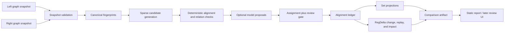

# Extending Policy Logic Forge with evidence-bounded semantic graph comparison

**Status:** implementation plan; proposed work is not implemented by this document  
**Decision:** proceed, but adapt the comparison concepts rather than porting the Policy-to-Knowledge implementation  
**Policy Logic Forge baseline:** `1964c00` (`main`, inspected 2026-09-07)  
**Policy-to-Knowledge reference baseline:** `f6185bef` (`main`, inspected 2026-09-07)

## 1. Executive direction

Policy Logic Forge should add semantic intersection, union, left-only, right-only,
and conflict views. They fit the existing RegDelta direction and would make its
old/new analysis much easier to inspect. The correct architecture is not to add
four more extraction agents or copy Policy-to-Knowledge Agents 7-10. It is to
build one post-extraction comparison service on top of Policy Logic Forge's
existing typed rule graph, fail-closed LExec compiler, exact-ID alignment,
semantic change classifier, differential executor, and impact propagation.

The upstream ideas divide into two groups:

- **Reuse the product concepts:** graph selection, comparison as an asynchronous
  job, behavior-based candidate blocking, directional set views, a conflict
  view, side-by-side evidence, progress reporting, and downloadable artifacts.
- **Replace the semantic core:** all-pairs LLM matching, greedy pairing,
  LLM-error-to-`UNRELATED` fallback, destructive “merged rule” construction,
  and set counts that omit uncertainty do not meet this repository's evidence
  and refusal standards.

The extension should support two explicitly different modes:

1. **Version mode:** two revisions from the same policy lineage. Results are
   unchanged/equivalent, modified, added, removed, unresolved, or refused, plus
   differential witnesses and downstream impact.
2. **Peer mode:** two policies from different issuers in the same domain.
   Results are shared/equivalent, left-only, right-only, conflicting,
   unresolved, or refused. “Stricter” and “weaker” are reported only where the
   typed logic proves or demonstrates that direction.

Keeping these modes separate matters. A missing rule in a newer version is a
possible removal; a missing rule in another issuer's policy is a coverage gap,
not a regulatory change. Likewise, conflicting peer policies can coexist,
while two revisions from one lineage represent replacement over time.

### Terminology assumption

The request's “left and right negative” is interpreted as the two directional
differences, `left − right` and `right − left`. The UI should call them
**Only in left** and **Only in right** (or **Removed** and **Added** in version
mode), because “negative” is easy to confuse with logical negation or negative
test cases.

## 2. What is actually present today

### 2.1 Policy Logic Forge

The repository already has the stronger half of the required semantic core:

| Capability | Current evidence | Boundary |
| --- | --- | --- |
| Typed, source-grounded rules | v2 rules carry predicates, condition logic, outcomes, variables, scope, exceptions, field evidence, readiness, and grounding | Many extracted rules remain review-required or outside the current LExec subset |
| Fail-closed compilation | [`utils/lexec_ir.py`](utils/lexec_ir.py), [`utils/lexec_compile.py`](utils/lexec_compile.py), and [`utils/smt.py`](utils/smt.py) | The bounded prover is not yet a general pairwise-equivalence prover |
| Pair alignment | [`utils/rule_alignment.py`](utils/rule_alignment.py) | Exact rule ID only; independent extractions do not align by ID |
| Semantic change classification | [`utils/semantic_diff.py`](utils/semantic_diff.py) | Precise for selected single-field IR changes; complex changes use honest catch-all labels |
| Differential execution | [`utils/regdelta_engine.py`](utils/regdelta_engine.py) | Works only for rules that compile on both sides and scenarios with sufficient inputs |
| Impact propagation | [`utils/impact_propagation.py`](utils/impact_propagation.py) | DAG reachability is extracted/narrative dependency, not always shared-symbol dataflow |
| Controlled validation | mortgage Tier 1: 65-rule universe, 45 compiled per side, 20 refusals, 16/16 labeled expectations; mobile Tier 1: 88-rule universe, 18 compiled per side, 70 refusals, 7 scenarios; mortgage Tier 2 recovered 3/3 planned field edits from an independent extraction | These are fixture-level results, not corpus-level alignment or semantic-comparison accuracy |
| Product surface | architecture and static documentation | There is no current comparison CLI, API, or review UI in this repository |

The retained result claims are in
[`results/aggregates/regdelta/`](results/aggregates/regdelta/). They establish
that controlled diff and replay work; they do not establish that arbitrary
independently extracted graphs can be semantically aligned.

### 2.2 Policy-to-Knowledge

The reference repository has a complete comparison-shaped workflow:

```text
graph A + graph B
  -> Agent 7: behavior clusters
  -> Agent 8: LLM pair classification
  -> Agent 9: intersection / left difference / right difference / union / conflicts
  -> Agent 10: HTML reports
  -> FastAPI job endpoints + React comparison page
```

Its retained Fannie Mae/Freddie Mac artifact demonstrates the output shape:
384 left rules and 371 right rules were rendered as 13 shared pairs, 371
left-only rules, 358 right-only rules, 12 reported contradictions, and a
742-item union. Those numbers are historical implementation output, not
ground-truth accuracy evidence; no labeled alignment protocol accompanies the
artifact.

Useful implementation references are:

- `apps/pipeline/agents/agent_7_rule_type_clusterer.py`
- `apps/pipeline/agents/agent_8_semantic_rule_matcher.py`
- `apps/pipeline/agents/agent_9_set_operations.py`
- `apps/pipeline/agents/agent_10_set_visualization.py`
- `apps/pipeline/cli/compare.py`
- `apps/pipeline/ui/backend/routers/compare.py`
- `apps/shell/src/pages/GraphComparison.tsx`

These paths are in the sibling `../policy-to-knowledge` checkout and are listed
as design evidence, not dependencies to import at runtime.

## 3. Why a direct port would be wrong

### 3.1 Model failure currently becomes a false absence

The upstream matcher converts a missing batch result, parse error, or LLM call
failure into `UNRELATED`. Agent 9 then treats the affected rules as left-only
and right-only. A provider outage can therefore look like a policy difference.
Policy Logic Forge's current contract does the opposite: uncertainty and
unsupported constructs remain visible as `unresolved-review` or refusal.

**Required change:** operational failures, incomplete responses, low margins,
and unsupported semantics must enter an `unresolved` bucket. They must never
create definitive directional differences.

### 3.2 Behavior labels are useful blockers, not identity

The upstream clusterer assigns one of eight behaviors and compares every left
rule with every right rule within that behavior. This reduces some work but has
two problems:

- semantically corresponding rules can receive different behavior labels; and
- large clusters still require `O(|L_b| × |R_b|)` model comparisons.

**Required change:** use behavior as one candidate-retrieval signal alongside
citation, source section, responsible party, scope, typed inputs/outputs,
predicate structure, and lexical/embedding retrieval. Never reject a candidate
solely because its behavior label differs.

### 3.3 Greedy matching is order-sensitive

The upstream matcher sorts positive pairs by model confidence and greedily
claims both nodes. Confidence is model self-report, not a calibrated matching
probability. Greedy selection can choose a plausible pair and prevent the
globally better alignment; it also has no split/merge representation.

**Required change:** score a sparse candidate graph, solve deterministic
maximum-weight one-to-one assignment for the first release, and send close
alternatives or one-to-many cases to review. Add explicit `split` and `merge`
cardinalities later; do not silently force them into one-to-one pairs.

### 3.4 The upstream union loses executable meaning

For a matched pair, the upstream set calculator copies the left rule, gives it
a `MERGED_...` ID, and stores a short summary of the right rule in provenance.
It also concatenates entity arrays without semantic entity resolution. That is
a useful display shortcut, but it is not a lossless or executable union.

**Required change:** union must be a projection over references to immutable
source rules. An equivalence class keeps both complete payloads and both
provenance chains. It must not invent a canonical executable rule unless a
separate, reviewed synthesis workflow produces and revalidates one.

### 3.5 Contradiction is a relation, not an error-free set operation

In the upstream flow, contradictory rules are not marked as matched, so the
same rules can remain in directional differences while also appearing in the
contradiction report. The batch prompt also omits detailed conflict fields that
the downstream calculator expects, which explains why the retained comparison
records all 12 conflicts as `UNKNOWN` type.

**Required change:** comparison buckets need a documented partition, and every
conflict edge needs typed evidence. Version-mode modification and peer-mode
conflict must not be conflated.

### 3.6 The visual layer is valuable but coupled

The upstream HTML visualizer is a large monolithic generator, while its React
page offers a good information hierarchy: selectors, asynchronous progress,
summary bar, metric cards, conflicts, directional lists, and side-by-side rule
details.

**Required change:** reuse that information architecture, not its generated
HTML implementation. Produce a stable JSON contract first, a small static
renderer second, and only then choose a durable interactive UI stack.

## 4. Product semantics

### 4.1 Inputs

Each side is an immutable `GraphSnapshot`:

```json
{
  "snapshot_id": "mortgage-2025-04-02",
  "domain": "mortgage",
  "lineage_id": "fannie-mae-selling-guide",
  "graph_path": ".../optimized_compliance_knowledge_graph.json",
  "graph_sha256": "...",
  "dag_path": ".../dependency_dags.json",
  "source_manifest_sha256": "...",
  "pipeline_commit": "...",
  "contract_version": "2.0",
  "readiness_stage": "agent_10_complete"
}
```

Validation rules:

- Reject cross-domain comparison before candidate generation.
- Version mode requires the same non-empty `lineage_id`; peer mode requires
  only the same domain.
- Record absent DAGs as `impact_unavailable`, not as an empty impact graph.
- Keep every input rule in coverage accounting, including review-required,
  grounding-failed, duplicate-ID, and compiler-refused rules.
- Hash all inputs and comparison configuration so results are replayable.

### 4.2 Normalized comparison record

Do not compare descriptions alone. Build a lossless `RuleFingerprint` beside
each original rule:

```json
{
  "rule_ref": {"snapshot_id": "...", "rule_id": "..."},
  "source_keys": ["section_id", "chunk_path", "normalized_span_hash"],
  "behavior_labels": ["threshold", "mandate"],
  "actor": "LENDER",
  "scope_signature": "sha256:...",
  "condition_signature": "sha256:...",
  "exception_signature": "sha256:...",
  "effect_signature": "sha256:...",
  "input_symbols": ["ltv_ratio_percent"],
  "output_symbols": ["primary_mortgage_insurance_policy_required"],
  "evidence_hashes": ["sha256:..."],
  "readiness": "ready",
  "compile_status": "compiled"
}
```

Signatures must canonicalize commutative `and`/`or` children, aliases accepted
by an explicit symbol map, units, enums, and harmless ordering, while retaining
operator direction, values, negation, exception position, scope, and effects.
The original v2 rule and LExec IR remain authoritative; fingerprints are only
indexes and comparison aids.

### 4.3 Alignment ledger

Alignment and semantic relation are separate decisions. Every candidate edge
must retain both:

```json
{
  "alignment_id": "aln-...",
  "left_rule_ids": ["R-120-004"],
  "right_rule_ids": ["B1-R001-HIGH-LTV-MI-REQUIREMENT"],
  "cardinality": "one_to_one",
  "alignment_status": "accepted",
  "alignment_method": "citation_effect",
  "relation": "modified",
  "evidence_level": "structural",
  "score_components": {
    "citation": 1.0,
    "scope": 0.9,
    "condition": 0.8,
    "effect": 1.0,
    "text": 0.7
  },
  "runner_up_margin": 0.24,
  "change": {
    "taxonomy": "threshold_or_constant_change",
    "direction": "weakening",
    "old_literal": 80,
    "new_literal": 78
  },
  "evidence_refs": ["..."],
  "review": null
}
```

Closed values for the first release:

- `alignment_status`: `accepted`, `proposed`, `rejected`, `unresolved`,
  `refused`
- `alignment_method`: `exact_id`, `source_identity`, `citation_effect`,
  `structural`, `semantic_model`, `human_review`
- `relation`: `identical`, `behaviorally_equivalent`, `modified`,
  `conflicting`, `unrelated`, `unknown`
- `evidence_level`: `canonical`, `bounded_proof`, `differential_witness`,
  `structural`, `model_proposed`, `human_reviewed`

`behaviorally_equivalent` must always state its boundary. Canonical IR equality
is stronger than agreement on a finite scenario suite; a bounded proof is only
as broad as its declared finite domains; observed agreement is not proof.

### 4.4 Set definitions

For release 1, accepted alignments are one-to-one. Let `L` and `R` be all input
rule references and `A` the accepted alignment edges.

```text
I_strict = accepted pairs whose relation is identical or behaviorally_equivalent
           and whose evidence level is canonical or bounded_proof

I_reviewed = I_strict plus human-reviewed equivalent pairs

Modified = accepted pairs classified modified (version mode)
Conflicting = accepted pairs classified conflicting (peer mode)

LeftOnly = non-refused left rules with no accepted correspondence and no unresolved candidate
RightOnly = non-refused right rules with no accepted correspondence and no unresolved candidate

UnresolvedLeft / UnresolvedRight = rules blocked by ambiguity, missing evidence,
                                  model failure, review status, or unsupported logic

Union = equivalence classes induced only by the selected intersection tier,
        plus every other source rule as an immutable singleton
```

Important consequences:

- Equivalent, modified/conflicting, directional-only, unresolved, and refused
  are disjoint primary accounting buckets; the precedence is refused, then
  unresolved, then an accepted relation, then directional-only.
- A modified or conflicting pair has a correspondence, so it is not also
  left-only/right-only.
- Unresolved rules are not directional differences.
- Union quotienting collapses only supported equivalence. It never collapses
  modified, conflicting, or unresolved rules.
- A union member stores complete references to both source rules; it is not a
  synthesized policy rule.

For one-to-one release-1 alignments, enforce conservation checks:

```text
|L| = equivalent_pairs + modified_or_conflict_pairs
      + left_only + unresolved_left + refused_left

|R| = equivalent_pairs + modified_or_conflict_pairs
      + right_only + unresolved_right + refused_right

|Union| = |L| + |R| - collapsed_equivalent_pairs
```

Any failed conservation check invalidates the comparison artifact.

### 4.5 Conflict semantics

Conflict classification should be deterministic where possible:

- same scope and output symbol with incompatible output values;
- overlapping conditions with mutually exclusive effects;
- incompatible numeric bounds over a shared normalized variable;
- prohibition versus permission/mandate over the same actor, action, object,
  scope, and time;
- exception changes that invert behavior for a demonstrable witness.

Use the bounded solver only after symbol and domain alignment. Search for a
counterexample to equivalence or a witness of overlapping incompatible effects.
Return `unknown` when domains are open, symbols are not aligned, the assignment
budget is exceeded, or the construct is unsupported. A model can propose a
conflict and explain candidate evidence, but it cannot move a pair into the
accepted conflict bucket without deterministic support or human review in the
first release.

## 5. Proposed architecture



The comparison system remains outside `agents/` and outside extraction
orchestration. Both graph snapshots must already exist. This preserves the
current architecture in which RegDelta consumes pipeline outputs without
changing or re-running them.

### 5.1 Candidate ladder

Run candidate generation in decreasing-confidence stages:

1. exact stable ID within a declared lineage;
2. exact source identity: document/section/span hash;
3. normalized citation plus compatible actor/effect signature;
4. compatible typed condition/effect/scope structure;
5. sparse lexical or embedding retrieval within domain and broad behavior;
6. optional model adjudication over the bounded candidate packet;
7. explicit review when the winner is ambiguous or semantics are unsupported.

Stages 1-4 are deterministic. Stage 5 retrieves candidates but does not decide
identity. Stage 6 proposes a relation with evidence citations. Stage 7 is a
state transition recorded in the ledger, not an edit to either source graph.

Candidate retrieval must be bounded and measurable. Initial defaults:

- at most 20 candidates per left rule before deterministic filtering;
- at most 5 model-adjudicated candidates per unresolved left rule;
- evidence packet capped by character and record count;
- candidates deduplicated by `(left_rule_id, right_rule_id)`;
- no pair evaluated twice after a valid checkpoint hit;
- checkpoints invalidated by input hash, schema version, prompt hash, model,
  or comparison-policy change.

### 5.2 Assignment policy

Release 1 supports accepted one-to-one alignments only. Use maximum-weight
bipartite matching over eligible candidate edges, with deterministic tie
breaking. Auto-accept only if all of the following hold:

- required readiness/grounding policy passes on both sides;
- the edge crosses the configured acceptance threshold;
- its margin over the next candidate on both nodes crosses the ambiguity
  threshold;
- no incompatible exact source identity exists;
- its semantic relation has an allowed evidence level.

Close scores, duplicate source spans, split/merge signals, or competing exact
citations become `unresolved`, never arbitrary winners. A later release may add
explicit one-to-many and many-to-one hyperedges after its UI and conservation
rules are specified and tested.

### 5.3 Artifact contract

Preserve `regdelta-impact/1.0` for compatibility. Add a separate
`regdelta-comparison/2.0` document rather than silently changing the existing
schema:

```json
{
  "schema_version": "regdelta-comparison/2.0",
  "comparison_id": "...",
  "mode": "version",
  "left_snapshot": {},
  "right_snapshot": {},
  "policy": {
    "intersection_tier": "strict",
    "readiness_policy": "ready_and_grounded",
    "candidate_limit": 20,
    "model_adjudication": false
  },
  "manifest": {
    "implementation_commit": "...",
    "config_sha256": "...",
    "prompt_sha256": null,
    "model": null,
    "started_at": "...",
    "completed_at": "..."
  },
  "alignments": [],
  "sets": {
    "intersection_strict": [],
    "intersection_reviewed": [],
    "left_only": [],
    "right_only": [],
    "union_classes": [],
    "modified": [],
    "conflicting": [],
    "unresolved": [],
    "refused": []
  },
  "regdelta_impact_ref": "regdelta-impact.json",
  "coverage": {},
  "validation": {"conservation_checks_passed": true}
}
```

Coverage must report raw rules, ready/grounded rules, compiled rules, accepted
alignments by evidence level, proposed pairs, unresolved rules by reason,
refusals by code, and rules in each projection. Headline overlap must show its
denominator and evidence tier; for example, “strict overlap among 45 + 45
compiled rules,” not merely “72% overlap.”

## 6. Interfaces

### 6.1 Python API

Add a pure orchestration boundary:

```python
compare_graphs(
    left: GraphSnapshot,
    right: GraphSnapshot,
    *,
    mode: Literal["version", "peer"],
    policy: ComparisonPolicy,
    scenarios: Sequence[Scenario] = (),
) -> ComparisonArtifact
```

The function must be deterministic when model adjudication is disabled. Model
work belongs behind an injected adjudicator interface so unit and integration
tests do not require a provider.

### 6.2 CLI

After the library contract is stable, add:

```bash
PYTHONPATH=. .venv/bin/python cli/compare.py \
  --left-batch mortgage-2025-04-02 \
  --right-batch mortgage-2026-03-04 \
  --mode version \
  --intersection-tier strict \
  --output-dir pipeline-output/_comparisons/fannie-2025-to-2026
```

Required exit behavior:

- `0`: artifact complete and all schema/conservation checks pass;
- nonzero: invalid input, cross-domain/lineage mismatch, corrupt artifact,
  orchestration failure, or incomplete required stage;
- comparison uncertainty does not crash the job, but is explicitly present in
  `unresolved` and can fail a caller-specified coverage gate.

The CLI must support `--no-model` and default to it until model-assisted
alignment has a labeled evaluation and review workflow.

### 6.3 Report and UI

Ship in this order:

1. JSON artifact and schema validator;
2. deterministic static HTML renderer for fixture inspection;
3. asynchronous API/job layer;
4. interactive review UI.

The report should have these primary tabs:

- Overview and coverage
- Shared / equivalent
- Modified (version mode)
- Only in left / removed
- Only in right / added
- Conflicts (peer mode)
- Unresolved and refused
- Affected cases and downstream impact
- Run manifest

Each rule-pair view shows complete left/right source excerpts, field-level
semantic diff, evidence level, alignment method and alternatives, readiness and
grounding state, differential witnesses, and impacted DAG neighbors. The page
must not display “comparison complete” as if it meant semantically complete;
it should display both job completion and comparison coverage.

## 7. Implementation work packages

### WP0 — lock terminology and schema

**Files:**

- add `plan/regdelta-comparison-v2.schema.json`
- add `utils/comparison_contract.py`
- add `tests/test_comparison_contract.py`

**Work:**

- Define snapshot, fingerprint, candidate edge, alignment, set projection,
  coverage, manifest, and error contracts.
- Preserve `regdelta-impact/1.0` unchanged.
- Encode the conservation invariants and closed enumerations.

**Exit:** malformed and incomplete artifacts fail validation; an artifact with
unresolved/refused items validates only when they are included in coverage.

### WP1 — deterministic fingerprints and exact set projection

**Files:**

- add `utils/rule_fingerprint.py`
- extend `utils/rule_alignment.py` without changing `align_by_id` behavior
- add `utils/set_projection.py`
- add focused unit/property tests

**Work:**

- Canonicalize supported LExec formulas and effects.
- Produce exact-ID and canonical-equality relations.
- Generate strict intersection, directional differences, union classes,
  unresolved, and refusal views.
- Run against both existing Tier 1 fixtures.

**Exit:** identical graph versus itself yields full strict intersection, empty
directional differences, and no modifications; swapping sides swaps only the
directional labels; all conservation checks pass.

### WP2 — sparse alignment beyond IDs

**Files:**

- add `utils/alignment_candidates.py`
- add `utils/alignment_assignment.py`
- add `fixtures/regdelta/alignment_tier1/`
- add `tests/test_alignment_candidates.py`
- add `tests/test_alignment_assignment.py`

**Work:**

- Implement source/citation, actor, scope, typed-symbol, condition, and effect
  retrieval signals.
- Implement deterministic maximum-weight assignment and ambiguity margins.
- Represent duplicate, split, and merge cases as unresolved.
- Use the independent-ID mortgage Tier 2 extraction as an initial regression,
  while creating a separately labeled alignment fixture for actual scoring.

**Exit:** all labeled exact/structural pairs and all labeled non-pairs are
accounted for; ambiguous cases remain unresolved; no full Cartesian LLM pass is
needed.

### WP3 — semantic relation and proof/witness layer

**Files:**

- add `utils/semantic_relation.py`
- extend `utils/semantic_diff.py` with backward-compatible entry points
- add relation fixtures for thresholds, scope, exceptions, negation, outputs,
  split/merge, unsupported constructs, and open domains

**Work:**

- Reuse `classify_change` for accepted version pairs.
- Add deterministic canonical equality and conflict checks.
- Add bounded equivalence/counterexample queries only after symbol alignment.
- Record proof boundary, explored assignments, counterexamples, timeouts, and
  unknown reasons.

**Exit:** a counterexample is reproducible through `evaluate_rule_for_diff`;
unknown solver results never become equivalent or conflicting automatically.

### WP4 — optional model proposal layer

**Files:**

- add `utils/comparison_adjudicator.py`
- add `prompts/semantic_alignment.txt`
- add domain overrides only where evidence demonstrates the need
- add checkpoint and malformed-response tests

**Work:**

- Send only sparse candidates with bounded, deduplicated source evidence.
- Require structured responses tied to candidate IDs and evidence references.
- Record model, prompt hash, response status, latency, and token/cost fields.
- Map timeout, parse failure, missing pair, or low confidence to `unresolved`.
- Keep model-only results `proposed`; add human accept/reject transitions later.

**Exit:** provider failure changes only operational metrics and unresolved
counts; it cannot increase intersection, conflicts, left-only, or right-only.

### WP5 — orchestration, CLI, and retained report

**Files:**

- add `utils/comparison_engine.py`
- add `cli/compare.py`
- extend `utils/regdelta_engine.py` only through a compatibility adapter
- add `utils/comparison_report.py`
- add `tests/test_comparison_engine.py`
- add CLI end-to-end tests

**Work:**

- Compose validation, fingerprints, candidates, assignment, relation,
  projections, existing RegDelta replay/impact, and manifests.
- Write artifacts atomically under `pipeline-output/_comparisons/<comparison>`.
- Render the retained fixture report from the JSON artifact.

**Exit:** one provider-free command recreates a validated report from checked-in
fixtures; rerunning it is byte-stable except explicitly normalized timestamps.

### WP6 — async API and review UI

This begins only after WP5's artifact is stable. Select the UI/backend stack in
a short architecture decision record because this repository currently has no
review application to extend.

Minimum endpoints:

```text
POST /api/comparisons
GET  /api/comparisons/{id}
GET  /api/comparisons/{id}/artifact
POST /api/comparisons/{id}/alignments/{alignment_id}/review
POST /api/comparisons/{id}/cancel
```

Review writes append-only decisions with reviewer identity, timestamp, prior
state, new state, and rationale. It never mutates either source graph. Jobs
must expose queued/running/complete/failed/cancelled state and per-stage
progress. A comparison may be operationally complete while retaining semantic
unresolved items.

**Exit:** a reviewer can select two compatible snapshots, run a provider-free
comparison, inspect every bucket, accept/reject a proposal, see counts update
without losing audit history, and download both JSON and HTML artifacts.

### WP7 — evaluation and release gates

Create three separate evaluations:

1. **Set/contract correctness:** deterministic and property-based tests.
2. **Alignment quality:** a frozen, human-labeled pair/non-pair dataset from
   independently extracted same-lineage and peer graphs.
3. **Relation quality:** separate labels for equivalent, modified, conflicting,
   unrelated, and unknown, with field-level evidence.

Do not combine extraction accuracy, candidate recall, alignment precision,
relation accuracy, or end-to-end coverage into one score.

## 8. Verification matrix

| Level | Required checks |
| --- | --- |
| Contract | schema validation; closed enums; hashes present; no dangling rule references; conservation equations |
| Fingerprints | ordering invariance for commutative formulas; sensitivity to negation/operator/value/scope/effect; provenance excluded from semantic equality but retained in output |
| Alignment | side-swap symmetry; deterministic tie breaks; duplicate IDs refused; close candidates unresolved; exact source identity outranks text similarity |
| Sets | self-comparison identity; empty-side behavior; disjoint graphs; equivalent pair collapse; modified/conflict non-collapse; unresolved excluded from directional differences |
| Semantic relations | threshold strengthen/weaken; exception add/remove; output conflict; scope overlap/disjointness; unknown on open/unsupported domains |
| Fail-closed behavior | provider timeout, invalid JSON, missing pair, stale checkpoint, prompt change, solver budget, and absent DAG never become a semantic conclusion |
| RegDelta integration | current mortgage/mobile fixtures retain their existing diff outcomes; witnesses reproduce; impact statuses and refusals remain visible |
| CLI | invalid mode/domain/lineage exits nonzero; `--no-model` needs no credentials; atomic output; rerun determinism |
| UI | all rule references reachable; coverage always visible; side swap correct; keyboard/mobile layout; cancellation; failed and unresolved states distinguishable |

### Required test commands for implementation PRs

At minimum, each work package runs its focused tests, then:

```bash
.venv/bin/python -m pytest -q
.venv/bin/python proofs/check_properties.py
.venv/bin/python scripts/validate_config.py --config config.example.json
git diff --check
```

Generated schemas/reports must be regenerated by their authoritative builder
and checked for drift where the work package introduces such a builder.

## 9. Measurable release gates

These are targets for future implementation and evaluation, not achieved
results:

### Engine gate

- 100% set-conservation checks across all fixtures.
- 100% retained RegDelta Tier 1 expectations remain matched.
- 0 operational/model failures classified as unrelated, directional-only,
  equivalent, modified, or conflicting.
- 0 source rules omitted from accepted, unresolved, or refused accounting.
- Deterministic provider-free runs produce the same semantic payload hash.

### Alignment gate

- Freeze the labeled evaluation before selecting thresholds.
- Auto-accepted alignment precision target: at least 0.98 with a reported 95%
  confidence interval; if the lower bound misses the target, move more cases to
  review rather than weakening the gate.
- Report candidate recall separately; missed candidates cannot be repaired by
  assignment or adjudication.
- Report coverage and abstention/unresolved rate beside precision.

### Relation gate

- Report per-class precision/recall/F1 and confusion matrix for identical,
  equivalent, modified, conflicting, unrelated, and unknown.
- No conflict recall claim without a labeled conflict cohort.
- Every accepted non-canonical equivalence or conflict has a deterministic
  proof/witness or recorded human review.

### Product gate

- Two real, full, independently processed document snapshots complete through
  the entry point with measured wall time, provider calls, and cost.
- Every source rule is visible in a primary bucket or explicit unresolved/
  refused bucket.
- The report discloses the selected intersection tier and denominator.
- Cancellation and restart/checkpoint recovery are tested.
- The feature is described as product-ready only after these gates pass; fixture
  success alone remains engine evidence.

## 10. Risks and controls

| Risk | Control |
| --- | --- |
| Semantically identical rules use unrelated IDs/symbol names | staged citation/structure candidates, explicit alias maps, sparse model proposals, review |
| A plausible text match hides a logic difference | typed scope/condition/exception/effect comparison outranks text; witnesses/proofs required |
| LLM outage creates false policy gaps | all operational failures become unresolved |
| Behavior clustering misses cross-category matches | behavior is a soft retrieval signal, never a hard exclusion |
| Greedy pairing creates wrong matches | global assignment, bidirectional margin, deterministic ties, unresolved ambiguity |
| Split or merge is forced into one-to-one | represent as unresolved in release 1; add hyperedge contract later |
| Union becomes a fabricated executable policy | immutable source references; no synthesized canonical rule |
| High overlap hides poor coverage | show raw, ready, compiled, accepted, unresolved, and refused denominators |
| “Equivalent” overstates finite testing | evidence-level labels: canonical, bounded proof, witness/observed, model-proposed, reviewed |
| Extracted DAG overstates causality | label potential impact as reachability; retain review/refusal; do not call it proven dataflow |
| Existing RegDelta consumers break | keep `regdelta-impact/1.0`; add a sidecar `regdelta-comparison/2.0` contract |
| Full comparison cost explodes | sparse top-k retrieval, deterministic filters, checkpointing, bounded evidence packets, provider-free default |

## 11. Non-goals for the first release

- Automatically synthesizing a new executable policy from union members.
- Treating model confidence as calibrated probability.
- Supporting cross-domain graph comparison.
- Automatically resolving one-to-many or many-to-one alignments.
- Claiming legal correctness, regulatory completeness, or corpus-wide accuracy.
- Re-running extraction as part of the comparison library call.
- Replacing the existing grounding, readiness, compiler, proof, or RegDelta
  contracts.

## 12. Recommended sequence and decision points

The shortest defensible path is WP0 → WP1 → WP2 → WP3 → WP5. This
delivers a provider-free CLI and report before optional model work or a new UI.
WP4 should proceed only when deterministic candidate recall is measured and a
labeled ambiguous set exists. WP6 should proceed only after reviewers have used
the static report and the artifact contract has stopped changing.

Three decisions should be made through small architecture records during the
work, not guessed now:

1. the exact scoring weights and auto-accept/margin thresholds, selected on a
   frozen development split;
2. whether a reviewed equivalence is included in the default intersection or
   only the opt-in reviewed tier; and
3. the UI/backend stack, after the provider-free report proves the workflow.

This direction turns Policy-to-Knowledge's comparison experience into a natural
extension of Policy Logic Forge without weakening the property that most
distinguishes this repository: unsupported, ungrounded, ambiguous, and failed
work remains visible instead of being converted into a confident semantic
answer.
