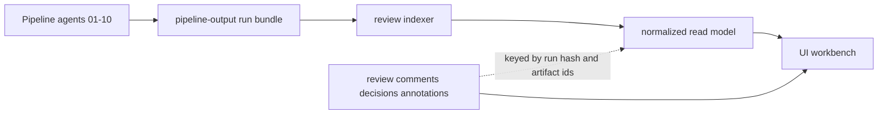
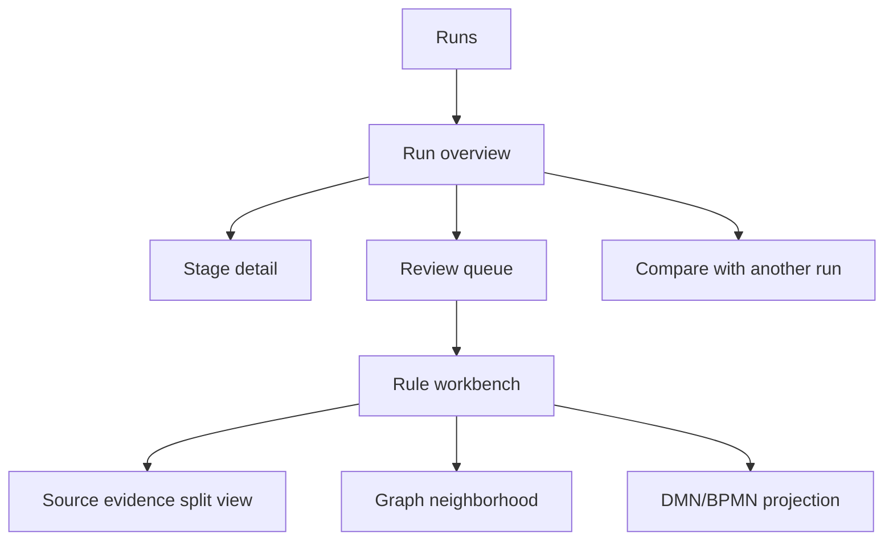

# Policy Logic Forge UI: Review, Validation, and Observability Workbench

## Objective

Build an interactive workspace on top of the existing Policy Logic Forge
pipeline so reviewers can inspect runs, validate outputs, trace every artifact
back to source evidence, compare runs, and record review decisions without
changing the pipeline's canonical artifacts.

This should not be a generic dashboard. It should be a provenance-first review
surface for a pipeline that already emits rich stage outputs, explicit failure
states, grounding evidence, dependency structures, and executable projections.

## Deep Review of the Current Pipeline

The current pipeline already produces most of the raw material needed for a
strong review UI. The main problem is not missing data. The problem is that the
data is fragmented across stage files, JSONL checkpoints, graph bundles, and
source chunks, so the reviewer has to reconstruct the story manually.

### What the pipeline already gives us

| Area | Current evidence in repo | UI implication |
| --- | --- | --- |
| Stage progression | `agent_01` through `agent_10` outputs under `pipeline-output/<batch>/` | We can build a stage-aware run overview without changing the core pipeline. |
| Run summaries | `agent_01-organized-documents/_processing_results.json`, `agent_04-validation/validation_report.json`, `agent_06-optimized/kg_readiness_report.json`, `agent_06-optimized/kg_grounding_report.json`, `agent_10-dag-generation/dependency_dags.json` | Each stage already has machine-readable status and metrics. |
| Rule-level review state | `requires_review`, `review_reason`, `contract_issues`, `readiness`, `grounding` on each rule in `optimized_compliance_knowledge_graph.json` | A rule review queue can be derived directly from canonical graph output. |
| Source traceability | `source_reference`, `field_evidence`, `scope_derivation`, `exception_verification`, document chunk paths, quoted source text | Side-by-side source-to-rule review is feasible immediately. |
| Execution projections | `execution.dmn`, `execution.bpmn`, `recommended_hit_policy` per rule | DMN/BPMN review can start as projection inspection before full compiler assets are integrated. |
| Graph relationships | `dependency_details.dependencies`, `dependency_details.conflicts`, `dependency_dags.json` | Network and DAG visualizations can be built from existing outputs. |
| Run provenance | `corpus_manifest`, `corpus_sha256`, `certified_graph_sha256`, checkpoint files, stage reports | Comparison and audit views can be hash-bound and fail closed. |
| Live-ish progress | `batch_results.jsonl`, `agent_07_rule_checkpoint.jsonl`, `agent_08_checkpoint.jsonl`, `agent_09_grounding_checkpoint.jsonl` | A monitor view can be built by tailing checkpoint files, even before true event streaming exists. |

### Gaps the UI must compensate for

| Gap | Current reality | Design response |
| --- | --- | --- |
| Fragmented read model | Review-relevant fields are spread across many files and schemas | Add a normalized read-only review index layer. |
| No review overlay | There is no first-class place for comments, annotations, disposition, or human decisions | Add a separate annotation store keyed by run hash and artifact IDs. |
| No run catalog | The repo stores runs as folders, not as queryable entities | Build a run registry from discovered bundles and manifests. |
| No cross-run diff model | Two runs can only be compared by hand | Add normalized rule, relationship, and document indexes with stable comparison keys. |
| No UI event contract | Progress is inferred from files appearing and JSONL growing | Add an adapter that emits stage status snapshots and optional event feeds. |
| No materialized DMN/BPMN artifacts in pipeline runs | Current pipeline stores projections in rules, not full visual assets | Start with projection viewers, then upgrade when compiler/back-end artifacts are available. |

### Important constraints the UI must preserve

- The pipeline is currently a CLI-and-library repo, not a product monolith.
- Canonical outputs remain the stage artifacts under `pipeline-output/`.
- The UI must never silently rewrite rule content or hide failed states.
- `requires_review`, readiness failures, grounding failures, and unresolved
  conflicts must remain explicit and queryable.
- Comments, decisions, and annotations must live in a separate overlay store so
  the line between machine output and human review stays clear.

## Current Implementation and UX Audit (2026-08-26)

The original plan has now been implemented under `ui/`: the repository has a
normalized indexer, local artifact API, immutable review overlay, React
frontend, retained-run tests, and the planned review surfaces. The next problem
is no longer feature availability. It is whether a reviewer can use those
features comfortably and confidently for hours at a time.

### What is professionally sound today

- The pipeline/UI boundary is correct: the frontend never rewrites canonical
  run artifacts, and review decisions remain in a separate hash-bound overlay.
- Failure states remain visible. Readiness, grounding, conflict, and index
  diagnostics are not collapsed into false-success empty states.
- The navigation covers the real review jobs: orient to a run, triage rules,
  inspect evidence, review relationships, compare runs, and diagnose failures.
- The read model and API are sufficiently complete for a UX-focused increment;
  redesigning the backend is not a prerequisite for improving the workbench.

### UX defects found in the implemented frontend

| Area | Current behavior | Reviewer impact | Required correction |
| --- | --- | --- | --- |
| Responsive shell | `body` has a 1,100 px minimum width and the sidebar is always expanded | Narrow laptop windows and mobile/tablet use overflow instead of adapting | Add a compact desktop rail and a real mobile drawer/top bar; remove fixed page minimums. |
| Information hierarchy | Run ID, absolute source path, status, timestamp, four metrics, flow graph, and two large panels compete at once | The first screen is technically complete but cognitively heavy | Use a concise run header, breadcrumb/context line, priority summary, and progressive disclosure for provenance. |
| Navigation | Navigation uses cryptic text glyphs and has no compact or mobile state | Icons are visually inconsistent and labels disappear poorly at reduced widths | Use a small internal SVG icon system, visible labels/tooltips, clear active state, and a menu control. |
| Stage flow | Ten nodes are compressed into tiny labels inside a generic graph canvas with a large minimap | The core pipeline is effectively unreadable at a normal zoom | Replace the overview with a semantic, horizontally scrollable stage stepper; reserve React Flow for detailed structural diagrams. |
| Search | Search opens only on submit, has no keyboard hint, no explicit loading state, and no escape/overlay semantics | Search feels abrupt and keyboard users cannot predict or dismiss it reliably | Add command-style search affordance, loading/results states, Escape handling, modal semantics, and background dismissal. |
| Tables and filters | Five filters and saved-view controls form a dense ungrouped strip; rows are optimized for data density only | Reviewers spend effort parsing controls before reviewing rules | Group primary filters, move secondary controls into a disclosure panel, add active-filter feedback, sticky headers, and responsive cards. |
| Interaction feedback | Refresh, polling, filter requests, and overlay writes have minimal or local-only feedback | Users cannot tell whether data is current, loading, saved, or stale | Add non-blocking progress, `aria-live` status, success/error notices, disabled states, and a visible last-refresh indicator. |
| Accessibility | Focus visibility is inconsistent, icon-only controls are small, modal focus is unmanaged, and table rows mimic buttons | Keyboard and assistive-technology behavior is unreliable | Establish focus-visible tokens, 44 px targets, real button/link semantics, dialog roles, labels, and reduced-motion support. |
| Visual system | Typography is undersized in evidence-heavy views; spacing and surface treatment are nearly uniform | Important warnings and decision actions do not stand out from supporting metadata | Define type, spacing, elevation, color, and motion tokens; strengthen hierarchy without hiding negative states. |
| Empty and error states | Most states are terse single lines and global errors persist above unrelated content | Recovery paths are unclear and errors can dominate the shell | Use contextual empty states with next actions and view-scoped, dismissible error notices. |

### UX outcome for this increment

The workbench should feel like a calm evidence-review product: clear at first
glance, dense only when the reviewer asks for detail, responsive from phone to
large desktop, keyboard navigable, and explicit about status without becoming
alarm-heavy. Smoothness means predictable transitions and preserved context,
not decorative animation.

### Acceptance criteria for the professional UI pass

- At 1440 px, the overview communicates run state, review burden, and the next
  action without exposing a full filesystem path as the dominant subtitle.
- At 1024 px, the app remains usable with a compact navigation rail and no page
  level horizontal overflow.
- At 390 px, navigation is available through a drawer, metric cards stack, and
  tables become readable review cards rather than clipped desktop tables.
- Pipeline stages are readable without zooming and remain individually
  actionable.
- Search behaves as an accessible dialog, supports Escape, and distinguishes
  loading, no-results, and result states.
- Every interactive element has a visible keyboard focus state and a usable
  target size; reduced-motion preferences are honored.
- Machine failure and `requires_review` states remain at least as prominent as
  they are in the current implementation.
- Existing API contracts and review-overlay semantics remain unchanged.

## Product Principles

1. Provenance first. Every rendered claim, warning, edge, and approval state
   must link back to the exact source artifact and field path that produced it.
2. Read-only core, writable overlay. Pipeline artifacts are immutable inputs.
   Review notes and decisions are separate records.
3. Fail closed in the UI too. Missing evidence, missing stage outputs, schema
   mismatches, and unresolved lineage must appear as review blockers, not empty
   states that look successful.
4. High-level to exact evidence in three clicks or less. Reviewers should be
   able to go from run summary to stage to rule to source text quickly.
5. Decouple generation from inspection. The pipeline should not know the UI
   exists. The UI consumes a normalized read model built from pipeline outputs.

## Recommended Product Shape

### Core concept

Treat each pipeline run as a reviewable evidence bundle:

- canonical source: `pipeline-output/<batch>/...`
- normalized read model: `review-index/<run-id>/...`
- reviewer overlay: `review-state/<workspace>.sqlite` or Postgres later

This yields a clean separation:



## Navigation Model

The UI should be organized around how a reviewer actually works, not around raw
file names.

### Top-level sections

| Section | Purpose |
| --- | --- |
| Runs | Catalog and compare available pipeline runs. |
| Run overview | Stage flow, totals, warnings, failures, and current review state. |
| Review queue | Triage rules, relationships, and unresolved items that require attention. |
| Rule workbench | Full rule detail with source, readiness, grounding, dependencies, and projections. |
| Documents and evidence | Browse source docs, chunks, evidence spans, and where they were used. |
| Graph explorer | Entity/relationship graph, dependency graph, conflict graph, and DAG partitions. |
| Compare | Compare two runs by stage metrics, rule deltas, relationship deltas, and review deltas. |
| Admin/health | Schema/version compatibility, indexing status, missing files, and adapter warnings. |

### Reviewer flow



## Capability Plan

Each capability below is defined by what it provides, why it matters, what data
it needs, and how to implement it.

| Capability | What it provides | Why it is valuable | Required data | Implementation |
| --- | --- | --- | --- | --- |
| Pipeline run overview | Run header, stage cards, pass/fail state, totals, timing, warnings, failure counts, review burden | Gives reviewers immediate orientation and lets them decide where to start | Stage summaries, checkpoint counts, corpus manifest, graph/report totals | Build a normalized `run_summary.json` from stage files and render as a stage flow with KPI cards. |
| Stage execution flow and status | Visual stage pipeline showing completed, failed, partial, waiting, or skipped stages | Makes it obvious whether a problem is extraction, validation, remediation, grounding, or DAG generation | Presence and parsed status of stage artifacts; checkpoint progress; CLI config if available | Use React Flow for stage orchestration view; each stage node links to stage detail and raw artifacts. |
| Stage detail screens | Metrics, warnings, failures, artifacts, checkpoint progress, raw JSON/JSONL viewers | Reviewers need to understand not just the final graph but where defects were introduced | Per-stage files including `_processing_results.json`, `validation_report.json`, readiness/grounding reports, DAG reports | One page per stage with structured panels and a raw artifact tab. |
| Interactive rule table | Sort, filter, group, pin columns, bulk-select, export selections | The optimized graph can be hundreds of rules; table ergonomics determine whether review is practical | Normalized rule index derived from `optimized_compliance_knowledge_graph.json` | Use TanStack Table with server-side or hybrid filtering on rule status, rule type, risk, responsible party, readiness, grounding, and source doc. |
| Review queue | Queues such as `requires_review`, failed grounding, missing field evidence, unresolved conflicts, low confidence | Converts a large graph into a manageable action list | Rule index, relationship index, review overlay state | Precompute queue definitions; allow saved views and reviewer assignment later. |
| Rule workbench | Canonical detail view for one rule with condition logic, outcomes, variables, evidence, readiness, grounding, related rules, and reviewer notes | This is the highest-value review surface in the system | Full rule object, relationship memberships, evidence index, review annotations | Use a multi-panel layout: rule summary, logic, evidence, validation, graph neighborhood, review notes. |
| Source-to-rule split view | Side-by-side source chunk and extracted rule with highlighted cited text and field evidence | Reviewers need to validate whether structured output faithfully reflects source | `source_reference`, `field_evidence`, organized documents, chunk files, word positions where available | Render the source text on the left and the rule fields on the right; highlight exact cited snippets and list which field each snippet supports. |
| Evidence explorer | Search and inspect every evidence record, where it appears, and whether it was accepted, contradicted, or insufficient | Prevents shallow review based only on rule summaries | Grounding claims, evidence records, readiness evidence, source chunk metadata | Create an evidence index keyed by `evidence_id`, chunk path, section id, and supporting quote. |
| Knowledge graph explorer | Entity and relationship network with filters by type, rule status, confidence, review state | Lets reviewers understand the topology and inspect clusters of related rules | `entity_types`, `relationships`, `business_rules`, `dependency_details` | Use Cytoscape.js for graph visualization with neighborhood expansion and compound grouping by entity type or stage status. |
| Dependency and conflict explorer | Directed dependency graph, conflict graph, circular dependency groups, and DAG partitions | Critical for reviewing executable behavior and optimizer output | `dependency_details`, `dependency_dags.json`, readiness conflict summaries | Use Cytoscape.js for dense relationship views and React Flow for DAG partition detail. |
| DMN/BPMN projection viewer | Per-rule visual projection of current `execution.dmn` and `execution.bpmn` payloads, with unsupported or incomplete indicators | Makes executable-readiness review tangible and prepares for compiler back-end validation | `execution`, `recommended_hit_policy`, variables, outcomes, readiness failures | Phase 1: render projection cards and simple node-edge visuals from rule fields. Phase 2: consume emitted DMN XML and BPMN assets when those artifacts are available. |
| Validation and diagnostics console | Unified display of schema issues, warnings, readiness failures, grounding failures, unsupported constructs, and adapter/indexing errors | Review work depends on seeing unresolved risk, not hiding it in scattered files | `contract_issues`, validation reports, readiness invariants, grounding failures, indexer health | Build a diagnostics model with severity, artifact path, field path, and remediation hint. |
| Cross-run comparison | Compare runs by stage metrics, rule additions/removals/changes, relationship changes, and review outcomes | High-value for regression detection, prompt changes, and pipeline tuning | Two normalized run indexes, stable comparison keys, rule/relationship hashes | Provide overview diff, rule diff, relationship diff, and evidence delta. Start with exact ID/hash compare; add semantic compare later. |
| Comments and decisions | Comments, annotations, labels, approve/reject/defer, reviewer state, audit history | Turns the UI into a real review workspace instead of a read-only browser | Stable artifact IDs, run hashes, reviewer identity, timestamps | Store overlay records in separate tables keyed by `run_id`, `artifact_type`, `artifact_id`, and `field_path`. |
| Search across outputs and source evidence | Full-text search with facets across rule names, descriptions, variables, evidence quotes, source text, relationships, and warnings | Search is the fastest path into large runs and supports targeted validation | Normalized indexes for rules, relationships, source chunks, and evidence | Use SQLite FTS5 first for local mode; expose BM25-ranked search with filters; move to Postgres/OpenSearch only if multi-user scale demands it. |

## Recommended Technical Architecture

## 1. Frontend

Recommended shape:

- `ui/frontend/` (implemented repository location)
- React + TypeScript
- Vite for local-first development and static bundle output
- Local state for the current single-page shell; add React Router only when
  shareable/deep-linked views become a committed requirement
- The existing typed API layer and explicit loading/error state; add TanStack
  Query only when cache invalidation complexity justifies it
- Semantic HTML table/card views for the current bounded local workload; add
  TanStack Table when column virtualization or server pagination is needed
- Cytoscape.js for graph/network views
- React Flow for DAG partitions and DMN/BPMN-like diagrams, not for the compact
  ten-stage overview
- A semantic stage stepper for primary pipeline orientation

Why this stack:

- The implemented UI/backend runtime is deliberately self-contained under
  `ui/`, so the SPA remains decoupled from the extraction pipeline.
- The current semantic table implementation supports the bounded local review
  workload without another abstraction layer; the interaction contract matters
  more than adopting a particular table library.
- Cytoscape.js is a mature graph visualization and analysis library that
  handles dense relationship views better than general-purpose flow libraries.
- React Flow is better suited to curated detail diagrams such as dependency DAG
  partitions and DMN/BPMN-like projection views. Its current
  docs explicitly point to `elkjs` as a viable layout option for these graphs.

## 2. Read-model indexer

Add a separate indexing layer rather than forcing the UI to parse every raw
artifact directly.

Recommended path:

- `scripts/build_review_index.py`
- input: one `pipeline-output/<batch>/` folder
- output: `review-index/<run-id>/`

Recommended normalized outputs:

| File | Purpose |
| --- | --- |
| `run_summary.json` | Canonical stage and run-level metrics |
| `stage_index.json` | Stage status, artifact paths, counts, raw-file references |
| `rule_index.jsonl` | Flattened rule records for table/search/queue use |
| `relationship_index.jsonl` | Dependencies, conflicts, circular groups, DAG membership |
| `document_index.jsonl` | Source document and chunk metadata |
| `evidence_index.jsonl` | Evidence spans, quotes, grounding linkages, field support |
| `comparison_keys.jsonl` | Stable hashes for rule and relationship diff |
| `search.sqlite` | Local full-text index |

This layer is the key decoupling boundary. The pipeline continues emitting its
existing canonical outputs. The indexer produces a review-optimized read model.

## 3. Review API

Keep the UI backend thin and artifact-oriented.

Recommended shape:

- `services/review_api/` or `review_api/`
- FastAPI is the pragmatic choice because the repo is already Python-heavy and
  the data sources are local JSON/JSONL artifacts.

Recommended endpoints:

- `GET /runs`
- `GET /runs/{run_id}`
- `GET /runs/{run_id}/stages`
- `GET /runs/{run_id}/stages/{stage_id}`
- `GET /runs/{run_id}/rules`
- `GET /runs/{run_id}/rules/{rule_id}`
- `GET /runs/{run_id}/relationships`
- `GET /runs/{run_id}/documents`
- `GET /runs/{run_id}/documents/{document_id}`
- `GET /runs/{run_id}/evidence/{evidence_id}`
- `GET /runs/{run_id}/search`
- `GET /compare?left={run_id}&right={run_id}`
- `POST /review/comments`
- `POST /review/decisions`
- `GET /review/queues/{queue_name}`

The API should serve normalized read-model records, not raw filesystem
structures by default. Raw artifact download links can exist as secondary
actions.

## 4. Review overlay store

Do not write reviewer edits into pipeline artifacts.

Recommended initial store:

- SQLite for local/single-user mode
- tables:
  - `comments`
  - `decisions`
  - `labels`
  - `saved_views`
  - `review_history`

Recommended keys:

- `run_id`
- `artifact_type` such as `rule`, `relationship`, `document`, `stage`
- `artifact_id`
- `field_path` for field-level notes
- `artifact_hash` so stale comments can be detected after a rerun

This allows comments to persist while still showing when the underlying rule
changed between runs.

## Data Contract Additions

The current pipeline outputs are enough to start, but the UI layer becomes much
cleaner if we formalize a few additional contracts.

### Add `run_manifest.json` per pipeline run

Location:

- `pipeline-output/<batch>/run_manifest.json`

Contents:

- batch name
- source directory
- domain
- start and end timestamps
- git commit
- config/model/reasoning summary
- executed agents
- per-stage artifact paths
- corpus hash
- optimized graph hash
- overall run status

Why:

- The UI should not infer run identity from folder names alone.

### Add `stage_status.json` per stage

Each stage directory should expose a lightweight status file:

- `stage_id`
- `status`
- `started_at`
- `finished_at`
- `input_counts`
- `output_counts`
- `warning_count`
- `failure_count`
- `primary_artifacts`

Why:

- It simplifies both the UI and live monitoring.

### Add stable comparison hashes

The indexer should derive:

- rule structural hash
- rule evidence hash
- relationship structural hash
- relationship evidence hash

Why:

- Run comparison needs more than `rule_id`, because IDs can persist while
  important semantics change.

## Search Design

Search should work across:

- rule name
- rule description
- rule variables
- outcomes and predicates
- rule IDs
- source document name
- section ID
- source text
- evidence quotes
- grounding reasoning
- relationship rationale and resolution
- warnings and failures

Recommended approach:

### Phase 1

- SQLite FTS5 generated by the indexer
- search documents:
  - `rule`
  - `relationship`
  - `source_chunk`
  - `evidence`
  - `diagnostic`

### Phase 2

- Add faceting and snippets
- saved searches
- query chips for `requires_review`, `grounding_failed`, `rule_type`, `risk`

### Phase 3

- If needed for multi-user scale, move the search layer to Postgres or
  OpenSearch. Do not start there.

## Visualization Design

## 1. Stage and execution flow

Use React Flow.

Why:

- The pipeline itself is a curated directed flow, not a free-form network.
- Stage cards can show status, input/output counts, and direct links into stage
  detail or queue slices.
- JSONL checkpoint counts can be displayed on stage nodes while a run is active.

## 2. Knowledge graph and relationship views

Use Cytoscape.js.

Why:

- The optimized graph and dependency/conflict structures are real networks with
  filtering, neighborhood inspection, and density concerns.
- Cytoscape.js supports interactive graph manipulation and graph analysis
  primitives that fit this workload.

Recommended graph modes:

- entity/relationship mode
- rule dependency mode
- conflict mode
- reviewer mode highlighting unresolved or failed nodes

## 3. DAG partitions

Use React Flow with ELK layout.

Why:

- `dependency_dags.json` is already partitioned into DAGs with node and edge
  payloads. These are closer to process diagrams than free-form networks.
- ELK layered layout is a good fit for readable topological flow.

## 4. DMN/BPMN visualization

Use React Flow first, not a heavyweight BPMN suite.

Reason:

- The current pipeline output only provides projected `execution.dmn` and
  `execution.bpmn` objects per rule.
- It does not yet provide run-level DMN XML or BPMN XML artifacts from the
  compiler path.

Recommended approach:

- Phase 1: render the rule's input columns, hit policy, output columns, lane,
  gateway, and true-path variables as structured cards and light node-edge
  diagrams.
- Phase 2: when full DMN emission and cross-engine artifacts become normal
  outputs, add a real DMN document viewer and backend discrepancy overlay.

## Review and Decision Layer

The UI is only useful if it supports review actions, not just inspection.

### Required review objects

| Object | Fields |
| --- | --- |
| Comment | reviewer, timestamp, run_id, artifact_type, artifact_id, field_path, text |
| Decision | reviewer, timestamp, run_id, artifact_type, artifact_id, disposition, rationale |
| Label | run_id, artifact_type, artifact_id, label, author |
| Saved view | reviewer, filters, sort, visible columns, queue definition |

### Required dispositions

- `approved`
- `approved_with_note`
- `reject_extraction`
- `needs_pipeline_fix`
- `needs_human_policy_review`
- `defer`

### Behavior rules

- Decisions should never overwrite canonical machine statuses.
- A rule can be human-approved while still retaining `requires_review: true` in
  the machine artifact. The UI must show both.
- If an artifact hash changes in a newer run, prior comments should be marked
  stale or inherited with warning, not silently attached as current truth.

## Comparison Design

Comparison is high value because the repo is actively changing prompts,
contracts, validation logic, and runtime defaults.

### Comparison views

| View | Purpose |
| --- | --- |
| Run summary diff | Compare stage counts, warning counts, grounding pass rate, DAG coverage, and queue size |
| Rule diff | Added, removed, changed, newly reviewable, newly certified, newly failing |
| Relationship diff | Added or removed dependencies/conflicts, changed statuses, changed rationales |
| Evidence diff | Changed source references, field evidence additions/removals, new missing evidence |
| Review diff | What humans approved/rejected in one run but not another |

### Comparison keys

Use this order:

1. exact `rule_id` / relationship ID
2. structural hash
3. evidence hash
4. semantic compare later if needed

Start conservative. If the system is unsure whether two records correspond, it
should show them as unmatched, not force a wrong diff.

## Integration Strategy Without Tight Coupling

The pipeline and UI should evolve independently.

### The UI layer should consume only:

- canonical run artifacts under `pipeline-output/`
- stable normalized review indexes under `review-index/`
- separate review overlay state

### The pipeline should not:

- import UI packages
- emit UI-only presentation state
- depend on a review database to complete a run
- change scientific or operational claim boundaries because the UI exists

### The adapter/indexer is the contract boundary

This is the most important design choice in the whole proposal. It gives the
UI a clean, queryable model without turning the extraction pipeline into a web
application.

## Delivery Status and Revised Implementation Plan

The current `ui/` implementation delivers Phases 0–1, most of Phase 2, and
bounded slices of Phases 3–4. Stalled-run detection, full executable-asset
viewers, semantic comparison, report export, and multi-reviewer assignment are
still follow-ups. Phase 5 remains artifact-gated because full compiler-produced
DMN/BPMN assets are not normal retained-run outputs. The active increment is
the UX professionalization phase defined here.

## Active increment: UX professionalization

Implementation order:

1. Establish design tokens, typography, focus, motion, and responsive shell.
2. Replace glyph navigation with accessible SVG icons and add compact/mobile
   navigation behavior.
3. Rebuild the overview hierarchy and replace its compressed graph with a
   semantic stage stepper.
4. Smooth search, loading, refresh, notification, and error interactions.
5. Make filters, review tables, detail layouts, graph controls, diagnostics,
   and compare views adapt cleanly across breakpoints.
6. Extend component tests for keyboard/dialog/navigation behavior, then verify
   production builds and representative retained-run screens at desktop,
   tablet, and mobile widths.

Out of scope for this increment:

- changing canonical pipeline artifacts or scientific status semantics
- introducing authentication or multi-user deployment infrastructure
- semantic rule matching or new compiler claims
- adding a large component framework solely for visual styling

## Delivered foundation: Phase 0 — Formalize the read model

Goal:

- Make runs queryable without changing the pipeline's core behavior.

Deliverables:

- `scripts/build_review_index.py`
- `review-index/<run-id>/run_summary.json`
- `review-index/<run-id>/rule_index.jsonl`
- `review-index/<run-id>/relationship_index.jsonl`
- `review-index/<run-id>/document_index.jsonl`
- `review-index/<run-id>/search.sqlite`
- contract tests for index generation

Why first:

- Every later UI feature depends on a stable review-oriented read model.

Acceptance criteria:

- A full privacy-policy run can be indexed successfully.
- Index generation fails clearly on missing or incompatible artifacts.
- At least one test fixture verifies hash stability and queue derivation.

## Delivered foundation: Phase 1 — Highest-value review workspace

Goal:

- Ship the minimum UI that makes real review work materially easier.

Deliverables:

- run catalog
- run overview page
- stage detail pages
- interactive rule table
- review queue
- rule workbench
- source-to-rule split view
- comments and decisions overlay
- diagnostics console

Why this is the highest-value phase:

- Most review effort today is rule-level validation and evidence checking, not
  graph aesthetics.

Acceptance criteria:

- A reviewer can find all `requires_review` rules, filter by failure type, open
  a rule, inspect evidence, add a comment, and record a disposition.
- A reviewer can navigate from a grounding failure to the cited source text.

## Partially delivered foundation: Phase 2 — Observability and live-run monitoring

Goal:

- Make the UI useful while runs are executing, not only after completion.

Deliverables:

- stage flow view with live status
- checkpoint progress panels for agents 03, 07, 08, 09
- run manifest page
- adapter health and schema compatibility page
- raw artifact viewer with JSON/JSONL tabs

Implementation notes:

- Start by polling checkpoint files and stage status snapshots.
- Add server-sent events later only if polling becomes insufficient.

Acceptance criteria:

- An in-flight run shows visible progress and stalled-stage detection.
- Missing artifact or schema errors show as explicit health failures.

## Partially delivered foundation: Phase 3 — Graph, DAG, and executable projection views

Goal:

- Expose the pipeline's structural outputs in ways that support validation, not
  just pretty pictures.

Deliverables:

- knowledge graph explorer
- conflict graph explorer
- dependency DAG viewer
- DMN/BPMN projection viewer
- rule neighborhood and impact analysis

Acceptance criteria:

- A reviewer can inspect a rule's dependency neighborhood and conflicts.
- A reviewer can open a DAG partition and trace its topological order.
- A reviewer can inspect execution projections for a rule and see unsupported
  or review-blocked constructs clearly.

## Partially delivered foundation: Phase 4 — Cross-run regression and multi-reviewer workflows

Goal:

- Make the workbench useful for pipeline development, regression analysis, and
  collaborative review.

Deliverables:

- run-to-run diff
- saved searches and saved views
- reviewer queues
- stale-comment detection across changed runs
- exportable review reports

Acceptance criteria:

- A developer can compare two runs and isolate which rules or relationships
  changed after a prompt or validation change.
- A reviewer can export unresolved items and review decisions as a report.

## Artifact-gated follow-up: Phase 5 — Compiler and external-backend integration

Goal:

- Extend the workbench into a full executable-logic validation surface when the
  rest of the research plan artifacts are normal outputs.

Deliverables:

- full DMN document viewer when emitted artifacts exist
- third-party DMN engine discrepancy viewer
- back-end disagreement explorer
- assumption review and CEGIR repair overlays where those artifacts exist

Why later:

- The current pipeline outputs only rule-level projections. Full executable
  artifact review belongs after the compiler path is producing stable assets.

## Suggested Repository Layout

```text
apps/
  review-workbench/
review_api/
  main.py
scripts/
  build_review_index.py
review-index/
  <run-id>/
review-state/
  review.db
tests/
  test_review_index.py
  test_review_api.py
  test_review_queues.py
```

## Validation Strategy

The UI layer needs its own contracts, not just visual smoke tests.

### Required tests

| Test type | Purpose |
| --- | --- |
| Index contract tests | Ensure normalized read model matches canonical artifacts |
| Queue derivation tests | Ensure `requires_review`, grounding failures, unresolved conflicts, and diagnostics are surfaced correctly |
| API tests | Ensure filtering, pagination, and compare semantics are stable |
| UI integration tests | Verify run overview, rule workbench, split view, and compare mode |
| Snapshot tests for critical screens | Catch accidental drift in review-critical rendering |
| Fixture-based regression tests | Validate against retained runs such as the privacy-policy full run |

### Minimum seed fixtures

- one small successful smoke run
- one run with heavy readiness failures
- one run with grounding failures
- one run with dependency conflicts
- one pair of runs for comparison regression tests

## Recommended Build Order

If the goal is maximum value quickly, implement in this order:

1. review indexer
2. run overview
3. rule table and review queue
4. rule workbench with source split view
5. comments and decisions overlay
6. stage detail and diagnostics console
7. live-run monitoring
8. graph and DAG views
9. comparison
10. DMN/BPMN advanced viewers

## Final Recommendation

Start with a review-first workbench, not a graph-first dashboard.

The highest-value surface is:

- run overview
- review queue
- rule workbench
- source evidence split view
- diagnostics console

Those features directly address the current pain in this repository: the
pipeline already produces rich outputs, but reviewers have no coherent way to
validate them without opening many files by hand.

Graph, DAG, and DMN/BPMN views should absolutely be part of the product, but
they should be built on top of a strong read model and review layer rather than
as the first UI milestone.

## Library Notes

- TanStack Table is currently documented as a headless table engine with strong
  support for sorting, filtering, grouping, pagination, selection, column
  management, and controlled state, which fits the rule review workload well:
  <https://tanstack.com/table/latest/docs/overview>
- Cytoscape.js currently positions itself as a graph theory visualization and
  analysis library with interactive graph handling and analysis utilities, which
  fits dense rule and relationship views: <https://js.cytoscape.org/>
- React Flow's current docs explicitly recommend external layout engines such as
  `elkjs` for flow layout, which matches the stage-flow and DAG use case here:
  <https://reactflow.dev/learn/layouting/layouting>
